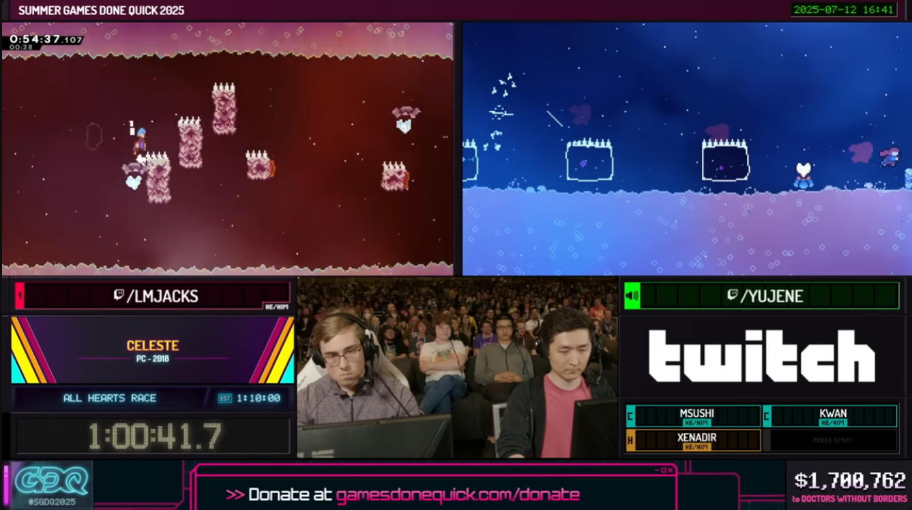
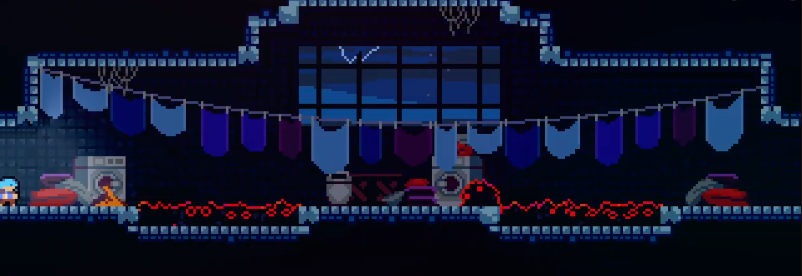
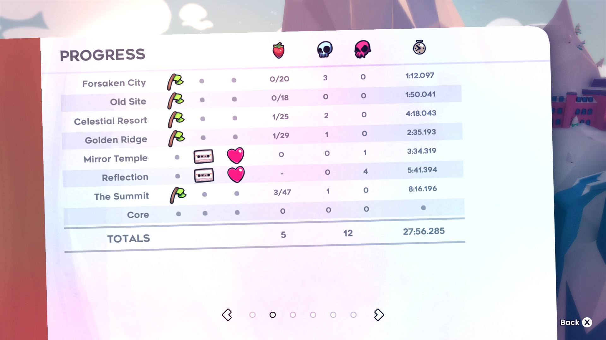

# The art

The following discusses various aspects of my personal approach to consistency. The key themes are
1. Celeste speedrunning is a performing art
2. Mental load management is an inherently human factor

## Strat selection

> The [2025 Celeste SGDQ race](https://www.youtube.com/watch?v=dMn6YJ-0fPs) featured 2 runners showcasing completely different stratsets

This one of the major avenues of artistic self-expression in Celeste. There are so many strats that you can choose from, plus the varying amount of degrees of optimization, that give rise to a high granularity of speeds and accessiblity to gradual improvement. One of the age-old questions is how to choose new strats and going for risky vs safe strats. Everyone has different playstyles, each with their advantages and drawbacks. I won't rehash all the arguments here: those who know me will know that I am biased towards starting with safer strats, mainly because I think their accessibility makes them more instructive for building fundamentals and gradual improvement. 

Something I don't hear often about is on the mental load of strat selection. Faster and riskier strats usually require more focus and attention to detail. This is a common dynamic in high-level bingo play: strong execution players may struggle to route the board compared to slower exec players who use much easier strats with a lighter mental load, reserving more mental capacity to read the board and find a good route. 

For speedrunners, we get the luxury of having a one-track mind of pure execution. That said, the mental load is still a factor when it comes to learning new strats. My personal style is to start with a set of easy strats just to give myself a foundation. Once the foundation is set, I look to gradually add optimizations. The key for me is to not learn too many new things at once. I write down a list of things I want to add, and practice those specific bits. Once I feel mentally saturated on the amount of new material, I enter the mode of running fullgame. Did I actually learn the new material? Maybe some strats need more practice, maybe some strats I'm not ready for yet. And that's okay, I'll come back when I'm stronger. Dropping a hard strat in favor of an easier one doesn't necessarily mean giving up or admitting defeat. It just means you need to focus your attention elsewhere and need a placeholder for the time being. You can always come back and revisit at any time. I've lost count of the amount of times I've been able to easily pick up a strat that I used to struggle with just by becoming better at the game, despite never practicing the harder strat in the time between. After running fullgame until satisfaction, I will look back at my stratset and movement and re-evaluate anything I want to improve. And the cycle begins anew. 

This is where I find starting with safe strats to be so powerful: they have a low mental load. Gradually adding in more difficult strats lets us concentrate our mental capacity onto a more focused space. People often talk about room and segment-based practice when learning strats to concentrate the learning onto smaller, more digestible pieces. The same principle can apply to learning strats in and of themselves: let the amount of strats you pick up at once be absorbed in small, digestible quantities.

Low mental load is particularly amenable for those of us who have limited time availability on playing Celeste. You might not have time to be grinding out all the hard strats in the entire any% category when you have less than an hour of available playtime per day. It might take you weeks or months to learn hard strats, by which time you've forgotten what you learned at the start and you get stuck in an endless cycle of relearning and derusting. You don't have to let that stop you from playing the game: there is so much of the game you can improve on. Just play the game, focus on the fundamentals, and you will improve over time.

## Reviewing your runs: the whack-a-mole game

>"Separate the results from the execution and the process" - [TGH](https://www.youtube.com/watch?v=XSDbB8dlrIE)

A common misconception among newer players is that avoiding deaths should be a goal of going fast (so common that there's a [video about "the worst speedrunning advice ever"](https://www.youtube.com/watch?v=hveNNVUBU68)). The short of it is that lowering death count should be a side effect, not a primary goal. I would apply this philosophy to the time as well: lowering time should be a side effect of your gameplay. This comes back to my take on Celeste speedrunning being a performing art: the focus should be on whether you are executing your plan or not, not whether you are dying a lot or losing a lot of time. The caveat is that your plan should be designed to be a balance of going fast and being safe.

When reviewing your runs, you may look at your journal or Livesplit deltas and think "oh I lost of lot of time in this chapter or checkpoint, I should practice it." It is not necessarily the chapter/checkpoint you need to practice, just certain spots within them may need fixing if at all. Don't evaluate your segments based on the time, look to the exact mistakes you made. Don't spend your time on practicing statistical anomalies either. Was it just a one-time mistake, or are you able to identify a recurring pattern? [An excerpt from habits](https://youtu.be/6YnlWciiheQ?si=c3npECcVzKy6NR_I&t=1102) as an illustration: look past timeloss and focus on the flaws in the plan.

It's easy to look at look at your own runs and just blindly practice spots you died in or lost a lot of time on that particular run. What happens often afterwards is that those "problems" are fine the next run, and then you start having problems in different or even completely new spots. This process repeats itself, just like a game of whack-a-mole. Every run will naturally have variance in your execution. Look to identify the recurring patterns in your mistakes, not whether you are dying a lot or losing a lot of time overall, or if you made one mistake in one spot just one time. Let the moles show their faces a few times, see which ones show up the most, and focus your efforts on attacking those. 

This is where, again, I find the low death, safe strat playstyle to be so much more tractable. It's just easier to identify where the real problem spots are when there aren't that many problems to begin with, and not get caught up in statistical anomalies. It's a concentrated mental capacity onto a focused space. Fundamentally this should be exercised regardless of if you are biased towards safer or risky strats, I just find this to be more tractable with a safer, lower-death playstyle. The whack-a-mole game is easier to solve when there aren't that many moles. 

## Practicing segments
>"it's easy to go wrong here, and one way i've gone wrong in the past is playing checkpoint and IL whack-a-mole, where i play a segment with the goal of getting a PB or "clean run", which usually takes a long time. this strategy is not inherently inefficient, but in the context of practicing for a fullgame run it's not ideal" - [WonderGinger](https://gist.github.com/WonderGinger/8df5904f296afb8d40f879767d0ebfe1)

Intermediate and higher level players understand the importance of practicing in smaller segments, whether it be rooms, checkpoints, or ILs. The pitfall I see too often is, once again, overvaluing the time and not the process. It may be fun to grind out ILs/checkpoints for a particular target time, but the goal should be on whether you are executing your plan or not. For this reason, I tend to choose segments that are not defined by the arbitrary boundaries of checkpoints and ILs, but on what I feel needs the most practice. In the context of fullgame, checkpoints and ILs are more useful to me as standardized benchmarks for movement, not as goals to hit. 

A pitfall I've seen happen often is grinding out segments for a particular goal time for fullgame preparations. Trying to grind out a strong Summit time, unless you are doing it for the sake of it as an IL, is easy to get stuck for the wrong reasons. Why do you need to play the entirety of Summit for practice? In the same vein, you should hold the standards of a "clean Summit" to the similar standards as you do would for a clean "1a Start - 4a Shrine." Speaking of, is that ever a segment you would practice? Don't worry about getting a clean Summit time when practicing it as a segment: focus on if you are doing what you want to do! You may never get a clean run that you would be satisfied with as an IL, but still have it sufficiently practiced for fullgame purposes. On the flip side, just because you got one clean run of an IL doesn't mean that everything within is fullgame ready. Achieving a goal segment time once has little reflection on my confidence in the segment.

Empirically, I find segments of about 1 minute in length, give or take, to be the best for focused practice with context. Shorter segments are reserved for learning new strats and performing strat maintenance. Longer segments are too diluted for focused practice. Frequently I'll identify some new strats/movement I want to work on, or problem rooms I need to fix, in close proximity to each other, then I'll select a segment that encompasses all of these together, regardless of what the arbitrary checkpoint boundaries are. One example I run is in the All Red Berries category: I commonly practice from the 2nd hub entry to archimedes (double bubble skip) because of the high density of complex inputs and occurrence of problem spots in this area. This segment is about a minute long for me, but I'm not married to this segment either; I may arbitrarily cut off or add a few rooms on either side. I don't need to practice the entire Depths ARB checkpoint or the entire Mirror Temple ARB chapter when I just want to focus on a few rooms, with some padding rooms for context. 

## Maintenance and oil checks

>"Never assume you've learned anything" - [JM](https://pastebin.com/FLa4rh1H)

In principle, once you identify a problem strat (I call this putting it on the chopping block), there are only 2 options: fix it or drop it. Unfortunately I cannot say too much on how to choose, this is a conversation you have to candidly have with yourself. For the statistically inclined, maybe you can try to look at average return on timesave, but I would generally recommend to just feel it out and make a judgment call. There is no right answer, but I will say that it is so common to find improvement by dropping problematic strats and shifting your mental energy elsewhere.

Between runs or as part of warm-up at the start of a session, I like to perform an "oil check" on problems spots that I think I've fixed previously. Start a few rooms back and see if I can properly execute on those spots. Again, no need to look at the timer, or play an entire chapter or checkpoint, focus on the execution. The more often it fails the oil check, the more liable it is to be dropped. It's important to remember that, if I am intending to run fullgame, then this step is just an "oil check" and not "practice the strat until consistency is achieved" If a strat fails the oil check, that's ok, keep it on the chopping block for the time being. I keep the oil check short so I don't lose sight of getting in my fullgame reps. 

## Death strats and cycles

Another major pitfall I see is on optimization of death strats. I cannot understate the power of opting for re-entry where possible. Having to learn multiple strats for one room just adds mental burden and dilutes our practice. Why should you spend time practicing a situation you seldom find yourself in? Additionally, re-entering lets us get in another rep of the entry strat and probe if we indeed have a problem or if it was just a statistical anomaly. 

"Re-entry is slow and loses 2s!", or "I hate deathlooping to the entry strat!" That's not the point: that's being concerned with the result and not the process. If you feel you have the capacity for learning optimized death strats and want to add them to your plan, then sure, go for it at your own risk. I would just warn you of how easy it is to hit diminishing returns with them. 

"I'm always encountering the death cycle!" Well then that calls for the chopping block: fix it or drop it.

In some cases, re-entry is not an option. For cases where I must have a death strat, I have 2 criteria
- Easy to remember
- Easy to execute
The combination of these two means that I don't need to spend time practicing them and I can pull them up at any time. I also apply this philosophy to death strats where re-entry is possible (7a 1500m in-between room). Death strats that can transpose onto the entry strat are also nice (8a vertical) because they simplify the mental burden. 

Imagine having to memorize all the possible death strats in the final room of Resort ARB. There are 4 variations you would need to know: entry, death+2 berries, death+1 berry, and death+0 berries. Do you really want to spend the time and energy to learn all of them AND keep them all maintained? Are you going to put "3a final, death cycle with 1 berry" into your practice routine? What if there were THREE berries in ONE room? Or even more? Your time would be much better spent elsewhere. This is why level 1 habits and red-dot are so powerful: have a basic idea of how to move and dodge major hazards, and then just get the hell out of there. Don't dilute your practice on situations you don't see often. 

## No reset runs

>"An attempt isn't a failure or a success. It's just an expression of what your body knows." - [JM](https://pastebin.com/FLa4rh1H)

A lot of this discussion culminates into why I almost exclusively do no-resets. The goal is to follow through on a performance and see if I am executing what I want to do. The no-resets diagnose of my performance and sheds light on what the problem spots are. The time will naturally follow as I improve my performance. My fullgame sessions look something like this
- quick oil check, 10 minutes max
- send no resets for 1-3 hours
- think about any recurring patterns in my mistakes (more tractable with a safer playstyle!)
- practice those at the end of the session if I have the time/energy, 1 hour max
It's important to not only send no resets runs, but also understand the objective of the no resets. It's not a PB attempt, it's just an evaluation of what you've actually learned and what you still need to work on. Sending no-resets while worrying about the pace and thinking about how much time you're losing and how far you're behind will just make you miserable. Let the mistakes happen as they come and take note of which ones are the most important to work on. It's important to find the right mental space to have a healthy approach to no resets, not just sending them for the sake of it because somebody told you to.

  
 1:1x city and a dream

  
  
  
  This is a bit of a meme about my first 27 any%, but also reflects my values. Why did I not reset here? Is 27 viable with a 1:1x city? The point is not about whether 27 is viable with a 1:1x city, or that I am 10 seconds behind what I am capable of in the first minute, or that I was able to make up the 10 seconds lost by locking in. The point is that you can make mistakes anywhere, but you don't need to let that deter you from following through on the motions. Do I think 1:1x City is "27 viable?" Not in the sense that a 27 runner should be capable of much better, but it doesn't matter if it happens in fullgame. It just means I made mistakes that happened to be in an arbitrarily short segment near the beginning of the run. I would be on the lookout if I started to repeatedly make those same mistakes in past or future runs, but not that I need to practice City as a whole or that I should be resetting to save 10s in earlygame and lose sight of the process.

Resetting for the goal of getting a better time or to adhere some pace benchmark is fundamentally against the idea of the run being a performance. That said, there are two kinds of resets I can get behind:
1. You are gambling. In this case, consistency is not a value. None of this discussion holds any meaning if you are gambling. 
2. You need an emotional reset. This is a complicated, highly personal matter with no one-size-fits-all answer.
   
Sticking to the philosophy of speedrunning being a performing art helps me emotionally detach myself from the pace and removes any expectations I have about the run. I have no idea if the run is going to be good, or bad, or I am going to play well or poorly. Instead I stay focused on the run as a reflection of myself. Have I actually learned everything I thought I did? Of all the problems that are happening, which ones feel like routine execution variance, and which ones do I feel like I don't know what is happening? No matter how good or bad the run is, it is a part of who I am, so I will accept everything it has to offer. I've found this to be far more instructive than resetting simply because the run is dead.

6a badeline cutscene
Badeline introduces herself as "Part of you." In some sense, I feel like resetting runs has the same spirit as the 6a start cutscene where Madelines tries to leave Badeline behind. It hides your flaws and protects your ego, but doesn't actually help you solve your problems.
(FMA excerpt, Hohenheim/Ed running away)

## Conclusions

To summarize the key points:
- speedrunning is a performance, not a time trial
- safe strats are good for time and mental load management
- don't evaluate yourself on time or deaths, evaluate it on the execution of your plan
- look for patterns in your mistake, don't get lost on statistical anomalies
- no resets are important as a candid self-evaluation

This is just my personal flavor on approaching consistency. Everyone has to find what works for themselves, but I hope that you can find something instructive and have some introspection on your own practice and fullgame routines. I don't always follow everything here religiously either. At the end of the day, the ultimate goal is to have fun and be proud of your accomplishments. 
