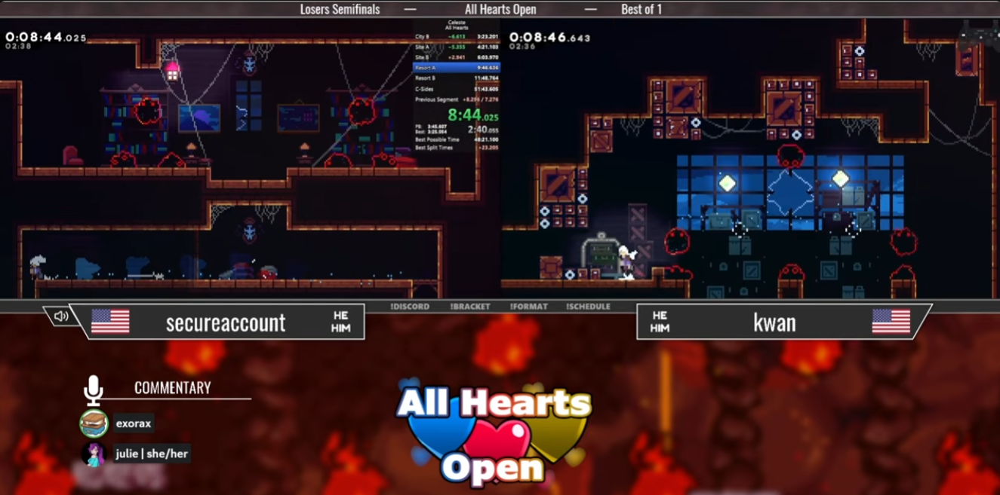
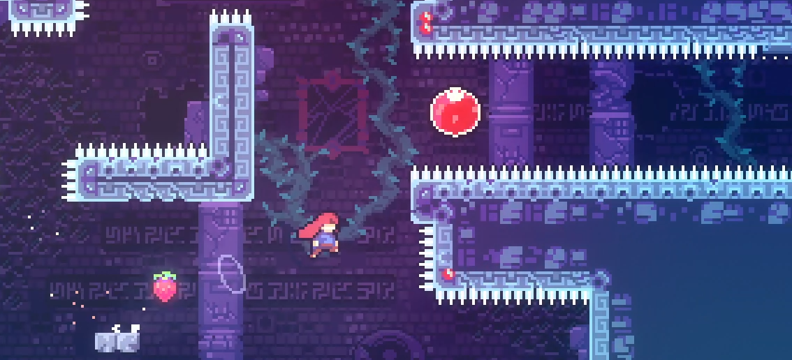
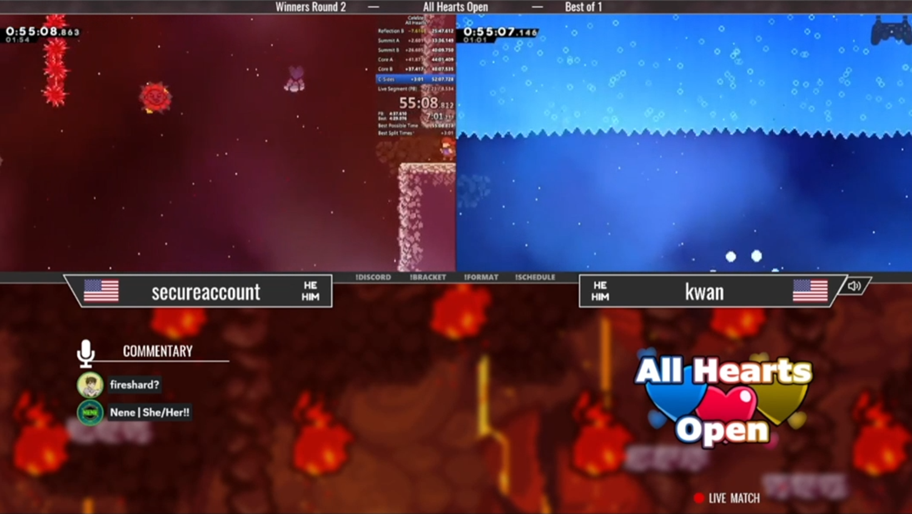
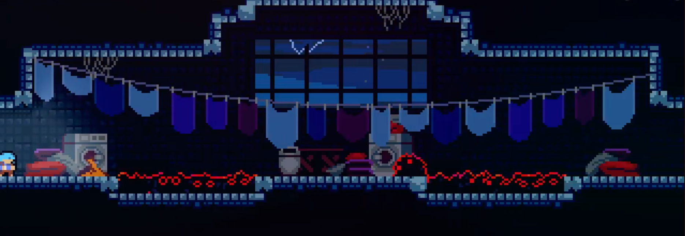
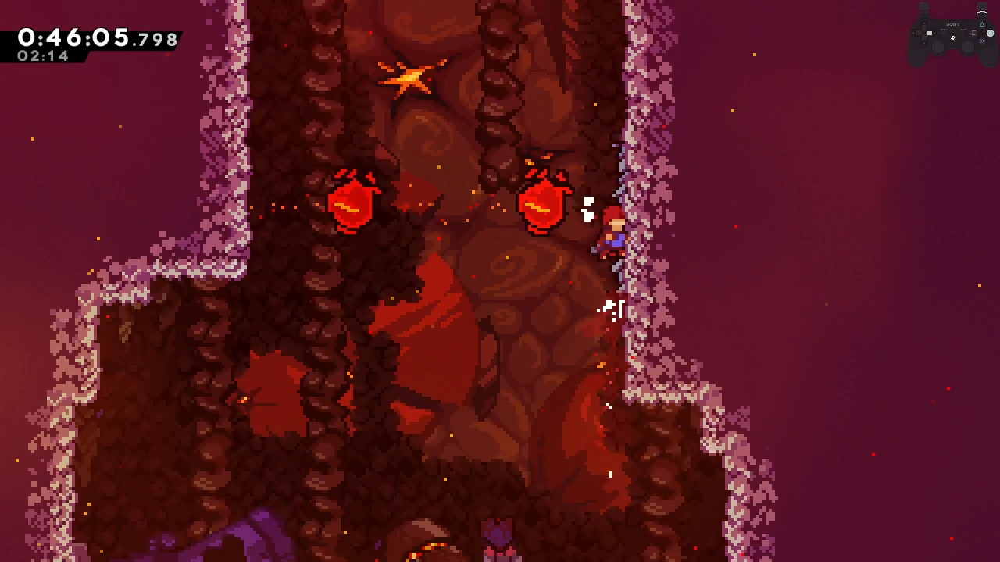
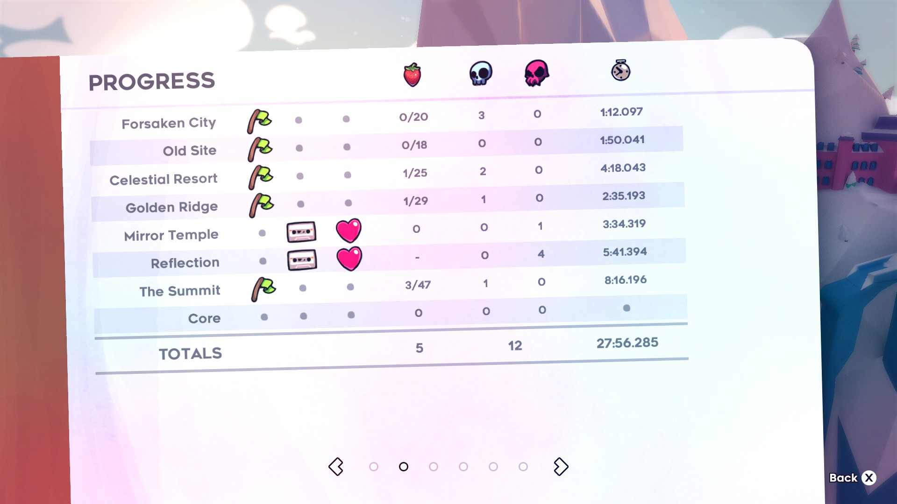
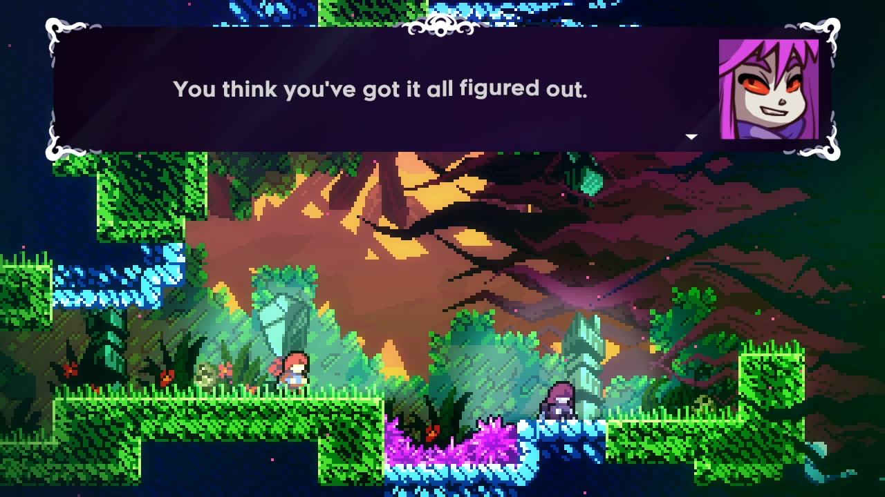
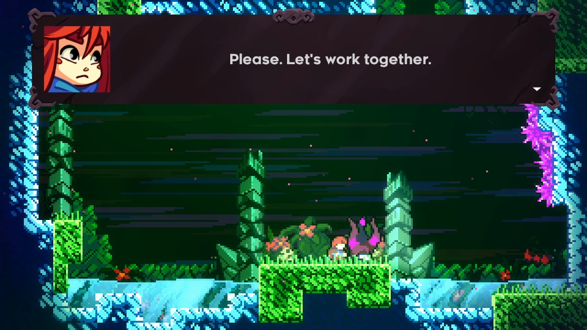
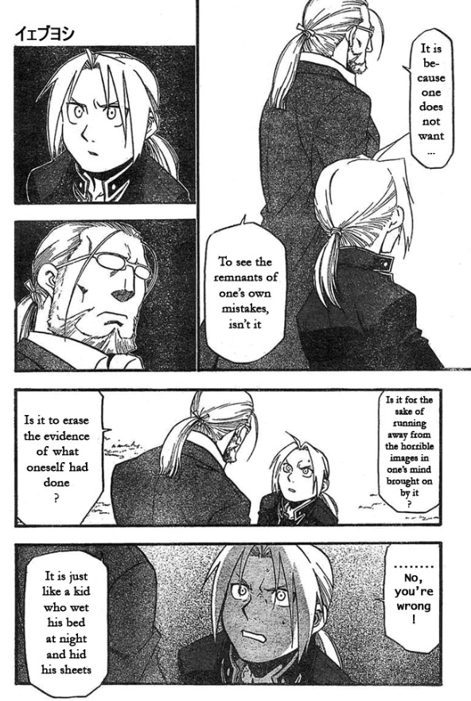

[back to main](https://github.com/kwan22/consistency/blob/main/README.md)

# The art of consistency

The following discusses various aspects of my personal approach to consistency. The overarching philosophy is that Celeste speedrunning is a performing art, which serves as a basis for my principles on how to build and maintain consistency.

- [Strat throttling](#strat-throttling)
- [Whack-a-mole](#whack-a-mole)
- [Practicing segments](#practicing-segments)
- [Maintenance and oil checks](#maintenance-and-oil-checks)
- [Death strats](#death-strats)
- [No reset runs](#no-reset-runs)

## Strat throttling

> "Just play Celeste" - [yujene](https://youtu.be/dMn6YJ-0fPs?si=AogDpwHAza9Q0MPt&t=2933)

Strat selection is one of the major avenues of artistic self-expression in Celeste. There are so many strats that to choose, plus the varying amount of degrees of optimization, that give rise to a high granularity of speeds and accessiblity to gradual improvement. One of the age-old questions is how to choose new strats and going for risky vs safe strats. Everyone has different playstyles, each with their advantages and drawbacks. I won't rehash all the arguments here. It should be no surprise that I am biased towards safer strats, mainly because I think their accessibility makes them more suitable for building fundamentals and gradual improvement. 

Faster and riskier strats usually require more focus and attention to detail. This is a known dynamic in high-level bingo play: strong execution players may struggle to route the board compared to slower exec players who use much easier strats with a lighter mental load, reserving more mental capacity to read the board and find a good route. For speedrunners, we get the luxury of having a one-track mind of pure execution, but mental load is a major factor for my bias towards safe strats. My personal style has been to start with a set of safer strats just to give myself a foundation. Once the foundation is set, I look to gradually add optimizations. The key for me is to not learn too many new things at once. I write down a list of things I want to add or improve, and practice those specific bits, with and without context. Once I feel mentally saturated on the amount of new material, I commit to a hard cutoff of learning. I may purposely leave some timesave on the table for me to come back to another time, even if it might be "free." The immediate next goal is to evaluate if I actually learned the new material. For this, I just send fullgame no resets: no matter your method, the key is to practice your execution in a flow state. I may find that some strats need more practice, maybe some strats I'm not ready for yet. And that's okay if I need to drop some stuff, I'll come back when I'm stronger. After running fullgame and performing maintenance in between until satisfaction, I will look back at my stratset and movement and re-evaluate anything I want to improve. And the cycle begins anew. I might not even pb during each cycle, I am just asking myself if I learned what I wanted to learn and figured out what I want to keep.

This is where I find starting with safe strats to be so powerful: they have a low mental load. Gradually adding in more difficult strats lets us concentrate our mental capacity onto a more focused space. People often talk about room and segment-based practice when learning strats to concentrate the learning onto smaller, more digestible pieces. I apply the same principle to learning strats themselves: I let the amount of material I pick up at once be absorbed in small, digestible quantities.

There's a lot of discussion on what the most efficient practice methods are. I don't have an answer for this because everyone has to find their own path on this matter. Strat throttling in the way I do is may be a slower approach to saving time, but the slow and gradual approach prevents me from burning out, maintains consistency throughout the journey, and keeps me healthily invested the real reason I play this game at all: to push myself to improve. To this end, I stay focused on what the most important aspects of the game and my understanding of it are, and gradually zoom in.

Low mental load is particularly amenable for those of us who have limited time availability on playing Celeste. I might not have time to be grinding out all the hard strats in the entire any% category when I have less than an hour of available playtime per day. It might take me weeks or months to learn hard strats, by which time I've forgotten what I learned at the start and I get stuck in an endless cycle of relearning and derusting. I don't have to let that stop me from playing the game: there is so much of the game I can improve on. Just play the game, build fundamentals, and I will improve over time. Hard strats are just easier to pick up with stronger fundamentals.

## Whack-a-mole

>"Separate the results from the execution and the process" - [TGH](https://www.youtube.com/watch?v=XSDbB8dlrIE)

A common misconception among newer players is that avoiding deaths should be a goal of going fast (so common that there's a [video about "the worst speedrunning advice ever"](https://www.youtube.com/watch?v=hveNNVUBU68)). The short of it is that lowering death count should be a side effect, not a primary goal. I apply this philosophy to the time as well: lowering time should be a side effect of my gameplay. This comes back to my take on Celeste speedrunning being a performing art: my focus is on whether I am executing my plan or not, not whether I am dying a lot or losing a lot of time. When I am in the fullgame phase, the time, just like deaths, simply becomes a consequence of my actions, not a benchmark to achieve. The goal of "saving time" is only considered when I am in the learning process and designing what plan I want to execute on.

When reviewing your runs, you may look at your journal or Livesplit deltas and just blindly practice spots you died in or lost a lot of time on that particular run. What happens often afterwards is that those "problems" are fine the next run, and then you start having problems in different or even completely new spots. This process repeats itself, just like a game of whack-a-mole. Every run will naturally have variance in my execution: chasing after every single mistake easily leads to a wild goose chase that has you running around in circles. A major challenge is figuring out how to beat this whack-a-mole game. I look to identify the recurring patterns in my mistakes, not whether I am dying a lot or losing a lot of time overall, or if I made one mistake in one spot just one time. Let the moles show their faces a few times, see which ones show up the most, and focus my efforts on attacking those. I find it helpful to write these down between runs or sessions, but also keep it limited to the most important ones! Just like with strat throttling, I limit the amount of material I want to review to not overwhelm myself. [An excerpt from habits](https://youtu.be/6YnlWciiheQ?si=c3npECcVzKy6NR_I&t=1102) as an illustration: **Time is an inherently flawed metric of performance**: there is some correlation, but, just like deaths, it does not tell the whole story. Look past timeloss and focus on the most important flaws in the performance.

Actually identifying the most problematic moles can be tricky since, unless you a dedicated coach to guide you, it is up to you to isolate the signal from the noise. Part of my approach to this is an emotional, vibes-based response. I will just feel a general fear or annoyance as a pattern of making a particular mistake begins to show up. It's basically just watching the moles come and go. A portion of my mindset during runs is dedicated to this surveillance. This is where, again, I find the low death (or more generally, low-mistake), safe strat playstyle to be so much more tractable. It's just easier to identify where the real problem spots are when there aren't that many problems to begin with, and not get caught up in statistical anomalies. It's a concentrated mental capacity onto a focused space. **The whack-a-mole game is easier to solve when there aren't that many moles to begin with.**

## Practicing segments

>"it's easy to go wrong here, and one way i've gone wrong in the past is playing checkpoint and IL whack-a-mole, where i play a segment with the goal of getting a PB or "clean run", which usually takes a long time. this strategy is not inherently inefficient, but in the context of practicing for a fullgame run it's not ideal" - [WonderGinger](https://gist.github.com/WonderGinger/8df5904f296afb8d40f879767d0ebfe1)

Experienced players understand the importance of practicing in smaller segments, whether it be rooms, checkpoints, or ILs. The pitfall I see too often is overvaluing the result and not the process. It may be fun to grind out ILs/checkpoints for a particular target time, but in the context of fullgame, my goal is seeing whether I am executing my plan or not. For this reason, I tend to choose segments that are not defined by the arbitrary boundaries of checkpoints and ILs, but on what I feel contains the elements that need the most practice. Attaining a certain checkpoint or IL time are more useful to me as standardized benchmarks for movement, not as indicators of readiness. 

Trying to grind out a strong IL time, unless you are doing it for the sake of it as an IL, is easy to get stuck for the wrong reasons. Why do you need to play the entirety of Summit for practice? Would you ever practice 1a Start - 4a Shrine as a single segment? Don't worry about getting a clean Summit time when practicing it as a segment: focus on if you are doing what you want to do! Achieving a segment goal time has little reflection on my confidence in that segment. I may never get a clean run that I would be satisfied with as an IL, but still have it sufficiently practiced for fullgame purposes, as long as I understand what I need to do. On the flip side, just because I got one clean run of an IL doesn't mean that everything within is guaranteed to be solved.

## Maintenance and oil checks

>"Never assume you've learned anything" - [JM](https://pastebin.com/FLa4rh1H)

In principle, once you identify a problem strat (I call this putting it on the chopping block), there are only 2 options: fix it or drop it. Unfortunately I cannot say too much on how to choose, this is a conversation you have to candidly have with yourself. Maybe you can try to look at average return on timesave, maybe there's some missing sauce you're not aware of, maybe you can send it to the lab and check the what the science says, but in general I would recommend to just feel it out, ask for help if you're not sure, and make a judgment call. There is no right answer, but I will say that it is so common to find improvement by dropping problematic strats and shifting your mental energy elsewhere. **Dropping a strat doesn't mean giving up, it just means you need to focus your attention elsewhere.** Have an easier strat as a placeholder: you can always come back and revisit at any time. I've lost count of the amount of times I've been able to easily pick up a strat that I used to struggle with just by becoming better at the game, despite never practicing the harder strat in the time between. 

Between runs or as part of warm-up at the start of a session, I like to perform an "oil check" on problems spots that I think I've fixed previously. Start a few rooms back and see if I can properly execute on those spots. Again, no need to play an entire chapter or checkpoint, or get hung up on what the timer says, focus on the execution. Did I do what I wanted to do? The more often something fails the oil check, the more liable it is to be dropped. It's important to remember that, if I am intending to run fullgame, then this step is just an "oil check" and not "practice the movement until consistency is achieved" If a strat fails the oil check, that's ok, keep it on the chopping block for the time being. I keep the oil check short so I don't lose sight of getting in my fullgame reps for the session. 

As much of a proponent I am for dropping hard strats, the decision to drop any strat should be done outside of actual fullgame runs. Dropping a strat mid-run because you're on a good pace and don't want to throw the run is being focused on the time and not the performance. Your fullgame runs should be a commitment of the plan you want to execute on, and confidence in your stratset is key. During runs, you may find it hard to hit certain strats while handling nerves on a good pace: dropping a strat for nerve control is understandable: it's along the same lines as mental load management. Either way, you should commit to a decision and stick to it during fullgame.

## Death strats

> "Planting seeds in the forest when your front yard is wilting." - secureaccount

Another major pitfall I see is on optimization of death strats. I cannot understate the power of opting for re-entry where possible. Having to learn multiple strats for one room just adds mental burden and dilutes our practice. Why should you spend time practicing a situation you seldom find yourself in? Additionally, re-entering lets us get in another rep of the entry strat and probe if we indeed have a problem or if it was just a statistical anomaly. It doesn't matter if re-entry is slow and maybe loses 2s. That's not the point: that's being concerned with the result and not the process. Why did you mess up the entry strat in the first place? It's a perfect time to check the mole. If you feel you have the capacity for learning optimized death strats and want to add them to your plan, then sure, go for it at your own risk. I would just warn you of how easy it is to hit diminishing returns with them and even potential harm from them occupying unnecessary mental real estate. 

In some cases, re-entry is not an option. For cases where I need/want a death strat, or backup strats in general, I have 2 criteria
- Easy to remember
- Easy to execute 

The combination of these two means that I don't need to spend time practicing them and I can pull them up at any time. I also apply this philosophy to death strats where re-entry is possible. Death strats that can transpose onto the entry strat are also nice because they simplify the mental burden. **In general, keep your backups as simple as possible**: don't spend your energy practicing complicated and nuanced backups: that's diluting your practice on situations you shouldn't be seeing often.  

  

Imagine having to memorize all the possible death strats in the final room of Resort ARB. There are 4 variations you would need to know: entry, death+2 berries, death+1 berry, and death+0 berries. Do you really want to spend the time and energy to learn all of them AND keep them all maintained? Are you going to put "3a final, death cycle with 1 berry" into your practice routine? What if there were THREE berries in ONE room? Or even more? Your time would be much better spent elsewhere. This is why [level 1 habits and red-dot are so important](https://github.com/kwan22/habits/blob/main/level1.md): have a basic idea of how to move and dodge major hazards, and then just get the hell out of there.  

 

## No reset runs

>"An attempt isn't a failure or a success. It's just an expression of what your body knows." - [JM](https://pastebin.com/FLa4rh1H)

A lot of this discussion culminates into why I almost exclusively do no-resets in my fullgame sessions. The goal is to follow through on a performance and see if I am executing what I want to do. The no-resets diagnose of my performance and sheds light on what the problem spots are. The time will naturally follow as I improve my performance. My fullgame sessions look something like this
- quick oil check, 10 minutes max
- send no resets, usually 1-2 hours
- think about and write down any recurring patterns in my mistakes
- practice those at the end of the session if I have the time/energy, 1 hour max
  
It's important to not only send no resets runs, but also understand the objective of the no resets. It's not an attempt to PB or to play within some distance of it, or even to try to "play well". The no-resets are just an evaluation of what you've actually learned and what you still need to work on. Sending no-resets while worrying about the pace and thinking about how much time you're losing and how far you're behind will just make you miserable. Let the mistakes happen as they come and take note of which ones are the most important to work on. It's important to find the right mental space to have a healthy approach to no resets, not just sending them for the sake of it because somebody told you to. I prefer to rack up the no-resets to give me the statistics to solve the whack-a-mole game. Playing well and getting a time you can be proud of will follow naturally. Once you start setting expectations about your results, you've lost sight of the process.

  
 1:1x city and a dream

  
  
  
  This is a bit of a meme about my first 27 any%, but also reflects my values. Why did I not reset here? Is 27 viable with a 1:1x city? The point is not about whether 27 is viable with a 1:1x city, or that I am 10 seconds behind what I am capable of in the first minute, or that I was able to make up the 10 seconds lost by locking in. The point is that you can make mistakes anywhere, but you don't need to let that deter you from following through on the motions. Do I think 1:1x City is "27 viable?" Not in the sense that a 27 runner should be capable of much better, but it doesn't matter if it happens in fullgame. It just means I made mistakes that happened to be in an arbitrarily short segment near the beginning of the run. I would be on the lookout if I started to repeatedly make those same mistakes in past or future runs, but not that I need to practice City as a whole or that I should be resetting to save 10s in earlygame and lose sight of the process.

Resetting for the goal of getting a better time or to adhere some pace benchmark is fundamentally against the idea of the run being a performance. That said, there are two kinds of resets I can get behind:
1. You are gambling. In this case, consistency is not a value. None of this discussion holds any meaning if you are gambling. 
2. You need an emotional reset. This is a complicated, highly personal matter with no one-size-fits-all answer.
   
Sticking to the philosophy of speedrunning being a performing art helps me emotionally detach myself from the pace and removes any expectations I have about the run. I have no idea if the run is going to be good, or bad, or if I am going to play well or poorly. Instead I stay focused on the run as a reflection of myself. Have I actually learned everything I thought I did? Of all the problems that are happening, which ones feel like routine execution variance, and which ones do I feel like I don't know what is happening? No matter how good or bad the run is, it is a part of who I am, so I will accept everything it has to offer. I've found this to be far more instructive than resetting simply because the run is no longer PBable or is otherwise suffering from large timelosses.

In the game's story, Badeline introduces herself as "Part of you." In some sense, resetting runs to me has the same spirit as the Reflection storyline where Madelines tries to leave Badeline behind. It hides your flaws and protects your ego, but doesn't actually help you solve your problems. You can accomplish so much more by working together.  

  
 
  

## Conclusions

To summarize the key points:
- speedrunning is a performance, not a time trial
- don't evaluate yourself on time or deaths, evaluate it on the execution of your plan
- look for patterns in your mistake, don't get lost on statistical anomalies
- ease of execution and lower-mistakes playstyle from safer strats helps with mental load management
- no resets are important as a candid self-evaluation

This is just my personal flavor on approaching and maintaining consistency. Everyone has to find what works for themselves: I wouldn't unilaterally prescribe any one method for everyone. My hope is that you can find something instructive from my perspective and have some introspection on your own practice and fullgame routines. I don't always follow everything here religiously either. At the end of the day, the ultimate goal is to have fun and be proud of your accomplishments.

Finally, an excerpt from my favorite manga, Fullmetal Alchemist.  

