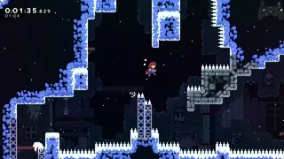
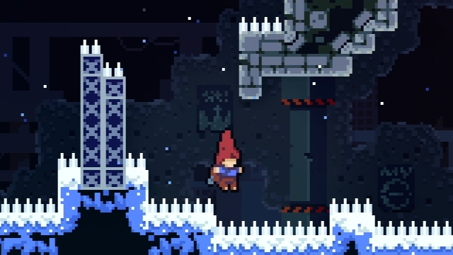
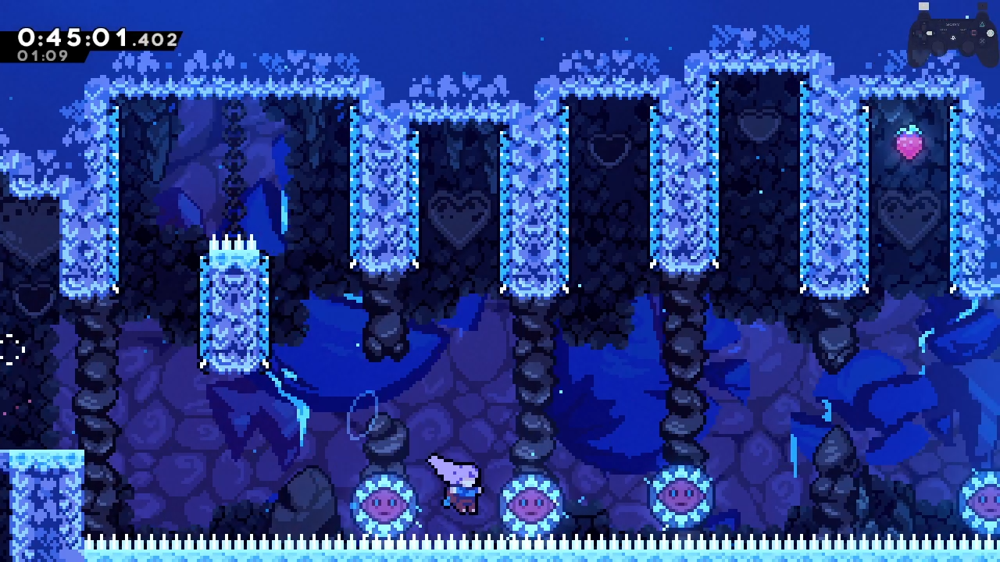
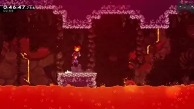
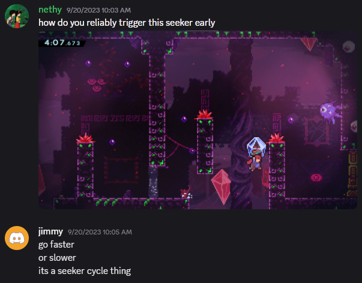
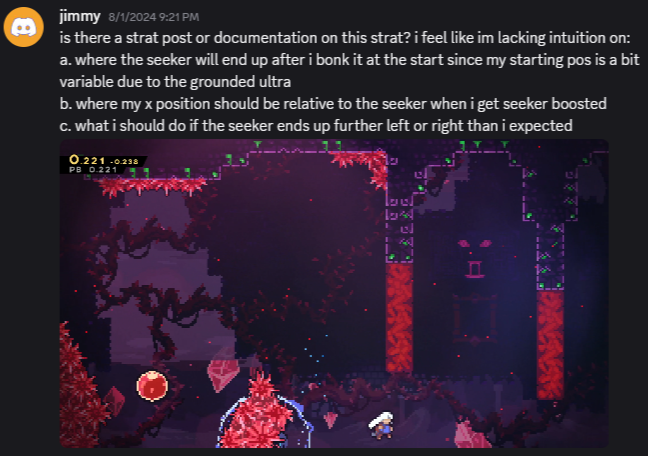

[back to main](https://github.com/kwan22/consistency/blob/main/README.md)

# The science of consistency

## Table of contents

- [Introduction](#introduction)
- [Leniency and convergence](#leniency-and-convergence)
- [Buffering and DashCD](https://github.com/kwan22/consistency/blob/main/science1_buffering.md)
- [Transitions](https://github.com/kwan22/consistency/blob/main/science2_transitions.md)
- [Other movement mechanics](https://github.com/kwan22/consistency/blob/main/science3_other.md)

## Introduction

  The following discusses some common patterns that I look for in my own speedruns. It is not a recommendation for faster strats: many examples shown are intentionally slower than conventional strats. The recurring themes are 
1. Maximizing use of the game's leniency mechanics.
2. Understanding the actions/variables that your objectives are most sensitive to.
3. Eliminating variables to reduce input complexity and remove failure modes.
4. Making small time sacrifices to relax precision, simplify inputs, and/or reduce sensitivity.

Many examples are provided and discussed in great technical detail, including frame data, pixel and speed values, and inner game mechanics that go beyond basic speedrunning knowledge. For those less familiar, you may want to have the TAS [tech](https://docs.google.com/document/d/1RVXyO7AZB-r7X3FxkxrBob775qWdhfOyBEOGGbnTgws/edit?tab=t.0#heading=h.yyzcmogdk15a) and [reference](https://docs.google.com/document/d/1z4caXIKvoEX-0gK3ApuJaJmDpy8NYAe62Dqt7Xxa9Tk/edit?tab=t.0#heading=h.vr60wzpdjz6c) on hand. These details are provided to justify the logic and illustrate the concepts. The overall goal is to understand the themes mentioned above. 

## Leniency and convergence

  Leniency is a fundamental property of speedrunning and is commonly expressed in terms of a window: the range of timings or positions you can perform an action and get the desired outcome. It is essentially a measure of your allowed margin for error. In Celeste speedrunning, frame windows are more prelevant than pixel windows, and many pixel windows are just translated into frame windows via speed. Not all frame windows of equal value are of the same difficulty. Context plays a major role in the perceived difficulty of a frame window. For example, extension timing is one of the easiest 5f windows to learn because the jump timing is anchored by the dash input. You are the one pressing dash, and then you learn the rhythm to press jump. However, hitting a random, unpracticed 5f window is quite difficult. 

  More generally, a frame window becomes easier to learn if it is **normalized** by an anchor. For extension timing, the dash input is the normalization anchor. Visual cues are also a common anchor to tie down a frame window to something more tangible. With enough experience, you can project Madeline's motion to develop an intuition for when Madeline will reach a visual cue to guide your timing. Both visual cues and muscle memory can be combined as well. Transition buffering is a fundamental timing that is based on a visual cue of the screen scroll coming to a stop. Some might also just "feel out" the visual motion of the screen scroll as well. Other useful normalized timings might be max height and [12f jump](https://www.youtube.com/watch?v=82gpR9rozdE). Max height jump might also be anchored by projecting the visual of Madeline coming to a vertical stop. [Habits level 3](https://github.com/kwan22/habits/blob/main/level3.md#basic-leniency-and-normalization) showcases several examples that uses basic leniency and normalization techniques to enable movement options. Besides buffering, the game offers many other leniency mechanics, including coyote, cornercorrection/floorsnap, liftboost timer, to name a few. Without these, Celeste would be a much less forgiving game to play. These leniency mechanics frequently come into play in prescribing an RTA-viable frame window for many actions.

  Some frame windows can be frustrating to deal with if not all frames within the window are equal. Frame windows are much nicer if every frame within gives the same outcome. I define some concepts about actions in general here:
- Convergent: small changes in the action result in the same outcome
- Divergent: small changes in the action propagate into different outcomes  
  
Changes in action generally refer to differences in timing or positioning. These are essentially expressions of sensitivity: convergence means the outcome is insensitive to small changes in the action. This describes a more general concept of a frame window: the window defines how small those "small changes" need to be. Outside of the frame window, the outcome diverges into different possibilities. What makes Celeste movement so interesting in this regard is that leniency mechanics combined with the discretization of the game physics may enable absolute convergence: different actions can converge onto the exact same game state. This enables some movement that may seem ridiculously precise to become RTA-viable.

   
> This precise-looking jump is first set up by lining up with the above wall, and then the jump can be input as early as the image shows. Pressing and holding jump anywhere between here and until you reach the wall (5f window) all lead to the same outcome.

  Normalization is a common way to approach convergence, and the two often go hand-in-hand. Transitions are the perhaps the best example, setting Madeline's position to exactly on the boundary and rounding off subpixels on both position and speed. Small differences in crossing a transition can converge onto the exact same game state. The normalizing properties of transitions enable many setups that would otherwise be difficult to make consistent. Bubbles also behave similarly, normalizing position and speed and having a well-determined trajectory. Convergence can still be achieved without a true normalization process, depending on the scope. Broadly, most continuous frame windows lend themselves to convergence, where each frame might be slightly different but sufficiently similar to make progress to the next sequence. 

---

  Using a transition hyper to normalize the entry to the final room of 3a loses 0.1 but makes the wavedash off the first pillar much more lenient. Typical movement involves a grounded ultra after transition, which virtually always results in a 3f window to downright onto the 1st pillar (assuming jump is held the whole time). With the transition hyper, the downright can be up to 7f, though not all 7f are equal. Being slightly late on buffering the transition hyper is also inconsequential. Besides frame windows, the major draw of the transition hyper is that the trajectory is the exact same every time: the timing for the wave is always the exact same timing, and there are no inputs in between to add complexity.  
  
> Both the slower horizontal trajectory and the downwards trajectory of the transition hyper as Madeline approaches the first pillar also helps make the wavedash more lenient, as landing a wavedash on a platform requires starting the downright within a diagonal pixel window. Releasing jump on the grounded ultra entry can theoretically replicate this concept, but this adds another variable.

---

Divergence in general means a high sensitivty of outcomes to small changes in actions. Bumpers, seekers, and core blocks are widely considered to be among the more frustrating mechanics for this reason. Rescue is one of the most challenging checkpoints for beginners because of how hard it can be to come up with a consistent stratset, as seekers can effectively behave randomly without sufficient attention to detail and precision in execution. High sensitivity can feel unpredictable because one tiny difference in the details of your movement can suddenly cause a strat to completely fail or otherwise have significant divergence from your intended outcome.

  
> The infamous bumper berry can be a nightmare just from the sheer volume of bumpers. [Some work has been done](https://discord.com/channels/403698615446536203/617809769322774533/1451832604822339645) to introduce convergence.

  
> Getting this clean bumper hit in 8a-HOTM-H might look simple but is notoriously frustrating as it features a triple-stack of divergence, involving coyote, a turnaround, and a bumper, not to mention the core block that follows immediately. All 3 Core chapters can be generally challenging because they frequently feature divergence.

   
> Seekers can be particularly challenging to understand because of how sensitive they are to small changes in movement. There are many possible variables that can affect a seeker's behavior. It can be difficult to identify what the actual important variables are, frequently causing confusion among speedrunners.

From a frame-window and strats perspective, divergence usually manifests as a small and/or discontinuous window, or one where different sections of a window require different follow-ups. These are often difficult to deal with. High-speed (grounded ultra) coyote often lends itself to divergence: the strat requires high-speed to enable longer-distance coyote, but the high speed inherently spreads out your possible trajectories. For the under strat in 2a-start, the grounded ultra travels at about 6.5 px/frame. In theory there are up to 3 possible coyote hyper frames that are viable for the under strat, but these are spread out over about 13 pixels. The end result is that the frame window for the upright is directly dependent on which coyote frame was reached. The first possible coyote frame gives a 1f window for the upright, the 2nd a 2f, and the 3rd (last) frame a 3f window.  
      
  > For the 2a under strat, the more coyote distance you get, the more lenient the following upright demo is. For the 5a "Archimedes": the updash is a 4f window, but each frame requires a different follow-up.

In some cases, the divergence may be acceptable if it is reactable. For this high-speed strat in 5a Rescue, there are 4 viable coyote jump frames, but frames 1-2 and 3-4 require different responses. The major challenge here is reacting to which set you get. While you have over half a second to decide during transition, it is certainly not easy to tell, especially with Madeline moving so fast, and the 2nd/3rd frame looking similar to each other.  
       
       
  > A cloud of dust indicates where the coyote jump occured, serving as a visual cue for making a split-second decision on which trajectory you think you are on.

While many instances of divergence remain unresolved, a lot of consistency can be gained by mitigating divergence where possible, as will be demonstrated in the later examples. 

---

The core of science is understanding cause and effect. The main application of science towards consistency in gameplay is understanding the variables (causes) that your outcome (effect) is most sensitive to, and how to tune your actions to put yourself in a favorable position to get the outcome you want. Reducing sensitivity of my desired outcome to those critical variables is a key theme. In many cases, these can be achieved at little to no timeloss if it done with convergence. Some variables can be removed entirely in some situations, making the problem more tractable. Celeste's physics and leniency mechanics enable many situations where small changes in actions frequently lead to small or even no differences in outcome. 

Runners need not understand all the frame data or underlying technical details, but I do find it helpful to understand the science of strats, at least to the extent of understanding how failure modes can happen. That way, when something goes wrong, I know how to adjust, and which variables I need to pay the most attention to. I may even design some setup to make that variable easier to deal with at the cost of a small bit of time. Overall, the goal of this document is to showcase the themes I mentioned at the beginning.

Celeste offers so many ways to play the speed vs precision tradeoff game that allows runners to take different paths to the same goal as an avenue of self expression. These show some of the ways that I express myself and drive my opinion on Celeste speedrunning being a performing art. The goal is to carry out a well-defined plan, allowing yourself an error margin of your choice at each step along the way.

---

[Next: Buffering and DashCD](https://github.com/kwan22/consistency/blob/main/science1_buffering.md)

[back to top](#the-science-of-consistency)
