[back to main](https://github.com/kwan22/consistency/blob/main/README.md)

# The science of consistency

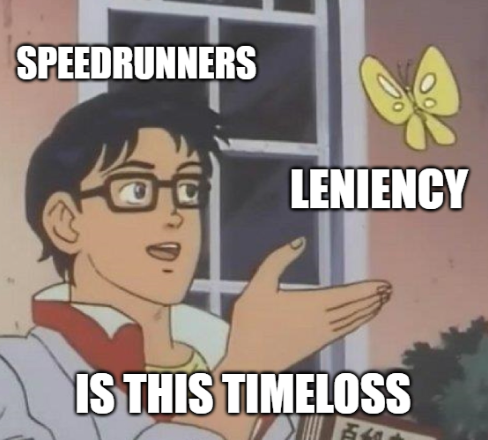

  The following discusses some common patterns that I look for in my own speedruns. It is not a recommendation for faster strats: many examples shown are intentionally slower than conventional strats. The recurring themes are 
1. Maximizing use of the game's leniency mechanics.
2. Understanding the variables that your objective is most sensitive to.
3. Eliminating variables to reduce input complexity and remove failure modes.
4. Making small time sacrifices to relax precision and simplify inputs.

Many examples are provided and discussed in great technical detail, including frame data, pixel and speed values, and inner game mechanics that go beyond basic speedrunning knowledge. For those less familiar, you may want to have the TAS [tech](https://docs.google.com/document/d/1RVXyO7AZB-r7X3FxkxrBob775qWdhfOyBEOGGbnTgws/edit?tab=t.0#heading=h.yyzcmogdk15a) and [reference](https://docs.google.com/document/d/1z4caXIKvoEX-0gK3ApuJaJmDpy8NYAe62Dqt7Xxa9Tk/edit?tab=t.0#heading=h.vr60wzpdjz6c) on hand. These details are provided to justify the logic and illustrate the concepts. The overall goal is to understand the themes mentioned above.

## Table of contents

- [Leniency and convergence](#leniency-and-convergence)
- [Buffering and DashCD](#buffering-and-dashcd)
- [Transitions](#transitions)
- [Half gravity](#half-gravity)
- [Cornercorrection lineups](#cornercorrection-lineups)
- [Dash attack leniency](#dash-attack-leniency)
- [Conclusions](#conclusions)

## Leniency and convergence

  Leniency is a fundamental property of speedrunning and is commonly expressed in terms of a window: the range of timings or spacings you can perform an action and get the desired outcome. It is essentially a measure of your allowed margin for error. In Celeste speedrunning, frame windows are more prelevant than pixel windows, and many pixel windows are just translated into frame windows via speed. Not all frame windows of equal value are of the same difficulty. Context plays a major role in the perceived difficulty of a frame window. For example, extension timing is one of the easiest 5f windows to learn because the jump timing is anchored by the dash input. You are the one pressing dash, and then you learn the rhythm to press jump. However, hitting a random, unpracticed 5f window is quite difficult. 

  More generally, a frame window becomes easier to learn if it is **normalized** by an anchor. For extension timing, the dash input is the normalization anchor. Other useful normalized timings might be max height and [12f jump](https://www.youtube.com/watch?v=82gpR9rozdE). Visual cues are also a common anchor to tie down a frame window to something more tangible. With enough experience, you can project Madeline's motion to develop an intuition for when Madeline will reach a visual cue to guide your timing. Both visual cues and muscle memory can be combined as well. Transition buffering is a fundamental timing that is based on a visual cue of the screen scroll coming to a stop. Some might also just "feel out" the visual motion of the screen scroll as well. [Habits level 3](https://github.com/kwan22/habits/blob/main/level3.md#basic-leniency-and-normalization) showcases several examples that uses basic leniency and normalization techniques to enable movement options. Besides buffering, the game offers many other leniency mechanics, including coyote, cornercorrection/floorsnap, liftboost timer, to name a few. Without these, Celeste would be a much less forgiving game to play. These leniency mechanics frequently come into play in prescribing an RTA-viable frame window for many actions.

  Some frame windows can be frustrating to deal with if not all frames within the window are equal. Frame windows are much nicer if every frame within gives the same outcome. I define some concepts about actions in general here:
- Convergent: small changes in the action result in the same outcome
- Divergent: small changes in the action propagate into different outcomes  
  
Changes in action generally refer to differences in timing or spacing. These are essentially expressions of sensitivity: convergence means the outcome is insensitive to small changes in the action. This describes a more general concept of a frame window: the window defines how small those "small changes" need to be. Outside of the frame window, the outcome diverges into different possibilities. What makes Celeste movement so interesting in this regard is that leniency mechanics combined with the discretization of the game physics may enable absolute convergence: different actions can converge onto the exact same game state. This enables some movement that may seem ridiculously precise to become RTA-viable.

  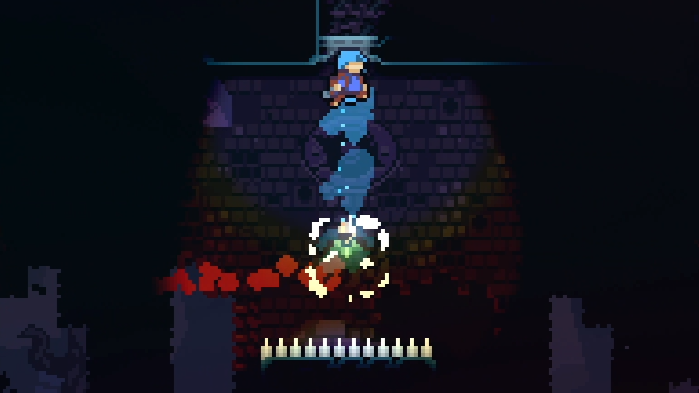  
>5a "Archimedes": the updash is a 4f window, but each frame requires a different follow-up.

  Normalization is a common way to approach convergence, and the two often go hand-in-hand. Transitions are the perhaps the best example, setting Madeline's position to exactly on the boundary and rounding off subpixels on both position and speed. Small differences in crossing a transition can converge onto the exact same game state. The normalizing properties of transitions enable many setups that would otherwise be difficult to make consistent. Bubbles also behave similarly, normalizing position and speed and having a well-determined trajectory. Convergence can still be achieved without a true normalization process, depending on the scope. Broadly, most continuous frame windows lend themselves to convergence, where each frame might be slightly different but sufficiently similar to make progress to the next sequence. 

---

  Using a transition hyper to normalize the entry to the final room of 3a loses 0.1 but makes the wavedash off the first pillar much more lenient. Typical movement involves a grounded ultra after transition, which virtually always results in a 3f window to downright onto the 1st pillar. With the transition hyper, the downright can be up to 8f, though not all 8f are equal. Being slightly late on buffering the transition hyper is also inconsequential. Besides frame windows, the major draw of the transition hyper is that the trajectory is the exact same every time: the timing for the wave is always the exact same timing, and there are no inputs in between to add complexity.  
  
> The downwards trajectory of the transition hyper as Madeline approaches the first pillar also helps make the wavedash more lenient.

---

Divergence usually manifests as a small and/or discontinuous frame window, or one where different sections of a frame window require different follow-ups. These are often difficult to deal with. High-speed (grounded ultra) coyote often lends itself to divergence: the strat requires high-speed to enable longer-distance coyote, but the high speed inherently spreads out your possible trajectories. For the under strat in 2a-start, the grounded ultra travels at about 6.5 px/frame. In theory there are up to 3 possible coyote hyper frames that are viable for the under strat, but these are spread out over almost 20 pixels. The end result is that the frame window for the upright is directly dependent on which coyote frame was reached. The first possible coyote frame gives a 1f window for the upright, the 2nd a 2f, and the 3rd (last) frame a 3f window.  
  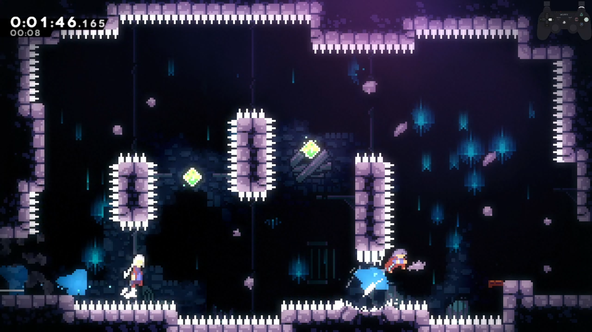  
  > The more coyote distance you get, the more lenient the following upright demo is.

In some cases, the divergence may be acceptable if it is reactable. For this high-speed strat in 5a Rescue, there are 4 viable coyote jump frames, but frames 1-2 and 3-4 require different responses. The major challenge here is reacting to which set you get. While you have over half a second to decide during transition, it is certainly not easy to tell, especially with Madeline moving so fast, and the 2nd/3rd frame looking similar to each other.  
  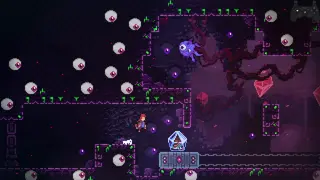   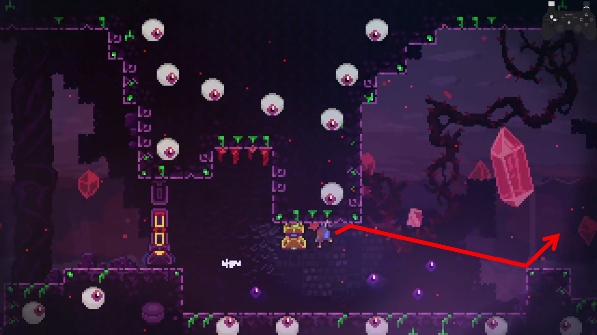  
  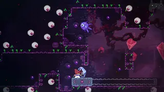   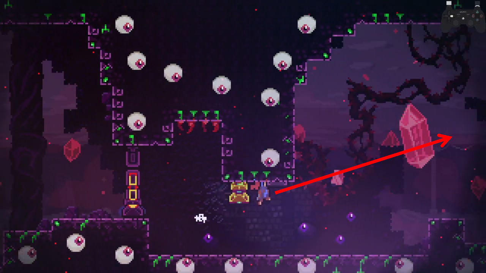  
  > A puff of smoke indicates where the coyote jump occured, serving as a visual cue for making a split-second decision on which trajectory you think you are on.

---

## Buffering and DashCD
  Buffering is perhaps the epitome of convergence: inputs of different timings generate the exact same result. While chains of consecutive buffers can quickly become complicated and arguably divergent from a human perspective (more about this later), sparse buffers showcase the concept of convergence quite well. Common, visually obvious examples include transition buffers, cb and cornerkick setups, and pause-buffering. 

  DashCD is one of the less visually obvious mechanics but has incredible potential in creating buffer setups. Besides the strats that essentially require it, a lot of leniency on otherwise hard strats can be gained by putting yourself in a position to buffer out of DashCD. Setting up the positioning may cost a small amount of time, opening an avenue to play the speed vs precision tradeoff game. Below are some examples where understanding DashCD is useful.

---

### DashCD position setups

    
> The faster you are moving, the less time you spend in a spatial window, and more precise it becomes to act within that spatial window. The plot shows the average frame window for hitting a wallbounce as a function of horizontal speed. Colored regions indicate nominal values for typical movement options.

  Normally with a neutral transition super, the updash on this wallbounce in the berry route of 2500m is a 3f window. By carefully positioning the rightdash in the previous room, this updash can instead be [transformed into a buffer out of DashCD](https://discord.com/channels/403698615446536203/617809769322774533/1086837734607441931). Furthermore, there is a 1-1 correspondence between each of the possible updashes and the rightdashes upon transition (blue bar). With dash speed moving at 4 px/frame and 3 possible rightdashes, there are thus 4 px/frame x 3 frames = 12 pixels from which the rightdash can be started and the updash is bufferable. The pixel window can be converted into a frame window assuming we are walking thru the window: with walking speed at 1.5 px/frame, it's an 8f window to time the rightdash.  
     
  > A 3f updash turns into a ~6f with the right setup.
  
  Each of the colored red/green/yellow boxes corresponds to a rightdash+buffered updash pair. Dashing in the 1st red box means the buffered updash comes out on the 2nd red box, etc. By starting the rightdash in the 12px window, we remove the failure mode of updashing too early. The updash itself is bufferable, but depending on where the rightdash is, the updash may have extra leniency frames. For example, if rightdashing from the 1st red box, the updash is allowed to be slightly late: 1f late updashes on the green box, 2f late updashes on the yellow box. Rightdashing from the 1st yellow box has no added leniency frames beyond the buffer, as the 1st possible updash is also the last one.

---

  Coincidentally, the ultra off the coreblock in 8a-HOTM-H has almost exactly the same structure as the 2500m ARB example above. It's a 3f window to downright after a buffered transition hyper to avoid negative liftboost. That 3f can then be [transformed into a buffer out of DashCD](https://discord.com/channels/403698615446536203/617809769322774533/1380229565674164317) by carefully starting the demo in a 12px window. I won't rehash all the details as it's similar to above, but I will mention some nuances. The failure mode of not properly buffering the transition hyper is more relevant here compared to the 2500m ARB example above. The choice of demo vs downright also matters from a leniency perspective. Horizontal dashes move 4 px/frame, and a downright moves ~3.4 px/frame. The higher speed from a horizontal dash effectively expands the pixel range over which this concept works, i.e. the dash timing upon transition is less sensitive to starting position when the dash speed is faster (see sensitivity analysis below for a more generalized form of this).  
    
  > Another 3f becomes a ~6f.

The same principle applies to other dash tech. These downrights can be made much more lenient by starting the instant hyper before transition from the right spot.  
   
> For these particular strats, hold jump until the buffered dash out of DashCD.

---

### DashCD speed control

  
> Speed of a buffered grounded ultra as a function of jump timing on a hyper. DashCD 1-5 is extension timing, with DashCD(1) being the last extension frame. There is a range of ~21 px/s on the buffered grounded ultra speed over the extension timing window. That is half the difference between a good and bad cb, usually inconsequential and compensated by the hyper itself moving faster than the dash during DashCD, but can propagate to noticeable differences when carrying that speed over great distances like in the eyeball room. 

  Controlling DashCD is useful to control speed on a grounded ultra. I use DashCD to control my speed at the start of the eyeball room of 5A. The most normalized entry for the eyeball room is to transition hyper and buffer a downright, but the speed of the buffered downright and ensuing Theo ultra depend on how much DashCD remains upon entering the room. Making the cycle requires good speed generation and preservation. Good speed generation means good Theo ultras, and good speed preservation, in practice, means fitting in has many bhops as possible. I struggled with fitting in small bhops near the beginning, so instead I opted to line up my DashCD entering the eyeball room itself such that the first Theo ultra is as fast as possible given a buffered transition hyper into downright out of DashCD. This simplifies the beginning of the room with just 1 big bhop instead of 2 small bhops that can easily go wrong. In terms of speed generation, dashing from as far away as possible (entering with the lowest DashCD) leads to the least loss to air friction and consequently the fastest ultra upon a buffered downright. However in this case, the lip at the start of the eyeball room presents some complications. If DashCD is too low when entering eyeball room, there is not enough height+distance covered to avoid the lip with a buffered hyper+downright, resulting in a grounded ultra on the upper platform before Theo (sometimes it still works but I wouldn't count on it).  
   
> Aiming the exit of the previous room to set up the eyeball entry to be as fast and consistent as possible.

  I settled with aiming for DashCD(5) when entering eyeball room to give myself some margin. DashCD(4) creates more speed and is easier to make the fast cycle, DashCD(3) is too far and runs into the grounded ultra issue, and DashCD(6) works but is just a tad more difficult. Incidentally, DashCD(4) and over are also allowed to be slightly late on buffering the transition hyper, adding a hair of leniency on that end. Recall that each dash timing corresponds to a 4px range of the starting demo because of the 4px/frame speed of the horizontal demo. To translate these numbers into something more practical: I aim to be near the left edge of the platform (red dashed line). A nice feedback cue is if I see the 2nd dash silhouette (indicated by the blue arrow) appear during the transition screen roll: this indicates DashCD(5) or less. If I don't see the 2nd dash silhouette appear during transition, I am more mentally prepared to have less speed on the first Theo ultra. A critical consequence is that by aiming for a particular DashCD, I am reducing the possible initial trajectories (and thus reducing variance) I will have at the start of the eyeball room.  
  
> For the duration of a max height jump (39f), a ~21 speed difference (see above figure) translates to ~15 pixel (~1.8 tile) difference in horizontal distance traveled. That might not sound like much after having traveled 3/4 of the way through the eyeball room (almost 100 tiles up to this point), but differences of that scale can be critical in making the cycle on the eyeball room. Success on this demohyper hinges upon being close enough to the platform, as this frequently occurs while the eyeball wave is pushing you backwards. Theo also needs to be some distance downstream so the grounded ultra will catch him.

---

  
> "wavedash.ppt is wrong, just learn the timing for extended hyper instead" - typical chatter

  Wavedashes present a way to control the timing of a hyper. As much as wavedash.ppt is criticized for being wrong, there is a useful consequence of starting the downdiagonal from midair: the hyper cannot come out until Madeline reaches the ground. This means with some careful positioning, we can design a buffered wave to give us a particular extension frame, or more generally, DashCD. This can be used to normalize trajectories. Incidentally, wavedashing on a max height jump gives DashCD(1) on the hyper, meaning in principle we can access any DashCD with a buffered wave by jumping from flat ground.  
   
> Using a wave makes these hypers bufferable and perfectly convergent. If they were to start from the ground, they would be frame-perfect ([5a](https://discord.com/channels/403698615446536203/617809769322774533/1300619075344535604)), or have otherwise terrible frame data ([8arb](https://discord.com/channels/403698615446536203/617809769322774533/1229338086454988860)).

---

### Buffer chains

      
> "It's free time save, just buffer" - typical chatter

  Much of Celeste's high input density and high-speed movement comes down to learning the muscle memory for movement sequences, where you may learn the timing of one input relative to a previous one. One of the challenges is chaining many consecutive buffers. A fundamental property of buffering is that the action does not occur at the same time as the input. This can add variance to timings that we are used to. A canonical example would be buffering extended hyper when landing without a dash. 

  The normal way to learn extended hyper timing is a muscle memory of the 10-14f rhythm between dash and jump. Nobody is counting 10-14f in their head, we just feel it out after having hit and missed it many times over. This is perhaps the most important arbitrary timing to learn in the game and mastery of it is a must for reaching advanced levels of play. When buffering the dash is thrown into the mix, our beloved timing gets a little befuddled. Buffering the dash means the jump input is no longer always 10-14f timing: for example, it could be a 14-18f timing, depending on where in the buffer window the dash was input.  

>Frame structure of a dash and ensuing jump. The dash can be input anywhere from -4 to 0 and it comes out on 0. The jump timing for instant and extended hypers is always the same 5f window with respect to the dash coming out, but its timing relative to your button press has variance. 

  Empirically, the typical way to handle this is just "jump a bit later than usual." As you stack more consecutive buffers there becomes increasingly more "wiggle room" for input timings relative to a previous input. In a sense, one could argue this to introduce divergence: the timing of a buffered input affects the relative timing of a subsequent buffered input. In many cases of high-density, multi-buffer sequences, I often find muscle memory to quickly fall apart, and need visual cues to reliably anchor my timing. 

  
> A fully buffered strat, but terribly unintuitive for muscle memory, being not only a long buffer sequence but also various extra freeze frames thrown in between. I heavily rely for visual cues in the background textures to help me guide my dash timings.

  A similar story can be said for instant hypers. Jump can be pressed on frames 0-4 for an instant hyper (0 being simultaneous), which empirically translates to "instantly", hence the name, but only if the dash isn't buffered. The timing is no longer "instantly" when the dash is buffered. One technique to mitigate the variance in jump timing is to stagger jump presses, though I would only recommend this when releasing jump is not an objective. Personally I'll use a dashjump + jump combo in some instances where it is crucial to buffer instant hyper and I intend or am allowed to hold jump for a long time. When the dash is properly buffered, the jump portion of dashjump doesn't actually do anything because it is lost to freezeframes. Rather, the dashjump simply serves to save me if I didn't actually buffer the dash, acknowledging that I am not going to hit every buffer. An accidental unbuffered dash combined with an intentionally delayed jump could spell trouble in situations where the hyper being instant is critical to success.  
     
  > The dashjump is not a replacement for a jump, it is just adding insurance.

This is a similar principle to staggering jumps on diagonal demo cornerkicks that are notorious for having variable timing because of the crouch state dynamics. In principle, one could roll a whole series of jumps as even more insurance, but not all of us have that luxury and would probably be more trouble than its worth to do for every instant hyper.  

---

## Transitions

  Buffering transition movement (e.g. transition hyper) is well-known for being an excellent normalizer: these are so common and I discussed them briefly already, so I won't go over them here. Hypering just before a transition seems like it adds variance depending on the starting x-position, but it turns out that it is still highly convergent across different starting x-positions because of the structure of the hyper trajectory and the properties of transitions. Some seemingly pixel-perfect or subpixel-precise strats involving a hyper before transition frequently have a pixel range that are a multiple of 5 in which they work because this convergence.
  
  The hyper has a factor ~6 difference in horizontal vs vertical speed during the 12f of jump timer. The hyper moves about 5 px/frame horizontally, and air friction is small at the startup, decrementing the horizontal speed by about 1.5% per frame in the first several frames. On the other hand, the hyper moves less than 1 px/frame vertically. The consequence of this is that the hyper stays at the nearly the same x-speed and y-position over a large x-range. Horizontal transitions set Madeline to an exact x-position, and round off decimals (in px and px/s units) on y-position and both components of speed. The possible trajectories of a hyper upon transition are thus discretized and can usually be exactly prescribed based on horizontal distance from said transition (with occasional offsets from subpixel rounding). 

  The plot below shows the possible hyper trajectories, y-position and x-speed (u), upon a horizontal transition as a function of distance from transition. Each step represents a frame, and all positions up to the next step converge to the exact same trajectory. The outcomes (y, u) are weakly sensitive to the changes in action (x). The consequence of this is that pre-transition hyper trajectories are discretized such that they increment every ~5 pixels away from transition. Because of the low sensitivity, adjacent hyper trajectories are often similar enough where many strats work across multiple 5-pixel windows.  
  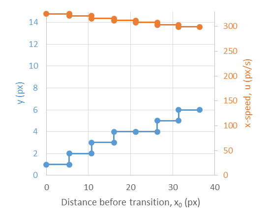  
  > In-game TAS tools can usually measure the hyper trajectory by seeing the DashCD or Jump timer values during transition as there is a 1-1 correspondence.
 
  Transitions introduce a **spatial convergence** of trajectories, which is especially noticeable for hypers: different spacings give the exact same result, and the width of the spacing is proportional to the speed. By comparison, buffering introduces a **temporal convergence** of inputs: different timings of button presses give the exact same result. Buffered transition hypers exhibit both spatial and temporal convergence and are the usual preferred method for converging horizontal trajectories. While this concept works for any well-defined trajectory, it is perhaps the most prevalent and well-illustrated by hypers before transition. Below shows examples where such pre-transition hypers are useful.

---
  
  Fastfalling directly into the 1st bumper in 6b Reprieve-3 seems absolutely insane. Fortunately, there is a [setup](https://discord.com/channels/403698615446536203/1137847274609848463/1137847278363738233) to help us out. Incidentally, optimal movement at the end of Reprieve-2 sets this up perfectly: buffered rightdash out of Badeline recoil sets us up on the left edge of the 5 pixel window of the winning hyper trajectory. That said, because the landing is on the left edge, there is some room to the right of the optimal landing that is still viable. The consequence of this is that differences in Badeline recoil between entry and death can be resolved by simply not fastfalling after the rightdash, as slowfalling lands us slightly further to the right but still within the 5px window. Slowfalling works for both entry and death, while fastfalling is a frame faster but works only on entry.  
  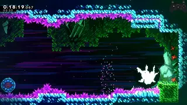  

  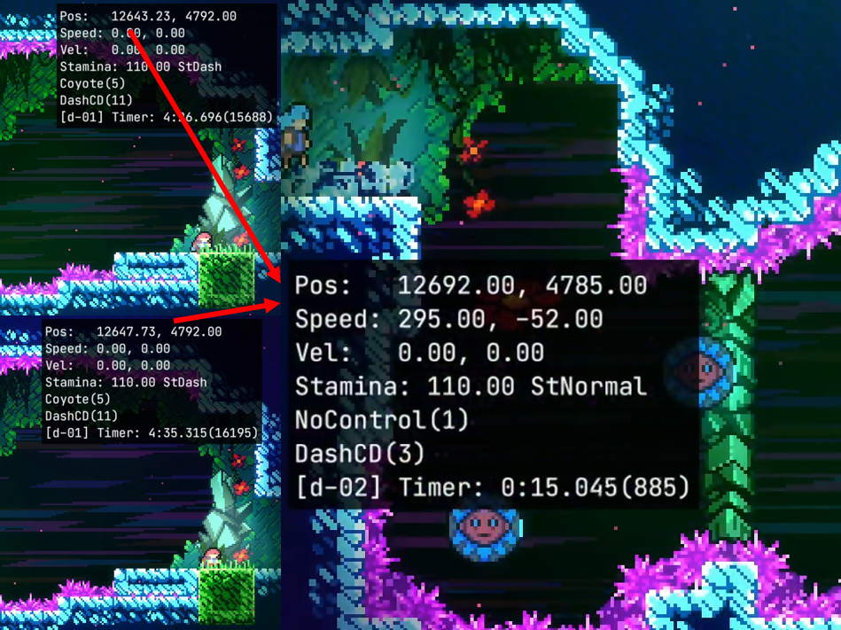 
  > Hypers from different initial positions that reach the transition at the same time converge onto the exact same trajectory. 

---

  The [setup](https://discord.com/channels/403698615446536203/617809769322774533/1162859316479537265) for the downright cb in Intervention can be traced all the way back to the end of the previous room. There are 2 viable hyper trajectories on transition, thus a 10px window for the exiting hyper. Incidentally, one of the hyper trajectories is more forgiving than the other, but both are sufficient to set up the rest of the strat with reasonable leniency.  
  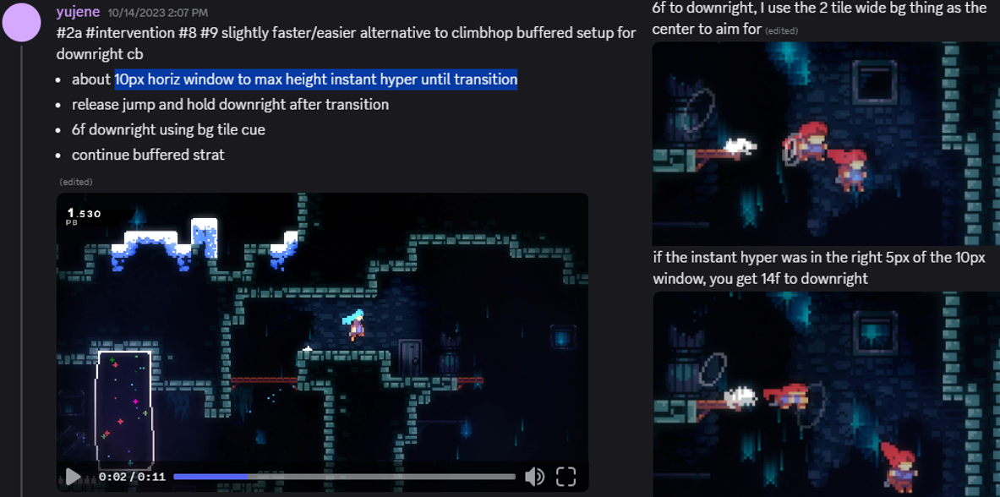
  > Because the setup starts from the previous room, so far there is no known normalized way of quickly setting up the downright cb from entry.

---

  The [first cb in 3b Start-2](https://discord.com/channels/403698615446536203/617809769322774533/1232274832390098974) has a ~25 pixel range (red box) to get a good cb. There are 5 possible hypers to cross the transition (blue) and get a good cb, spread out across ~25 pixels of initial x-pos (x0, red). For the outcome of "good first cb", the pre-transition hyper is highly convergent across different initial starting positions. That said, the following upright cb being successful has some sensitivity to x0 because of the slightly different speeds mattering. In general, the longer a sequence is, the more opportunities there are for divergence to arise, as small differences in intial conditions propagate to increasingly larger changes in outcomes. Thankfully, Celeste provides many anchors for normalization, making chaining many short sequences amenable to convergence.  
  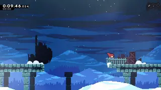 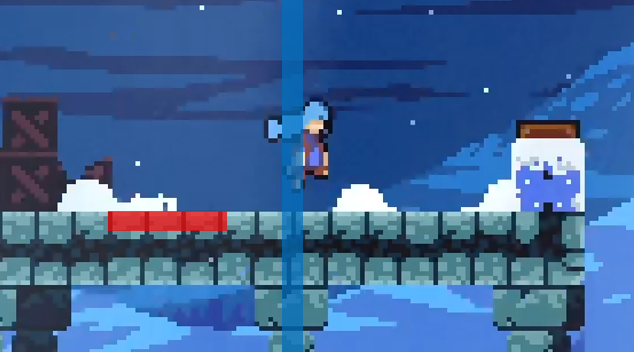
  > There is a massive range to get the first cb to be a good cb, but getting the 2nd cb is a bit trickier.

---

  I find a pre-transition hyper to be much more consistent in setting up these 7a 500m and the 8b HOTM-H strats than transition hyper. While transition hypers are well-known for their normalization properties, a major variable in using a transition hyper here is the jump release timing. Pre-transition hyper shifts the variance from jump release timing to hyper positioning, which I can take a moment to aim for if I so choose. All this may be at the cost of a few frames compared to the transition hyper, if at all. In general, the transition hyper is amazing on horizontal convergence, but less so on vertical where a short hyper is required, as each frame of jump release gives a different outcome (e.g. the landing position for the bhop on this strat).  
   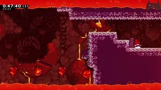  
  > More speed loss to air friction also may mean a larger window for the 500m cornerslip itself and better avoids brushing against the next wall. In 8b, with a very close pre-transition hyper, a [12f jump](https://www.youtube.com/watch?v=82gpR9rozdE) on the bhop sets up the upright demo very well and avoids crashing into the wall. The death strat is to simply reverse transition hyper, which is an even more normalized pre-transition hyper thanks to buffer leniency.

  To generalize, the minimum landing distance (assuming no forward release and jump held until transition) of a pre-transition hyper as a function of initial distance before transition is illustrated below. Landing distance is useful as the ability to fit in a bhop is frequently dictated by how much floor you have in front of you. For a wide range of starting x-positions, the total variance in minimum landing distance is just under 16 pixels (2 tiles).  
    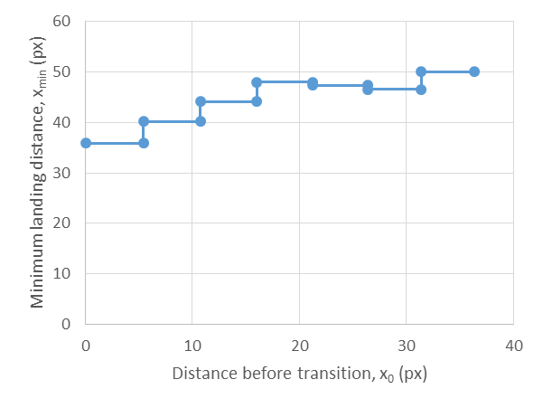  
  For comparison, the minimum landing distance of a transition hyper as a function of jump duration is illustrated. Every frame of jump timing increments the minimum landing distance by almost 10 pixels (~1.2 tiles). While comparing initial starting position and jump release timing is not exactly apples-to-apples, the point is that there is much more variance in the landing distance from a transition hyper compared to a pre-transition hyper with a comparable precision of execution.  
  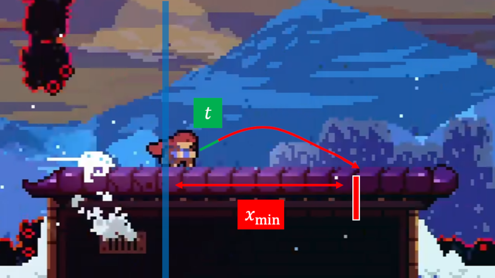  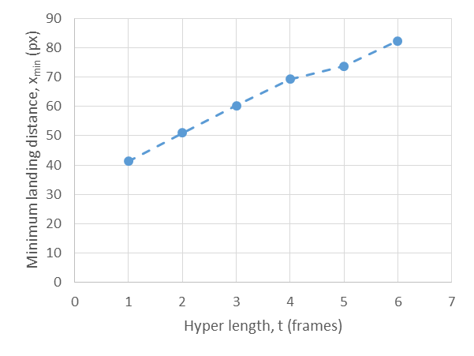  
  Understanding minimum landing distance is also useful when trying to move downwards past the floor. Pre-transition hypers are frequently successful at normalizing this.  
  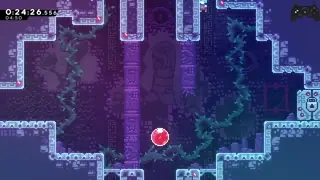  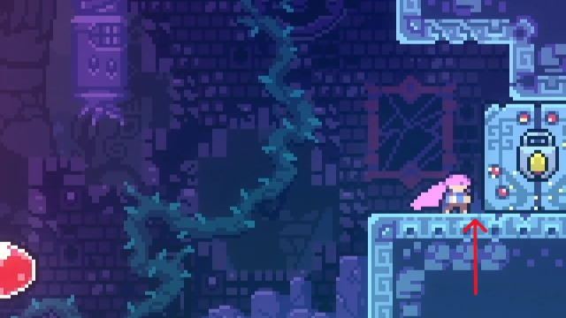  
  Notice the small amount of space between Madeline and the door. This spacing ensures the minimum landing distance carries over the floor in the next room so we can get a better downwards trajectory into the bubble. This loses a frame in the current room, but gains more back in the next. Incidentally, this positioning is set up perfectly with a single downright coming out of the previous room (which by itself is already optimal for key cycle considerations), and then naturally coming to a stop by just holding downright.

  Pre-transition hypers are especially useful on converging vertical trajectories. Transition hyper vertical trajectories are much more sensitive to jump release timing: hence, there is a tradeoff between horizontal and vertical convergence. On the other hand, the transition hyper's horizontal speed is nearly independent of jump release timing since air friction is a constant: there is just a slight variable in the timing of when the +40 bhop speed is applied (earlier = faster). This kind of variance usually has negligible impact assuming vertical trajectory is irrelevant. 
  
---

  
Sensitivity analysis

  In general, the sensitivity coefficient is expressed as a derivative of the outcome with respect to the input. High sensitivity = high divergence = bad. We can perform sensitivity analysis of the hyper trajectory (y and u) to initial starting position (x) without jumping through all the hoops of graphs and long-winded explanations. Let v = y-speed = dy/dt, u = x-speed = dx/dt. The sensitivity coefficients dy/dx and du/dx are thus

  dy/dx = dy/dt * dt/dx  
  dy/dt = v, dt/dx = 1/u  
  dy/dx = v/u

  du/dx = du/dt * dt/dx  
  du/dt is air friction, which is a constant  
  du/dx ~ 1/u

  This is all just a concise, mathematical way of expressing all the numbers I was discussing earlier. Comparing hypers and supers, hypers have lower v and higher u, so dy/dx and du/dx are larger for supers compared to hypers. One can expect pre-transition supers to be more sensitive (less convergent) on starting x-position. The main missing piece of this analysis is the rounding and discretization that happens on transition that enables certain strats, but this reflects the overall trend. There are a few spots where pre-transition supers enable certain strats, though these are less common than their hyper counterparts, mainly due to level layouts generally being more conducive to hypers over supers.  
  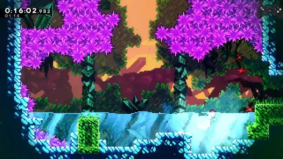 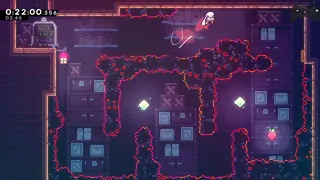

  The outcome of the pre-transition hyper is really the timing upon hitting transition (t) which uniquely determines y and u, and the input is the spacing from transition (x). Notice that the dt/dx term appears in both dy/dx and du/dx. This is distinctly different than the wallbounce vs horizontal speed example earlier. In the wallbounce vs speed example, the outcome is position (x), and the input is the timing of the updash (t), so the sensitivity coefficient is dx/dt = u: faster speed = more sensitive to timing = bad. It's important to understand what your outcomes and inputs are when looking at a sensitivity analysis.
  

---

## Half-gravity

  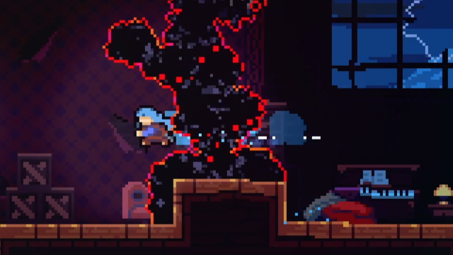  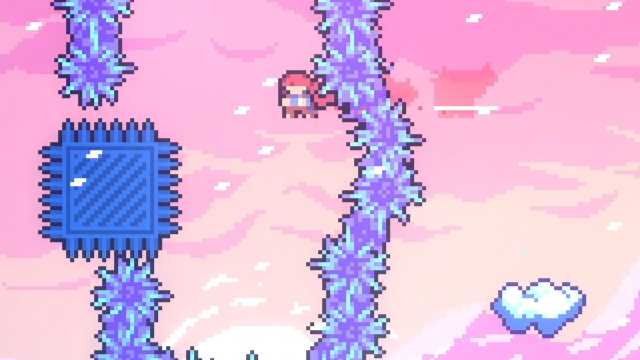  
  > Half-gravity can be either helpful or harmful for precise vertical positioning.

  Half-gravity can extend the duration Madeline exists at a given y-position. This typically manifests in line-ups with max-height jumps, e.g. 3a shaft demo and a whole class of demos out of a max height hyper. Certain actions and interactions apply autojump as well, that act as if we are holding jump to give us half-grav whether we want to or not. Fundamentally, half-gravity can improve frame-windows by keeping us in the same y-position for an extended period of time. On the other hand, half-gravity can be detrimental sometimes, by introducing deadframes on some strats, or more fundamentally, adding unnecessary airtime. Avoiding half-gravity can also be convergent, where releasing jump on different frames gives the exact same trajectory if timed correctly (the so-called [12f jump](https://www.youtube.com/watch?v=82gpR9rozdE)). In summary, a 12f-17f jump gives the exact same trajectory for a normal jump, i.e. releasing jump at different times within this 6f window gives the same result. There is an even larger window for wallbounce jump release convergence (9f) and other vertically boosted trajectories. A good deal of RTA movement optimization comes from putting yourself in a position to enjoy the luxury of a convergent jump release timing. For a speedrunner's perspective, the main takeaway is "just hold jump" to use half-gravity, or "find the 6f+ jump release window" to avoid half-gravity.   
  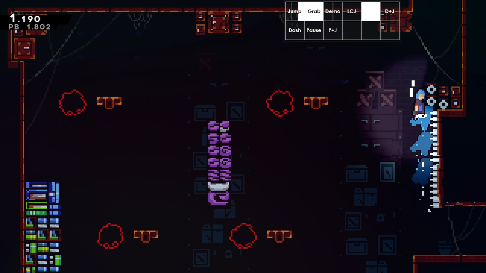  
  > Sometimes there are [setups](https://discord.com/channels/403698615446536203/617809769322774533/1269034670272680093) to have a 12f jump give an optimal landing

  The movement in this 3b start room hinges heavily on convergence. The first downwards cb by the spinners is set up with a buffered wallkick that induces ForceMove (more on this later). The last climbjump by the spikes is [set up in a normalized manner](https://discord.com/channels/403698615446536203/617809769322774533/1380402607612231783), with a wide window for jump release that includes an even more lenient version of the 6f jump release window to mitigate half gravity.  
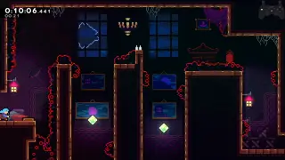

## ForceMove

  The main feature of ForceMove is that we lose horizontal aerial control and, barring an interruption like a dash, we are "forced" to travel along a specified horizontal trajectory. Typical sources of ForceMove are wallkicks (10f) and springs (18f). The first notable consequence for wallkicks is that holding into and holding away from a wall for a walljump are equivalent: it can be helpful to preferentially hold in towards walls by default for wallkicks to generally just remove the variable of needing to switch directions in the first place. 

  Because the horizontal trajectory is forced, it is also normalized horizontally. There are many situations where once we enter ForceMove state, we can simply ride the ForceMove and focus our attention elsewhere, frequently a dash in a different direction. As a bonus, the risk of misdash can be mitigated by preloading the direction we need to dash in long before we actually dash in that direction. Increased air friction from releasing forward is also frequently irrelevant (e.g. if bottleneck is vertical), and the horizontal deceleration can help with precise horizontal positioning. 

Some strats rely on the properties of ForceMove to be set up precise positioning.  
  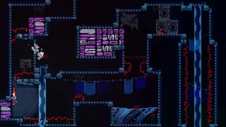 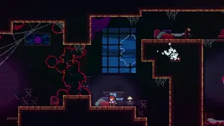

Some spots where I let ForceMove carry me to reduce misdash risk and/or make a horizontal positioning easier at virtually no timeloss.  
  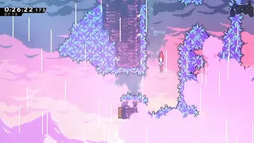  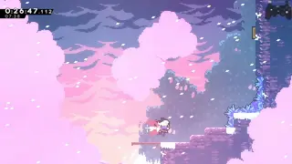  
  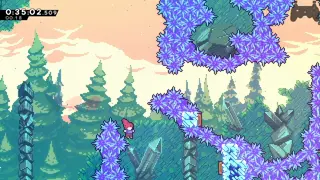  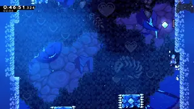

ForceMove is useful to not need to change directions for a wallkick. 
  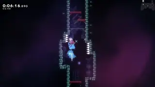 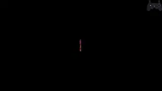  
  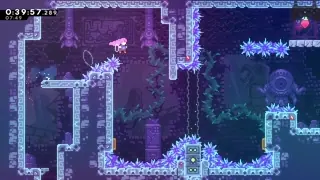 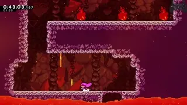 

  A max height jump and max height wallkick makes the first horizontal demo on 7a Flag 17 much more lenient. In this instance, going neutral during ForceMove from the wallkick eliminates the possibility of being too far and crashing into the ceiling spinners. Acting at the peak of each jump gives a consistent, sufficiently converged starting point for the first upright dash. The demo usually ends up being a 5f window. Waiting for peak height loses time to optimal movement but is still appreciably faster than doing a 2nd upright.   
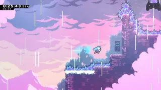

---

## Cornercorrection lineups

  For ground jumps there are 3 convergent vertical trajectories: full jump (jump held the whole time), [12f jump](https://www.youtube.com/watch?v=82gpR9rozdE), and full hyper. These are extremely common actions and provide various options for lining up for cornercorrection/floorsnapping, showcasing the speed vs precision tradeoff quite nicely. The plots below the vertical trajectories of these jumps, focusing on their alignment with 1-, 2-, and 3-tile height as canonical examples. Of the two collision correction mechanics, cornercorrection by itself is mainly useful for 2-tile extensions and other precise positioning setups as x-pos is perfectly normalized and y-subpixels are retained. Floorsnapping by itself is less useful and is generally harder to intentionally use because of its smaller pixel window, but has some niche applications. In general, when arbitrarily passing over a floor at max jump speed (105), there is a 78% chance that cornercorrection is a 2f and 12% chance a 3f. 1-tile height alignment happens to enjoy the luxury of a 3f window for cornercorrection, improving accessibility of some setups like [burgyscience](https://discord.com/channels/403698615446536203/617809769322774533/1092191710504828979). Combined cornercorrection/floorsnap leniency for alignment at max jump speed is virtually always a 4f, barring some shenanigans like floating point precision.  
  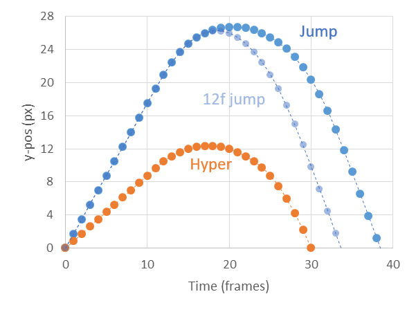   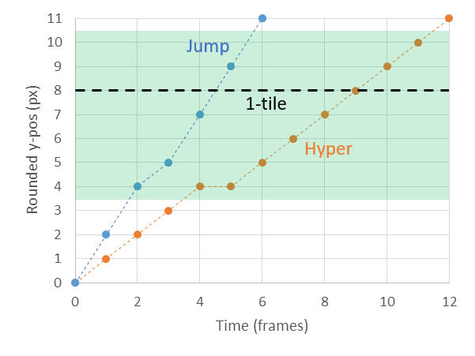   
  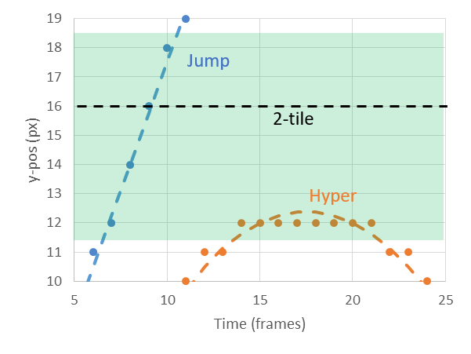  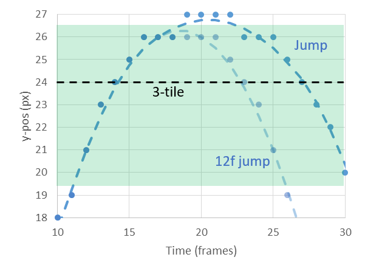  
  > Vertical trajectories of a full jump (blue), 12f jump (light blue), and a hyper (orange), accompanied by zoom-ins around a 1-, 2-, and 3-tile elevation gain on the upswing. Green regions show zones of cornercorrection and floorsnapping. Black dashed lines show the position of 1, 2, or 3 tiles, on/above being floorsnapping and below being cornercorrection. Zoomed in plots are rounded to the nearest y-px to highlight Madeline's rendered hitbox position, assuming no initial subpixels.  
  
  Despite 1-tile alignment from jumping being a 4f, I find it more difficult than the 2-tile alignment primarily due to it empirically being "jump and then very quickly but also not too quickly dash", i.e. frame consecutive jump+dash fails. One way to get around the frame-consecutive failure mode is to use a super and take advantage of DashCD: the 1st 4f of extension allow a buffered dash to line up with a 1-tile because DashCD nullifies the "deadframe" as long as you don't get 5th frame extension. This simply moves the 4f to a more comfy spot at the cost of a buffer and potentially a small amount of timeloss. The same principle applies to a 1-tile cornercorrect alignment, though this method would need the middle 3f extension.  
  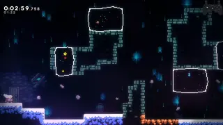   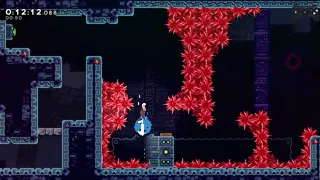   
  > Sometimes the target extension frame gains buffer leniency. Sound familiar?

  Requiring cornercorrection enables 2-tile extension but significantly increases the required precision due to loss of floorsnap leniency. This is where I preferentially use hypers for some required cornercorrects. The slower vertical speed of hypers makes the vertical positioning easier. In some cases, it may help with making horizontal progress as well.  
  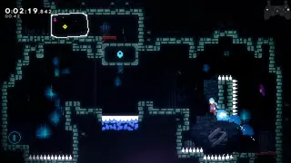   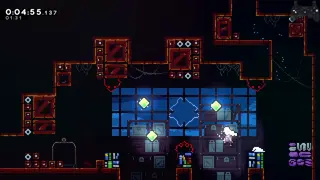   
In a similar vein, max height hypers always cornercorrect at 2-tile height. The tradeoff for vertical speed and precision is quite clear, with hypers having much more lenient frame windows but taking ~4f longer on average for a 1-tile alignment and ~10f for a 2-tile alignment, measured from the middle of their respective frame windows.

  3-tile alignment tells an interesting story. Cornercorrection on the upswing is still a 2f despite a small loss of speed due to gravity. Both full and 12f jump give good frame data for 3-tile alignment, but full jump actually has 4 deadframes at the very top. 12f jump gives a continuous 15f window for alignment. 12f jump also gives an 8f continuous window for floorsnap, where full jump would have a double 3f. This type of trajectory and ensuing frame pattern shows up in both [3arb jasig](https://discord.com/channels/403698615446536203/617809769322774533/1354968751262535691) and [7b heart demo](https://discord.com/channels/403698615446536203/617809769322774533/1353209624232464395). It can be argued that in cases where vertical positioning is the only relevant factor, releasing jump might be preferred for 3-tile alignment to remove deadframes despite adding another variable in jump release timing, as even a 9f jump still gives a massive, continuous window for a 3-tile alignment. 

  Below is a summary of the nominal frame windows for these various types of jumps and canonical alignments, with or without requiring cornercorrection. Exact frame data for specific geometries and movement options is largely case-by-case: these examples aim to highlight some common patterns.  
  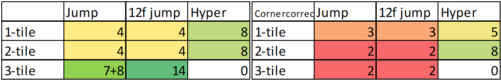  

  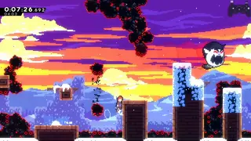  
  >After the super, it is optimal to do 2 climbjumps to maintain maximum jump speed, and the demohyper is a 4f as mentioned above, but runs the risk of overshooting and falling into the dust bunnies at the end of a very long room. 1 climbjump is an alternative that loses a few frames but still works, reduces input density, increases leniency, and significantly reduces risk.

  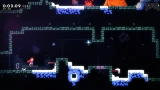 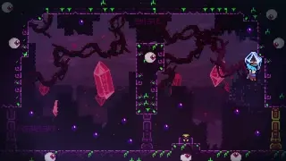  
  > The massive frame windows on 3-tile alignment might seem like overkill, but they reduce sensitivity to horizontal trajectories or other factors that influence the time at which the corner is reached. The actual frame windows for the above midair super/demohyper at 3-tile elevation gain may be less than 8f because of horizontal considerations and seekers, but they allow slightly different trajectories approaching the corner to still be viable.

## Dash attack leniency

Dash attack leniency here refers to the 6 frames after a dash ends while still retaining some properties of a dash. The key properties of interest here are
1. regain aerial control
2. loss of vertical speed

### Aerial control 

  Regaining aerial control in this context means that wallbounces can gain some extra leniency away from the wall. In the 6 frames of dash attack leniency, Madeline can move up to 2.7px horizontally, theoretically adding that much leniency, room layout allowing. That said, it is not always easy or ideal to take advantage of this leniency. For example, holding in toward a wall means the wallbounce will experience increased air friction until away is held, which can be helpful or harmful depending on context. 

  The 2nd wallbounce on Flag 2 is difficult partially because of the spinners interfering with updash cornercorrection leniency, but it can be made easier with dash attack leniency. I aim to have my horizontal trajectory as normalized as possible before attempting this precise wallbounces: in this case, to have the previous wallbounce be flush/cornercorrect on the wall to normalize horizontal trajectory so the updash alignment is the exact same timing every single time. Furthermore, having the first wallbounce flush against the wall reduces the horizontal distance needed to travel, and thus total time traveled and total horizontal speed gained from acceleration. Less horizontal speed means more time in the pixel window. The lineup may or may not be optimal from a movement perspective, but what I am actually interested here is the normalization and the potentially increased frame window for the updash due to low horizontal speed. If I see the first wallbounce was not normalized, i.e. not from flush against the previous wall, I will completely bail on attempting the 2nd wallbounce because of both reduced frame window and loss of normalization.  
  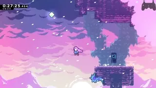 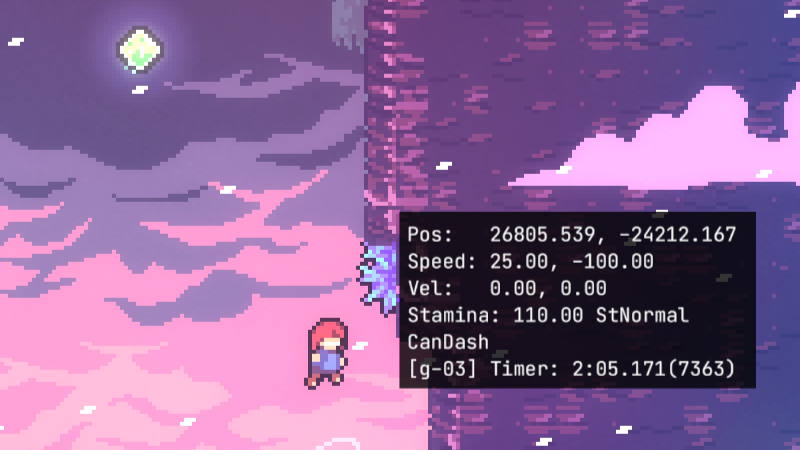  
  > Image show the first possible updash frame for the 2nd 7a Flag 2, hinging upon aerial control during dash attack to enter wallbounce range from outside. Note the low horizontal speed, enabled by setting up the previous wallbounce at a more favorable horizontal position, that will generally increase the updash frame window. Perhaps more importantly, a consistent starting horizontal position on the previous wallbounce normalizes the timing of the updash.

  A similar story happens with the 8arb lava wallbounce. Here, lining the previous wallbounce to be flush off the upper coreblock is easier because the lower coreblock helps line it up. A nuance here is that I aim the previous wallbounce to be low so dash attack does not vertically overshoot the lava. Holding left for too long may suffer the increased air friction problem mentioned earlier. The Flag 2 example is less sensitive to air friction.  
     

With the right vertical positioning, using dash-attack leniency to hold towards the wall adds 1f of leniency (3f at best to 4f at best) to the updash on lakeskip. Holding towards the wall immediately after the wallbounce happens to be optimal in this case.  
      

One caveat to be careful about is colliding with a wall, which immediately removes dash attack. For this transition wallbounce in 7arb 1500m towards the winged berry, I wait to hold left until shortly after hitting the wallbounce. In principle, holding left the whole time for the transition wallbounce is fine, but being slightly late on the transition buffer while holding left will cause the transition wallbounce to fail. The wallbounce being neutral for a few frames has essentially no impact on the room.  
      
  > Image shows the first frame I started holding left.

---

### Vertical speed loss

The loss of vertical speed opens up some setups enable a larger frame window to fire a wallbounce within a precise y-pos. Firing a wallbounce during dash attack leniency significantly reduces the sensitivity of the wallbounce trajectory to jump timing. Once again, another instance of a speed vs precision tradeoff.  
    
  > The elevation gain of an updash as a function of time. Orange points indicate dash attack leniency.

Getting clean landing in 3a shaft-3 requires a wallbounce at the top ~5px of the 1-tile thick platform. The grounded ultra setup not only gives a consistent horizontal position for the updash, but also puts us in a vertical position such that dash attack leniency gives us a large and consistent (5-6f depending on cornercorrection) frame window to hit this clean landing. Otherwise, passing through this spatial window at max dash speed gives a 1-2f window on the jump input for clean landing.  
    
I apply a similar principle to a section of 7a Flag 1. It is optimal to super when dashing left towards the wall to resolve the vertical bottleneck. I opt to start the updash from the ground level and wallbounce during dash attack. This makes lining up the following super more normalized with larger frame windows, shown below.  
      
> Nominal frame data for the right dash as a function of prior wallbounce timing when starting the updash from the ground. Frame 0 is the last frame of dash and the lowest viable wallbounce, frames 1-6 are dash attack leninecy. 

The exact frame data here depends on subpixels so only nominal values are given, but regardless, the windows will be large. Furthermore, the timings are commonly performed timings: dash attack leniency and peak wallbounce height timings are commonly used in many places. I am well-versed in them and they take no additional brain space. By comparison, with the optimal super before the updash to save 0.1-0.2, the frame data becomes some combination of:
- tighter: most likely a faster y-speed while aiming the right dash
- more arbitrary: either jump on some arbitrary mid-late extension frame to line up the wallbounce peak height, or right dash at some arbitrary position along the wallbounce trajectory
- less normalized: add variables in the extension timing of the super and subsequent updash

## Conclusions

Many examples showcased various leniency mechanics enabling highly consistent movement. Others showed ways to improve leniency usually by making a small sacrifice in movement and/or some setup to remove variables and input complexity. The examples showcased are by no means optimal strats: I intentionally tank timeloss on many conventional strats just to ease precision. 

The core of science is understanding cause and effect. Runners need not understand all the frame data or underlying technical details: I only use these to guide me when finding ways to simplify otherwise difficult movement and make decisions on what I want to put into my plan. What's important is finding the actions that your outcome is most sensitive to, and how to tune your actions to put yourself in a favorable position to get the outcome you want. Celeste's physics and leniency mechanics enable many situations where small changes in actions lead to small or even no differences in outcome. 

Celeste offers so many ways to play the speed vs precision tradeoff game that allows runners to take different paths to the same goal as an avenue of self expression. These show some of the ways that I express myself and drive my opinion on Celeste speedrunning being a performing art. The goal is to carry out a well-defined plan, allowing yourself an error margin of your choice at each step along the way.
