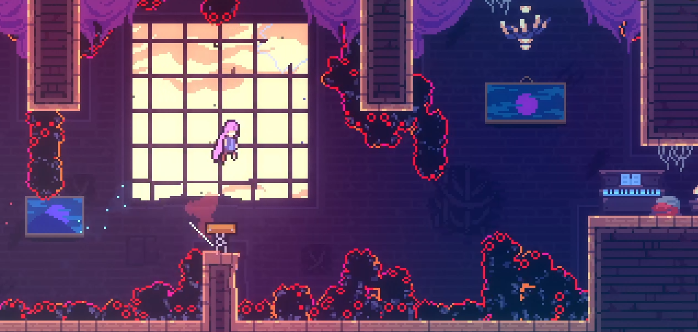
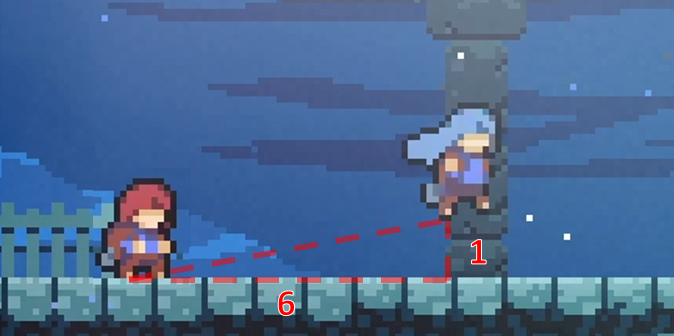

[back to main](https://github.com/kwan22/consistency/blob/main/README.md)

# The science of consistency

The following discusses some common patterns that I use in my own speedruns. The discussion will be highly technical, including frame data, pixel/speed values, inner game mechanics, etc. to justify the logic. That said, the recurring themes are 
1. Maximizing use of the game's leniency mechanics.
2. Eliminating variables to reduce input complexity and remove failure modes.
3. Making small time sacrifices to relax precision and/or simplify inputs.

- [Leniency](#leniency)

## Leniency

Leniency is a fundamental property of speedrunning and is commonly expressed in terms of a window: the range of timings or spacings you can perform an action and get the desired outcome. It is essentially a measure of your allowed margin for error. In Celeste speedrunning, frame windows are more prelevant than pixel windows, and many pixel windows are just translated into frame windows via speed. Not all frame windows of equal value are of the same difficulty. Context plays a major role in the perceived difficulty of a frame window. For example, extension timing is one of the easiest 5f windows to learn because the jump timing is anchored by the dash input. You are the one pressing dash, and then you learn the rhythm to press jump. However, hitting a random, unpracticed 5f window is quite difficult. 

More generally, a frame window becomes easier to learn if it is **normalized** by an anchor. For extension timing, the dash input is the normalization anchor. Other useful normalized timings might be max height and 12f jump. Visual cues are also a common anchor to tie down a frame window to something more tangible. With enough experience, you can project Madeline's motion to develop an intuition for when Madeline will reach a visual cue to guide your timing. Both visual cues and muscle memory can be combined as well. Transition buffering is a fundamental timing that is based on a visual cue of the screen scroll coming to a stop. Some might also just "feel out" the visual motion of the screen scroll as well. [Habits level 3](https://github.com/kwan22/habits/blob/main/level3.md#basic-leniency-and-normalization) showcases several examples that uses basic leniency and normalization techniques to enable movement options. Besides buffering, the game offers many other leniency mechanics, including coyote, cornercorrection/floorsnap, liftboost timer, to name a few. Without these, Celeste would be a much less forgiving game to play. These leniency mechanics frequently come into play in prescribing an RTA-viable frame window for many actions.

Some frame windows can be frustrating to deal with if not all frames within the window are equal. 5a archimedes is a classic example: there are 4 viable updash frames, but each one requires a different response. Frame windows are much nicer if every frame within gives the same outcome. I define some concepts about actions in general here:
- Convergent: small changes in the action result in the same outcome
- Divergent: small changes in the action propagate into different outcomes
  
Changes in action generally refer to differences in timing or spacing. These are essentially expressions of sensitivity: convergence means the outcome is insensitive to small changes in the action. This describes a more general concept of a frame window: the window defines how small those "small changes" need to be. Outside of the frame window, the outcome diverges into different possibilities. What makes Celeste movement so interesting in this regard is that  leniency mechanics combined with the discretization of the game physics may enable absolute convergence: different actions can converge onto the exact same game state. This enables some movement that may seem ridiculously precise to become RTA-viable. For this reason, I elected to use the term "convergence" over "sensitivity".

## Convergence
Normalization is a common way to approach convergence, and the two often go hand-in-hand. Transitions are the perhaps the best example, setting Madeline's position to exactly on the boundary and rounding off subpixels on both position and speed. Small differences in crossing a transition can converge onto the exact same game state. The normalizing properties of transitions enable many setups that would otherwise be difficult to make consistent. Bubbles also behave similarly, normalizing both x and y position and speed.

Convergence can still be achieved without a true normalization process, depending on the scope. Broadly, most continuous frame windows lend themselves to convergence, where each frame might be slightly different but sufficiently similar to make progress to the next sequence. Cornercorrection and floorsnapping often give sufficiently similar game states for many scenarios, but some exceptions exist due to particular geometries or subpixels. For example, cornercorrection is required to extend a 2-tile horizontal dash, while floorsnapping will fail to extend. Cornercorrection also does not round off subpixels, occasionally leading to some niche scenarios such as the 3a shaft demo in ARB. 

### Buffering
Buffering is perhaps the epitome of convergence: inputs of different timings generate the exact same result. While chains of consecutive buffers can quickly become complicated and arguably divergent, a low density of buffers showcase the concept of convergence quite well. Common, visually obvious examples include transition buffers, cb and cornerkick setups, and pause-buffering as a whole. 

DashCD is one of the less visually obvious mechanics but has incredible potential in creating buffer setups. Besides the strats the essentially require it, a lot of leniency on otherwise hard strats can be gained by putting yourself in a position to buffer out of DashCD. Setting up the positioning may cost a small amount of time, letting us play the speed vs precision tradeoff game. 
  
    

  Normally with a neutral transition super, the updash on this wallbounce is a 3f window. By carefully positioning the rightdash in the previous room, this updash can instead be transformed into a buffer (5f). Furthermore, there is a 1-1 correspondence between each of the possible updashes and the rightdashes upon transition (blue bar). With dash speed moving at 4 px/frame and 3 possible rightdashes (DashCD frames upon transition), there are thus 4 px/frame x 3 frames = 12 pixels from which the rightdash can be started and the updash is bufferable. The pixel window can be converted into a frame window assuming we are walking thru the window: with walking speed at 1.5 px/frame, it's an 8f window to time the rightdash.  
  
  Each of the colored red/green/yellow boxes corresponds to a rightdash+buffered updash pair. Dashing in the leftside red box means the buffered updash comes out on the rightside red box, etc. By starting the rightdash in the 12px window, we remove the failure mode of updashing too early. The updash itself is bufferable, but depending on where the rightdash is, the updash may have extra leniency frames. For example, if rightdashing from the left red box, the updash may be from the right red box (5f buffer), or it can also be slightly late: 1f late updashes on the right green box, 2f late updashes on the right yellow box. Rightdashing from the left yellow box has no added leniency frames beyond the buffer, as the 1st possible updash is also the last one. [Link to stratpost](https://discord.com/channels/403698615446536203/617809769322774533/1086837734607441931).

   

Coincidentally, the ultra of the coreblock in 8a-HOTM-H has almost exactly the same structure. It's a 3f window to downright after a buffered transition hyper to avoid negative liftboost. That 3f can then be transformed into a buffer out of DashCD by carefully starting the demo in a 12px window. I won't go thru all the details: it's mostly the same structure, but here the failure mode of not properly buffering the transition hyper is more relevant here that was less so in the 2500m ARB example above. The choice of demo vs downright matters here from a leniency perspective. Horizontal dashes move 4 px/frame, and a downright here would move ~3.4 px/frame. The higher speed from a horizontal dash effective expands the pixel range from which this concept works, i.e. the dash timing upon transition is less sensitive to a faster dash speed (see sensitivity analysis below for a more generalized form of this). [Link to stratpost](https://discord.com/channels/403698615446536203/617809769322774533/1380229565674164317).

  

This is not limited to transition buffers: we can apply the same principle to other dash tech, for example an instant hyper before transition, as seen in [habits level 4](https://github.com/kwan22/habits/blob/main/level4.md#dashcd). These also remove the variable of timing the buffered jump out of transition. 

  

A personal variation of mine is to use DashCD to control my speed entering the eyeball room of 5A. The room itself has many variations, and making the cycle requires good speed generation and preservation. Good speed generation means good Theo ultras, and good speed preservation, in practice, means fitting in has many bhops as possible. I particularly struggled with fitting in small bhops near the beginning, so instead I opted to line up my DashCD entering the eyeball room itself such that the first Theo ultra is as fast as possible given a buffered transition hyper into downright out of DashCD, and simplify the beginning of the room with just 1 big bhop (monkey brain hold jump) instead of 2 small bhops that can easily go wrong. In terms of speed generation, dashing from as far away as possible (entering with the lowest DashCD) leads to the least loss to air friction and consequently the fastest ultra upon a buffered downright. However in this case, the lip at the start of the eyeball room presents some complications. If DashCD is too low when entering eyeball room, there is not enough height+distance covered to avoid the lip with a buffered hyper+downright, resulting in a grounded ultra on the upper platform before Theo (sometimes it still works but I wouldn't count on it). 

I settled with aiming for DashCD(5) when entering eyeball room: DashCD(4) creates more speed and is easier to make the fast cycle, DashCD(3) is too far and runs into the grounded ultra issue, and DashCD(6) works but is just a tad more difficult. Recall that each dash timing corresponds to a 4px range of the starting demo because of the 4px/frame speed of the horizontal demo. To translate these numbers into something more practical: I aim to be near the left edge of the platform (red dashed line). A nice feedback cue is if I see the 2nd dash silhouette (indicated by the blue arrow) appear before transition: this indicates DashCD(5) or less. If I don't see the 2nd dash silhouette appear during transition, I am more mentally prepared to have less speed on the first Theo ultra. 

7b 0m spring

wavedash for height setup: 5a heart, 8a itc hyper cb, wave vs hyper meme

### The pre-transition hyper

Hypering just before a transition is highly convergent across different starting x-positions because of the structure of the hyper trajectory and the properties of transitions. Some seemingly pixel-perfect or subpixel-precise strats involving a hyper before transition frequently have a pixel range that are a multiple of 5 in which they work because this convergence.

  
Some numbers about hypers

  
  
  The hyper has a factor ~6 difference in horizontal vs vertical speed during the 12f of jump timer. The hyper moves about 5 px/frame horizontally, and air friction is small at the startup, decrementing the horizontal speed by about 1.5% per frame in the first several frames. On the other hand, the hyper moves less than 1 px/frame vertically (with no loss to gravity during jump timer). The consequence of this is that the hyper stays at the nearly the same x-speed and y-position over a large x-range. Horizontal transitions set Madeline to an exact x-position, and round off decimals (in px and px/s units) on y-position and both components of speed. The possible trajectories of a hyper upon transition are thus discretized and can be (almost) exactly prescribed based on horizontal distance from said transition. The discretization happens in steps of about every 5 pixels because hyper x-speed is ~5 px/frame. Increments in x-speed and y-pos are small, so adjacent hyper trajectories are frequently sufficiently similar to execute a strat. 

The plot below shows the possible hyper trajectories, y-position and x-speed (u), upon a horizontal transition as a function of distance from transition. Each step represents a frame, and all positions up to the next step converge to the exact same trajectory. This is the essence of sensitivity analysis. In this case, the outcomes (y, u) are weakly sensitive to the changes in action (x). In math speak, the sensitivity coefficients dy/dx and du/dx are small. 

  

  > In-game TAS tools can usually measure the hyper trajectory by seeing the DashCD or Jump timer values during transition as there is a 1-1 correspondence.

Many strats call for a jump release upon transition, which automatically converges y-speeds. Even for strats that do not release jump on transition, the y-speed will still be the same as long as jump timer is active until the next action. One caveat on the y-position is the possibility of y-subpixel offsets causing rounding differences, which shows up occasionally on a few strats but can be controlled with deliberate movement. 

    
  The movement to set up the downright cb in 2a-Intervention can be convergent across initial starting hyper positions. 10 px window implies 2 viable hyper trajectories. Incidentally, one of the hyper trajectories is more forgiving than the other, but both are sufficient to set up the rest of the strat with reasonable leniency. [Link to stratpost](https://discord.com/channels/403698615446536203/617809769322774533/1162859316479537265). 
  
    
  The first cb in 3b Start-2 has a 25 pixel range to get a good cb because of this convergence. There are 5 possible hypers to cross the transition (blue) and get a good cb, spread out across 25 pixels of initial x-pos (x0, red). For the outcome of "good first cb", the pre-transition hyper is highly convergent across different initial starting positions. That said, the following upright cb being successful has some divergence from x0 because of the slightly different speeds mattering. In general, the longer a sequence is, the more opportunities there are for divergence to arise, as small differences in intial conditions propagate to increasingly larger changes in outcomes. Thankfully, Celeste provides many anchors for normalization, making chaining many short sequences amenable to convergence. [Link to stratpost](https://discord.com/channels/403698615446536203/617809769322774533/1232274832390098974).
  
    
  Fastfalling directly into the 1st bumper in 6b Reprieve-3 seems absolutely insane without the right setup. Fortunately, we have our friend, the convergent pre-transition hyper, to help us out. Incidentally, optimal movement at the end of Reprieve-2 sets this up perfectly: buffered rightdash out of Badeline recoil sets us up on the left edge of the 5 pixel window of the winning hyper trajectory. That said, because the landing is on the left edge, there is some room to the right of the optimal landing that is still viable. For example, sliding forward slightly on landing via being late on buffering instant hyper (up to 3f) still gives the exact same hyper trajectory. Not that a speedrunner should be aiming for this, it is just a leniency that exists. The more speedrunner-relevant consequence is that differences in Badeline recoil between entry and death can be resolved by simply not fastfalling after the rightdash, as not fastfalling lands us slightly further to the right but still within the 5px window. [Link to stratpost](https://discord.com/channels/403698615446536203/1137847274609848463/1137847278363738233). 

    
  A personal variation I haven't seen anyone else do: I find a pre-transition hyper to be much more consistent in setting up the cornerslip than transition hyper. While transition hypers are well-known for their normalization properties, a major variable in using a transition hyper here is the jump release timing. Pre-transition hyper shifts the variance from jump release timing to hyper positioning, which as we've been saying, is highly convergent. More speed loss to air friction also may mean a larger window for the cornerslip itself. All this may be at the cost of a few frames compared to the transition hyper. In general, the transition hyper is amazing on horizontal convergence, but less so on vertical for short hypers, as each frame of jump release gives a different outcome (e.g. the landing position for the bhop on this strat). The pre-transition hyper suffers a small loss of horizontal convergence, but is far more vertically convergent for short hypers. The rest of the strat still has its difficulties, but I find this variation more accessible.

  
Sensitivity analysis: a comparison between hypers and supers (warning: calculus)

  In general, the sensitivity coefficient is expressed as a derivative of the outcome with respect to the input (action). With the power of calculus, we can quickly do this sensitivity analysis of the hyper trajectory (y and u) to initial starting position (x) without jumping through all the hoops of graphs and long-winded explanations. Let v = y-speed = dy/dt, u = x-speed = dx/dt

  dy/dx = dy/dt  * dt/dx  
  dy/dt = v, dt/dx = 1/u  
  dy/dx = v/u

  du/dx = du/dt * dt/dx  
  du/dt is just air friction, which is a constant  
  du/dx ~ 1/u

  This is all just a concise, mathematical way of expressing all the numbers I was discussing earlier. Comparing hypers and supers, hypers have lower v and higher u, so it can be easily seen that dy/dx and du/dx are larger for supers compared to hypers, thus one can expect pre-transition supers to be more sensitive (less convergent) on starting x-position. The main missing piece of this analysis is the rounding and discretization that happens on transition that enables certain strats. There are a few spots where pre-transition supers enable certain strats, though these are less common than their hyper counterparts.

  
  
  

### Half-gravity

  

Half-gravity can expand convergence by extending the duration Madeline exists at a given y-position. This typically manifests in line-ups with max-height jumps, e.g. 3a shaft demo and a whole class of demos out of a max height hyper. Certain actions and interactions apply autojump as well, that act as if we are holding jump to give us half-grav whether we want to or not. Fundamentally, half-gravity can improve frame-windows by keeping us in the same y-position for an extended period of time. On the other hand, half-gravity can be detrimental sometimes, by introducing deadframes on some strats, or more fundamentally, adding unnecessary airtime. [Avoiding half-gravity can also be convergent on jumps and wallbounces,](https://www.youtube.com/watch?v=82gpR9rozdE), where releasing jump on different frames gives the exact same trajectory. A good deal of RTA movement optimization comes from putting yourself in a position to enjoy the luxury of a convergent jump release timing. For a speedrunner's perspective, the main takeaway is "just hold jump" to use half-gravity, or "find the 6f+ jump release window" to avoid half-gravity with convergence. 

## Divergence

Divergence is often difficult to deal with, but is sometimes manageable, such as the aforementioned 5a archimedes. High-speed (grounded ultra) coyote often lends itself to divergence: the strat requires high-speed to enable longer-distance coyote, but the high speed inherently spreads out your possible trajectories (2a start under). In some cases, the different trajectories are reactable (5a rescue). In general, high-speed movement inherently lends itself quickly to divergence because each subsequent frame leads to a large change in game state by definition of high speed.

In the name of consistency, the general goal is to mitigate divergence as much as possible, usually by a setup that costs a small bit of time. One way to mitigate divergence is to slow down to expand a frame window. Releasing forward to slow down to create a larger framewindow for a wallbounce (or other similar actions) can itself be divergent though: releasing forward at different times ends up with different viable timings for the updash. However, there are many ways to slow down to increase a frame window in a more normalized manner. 

Case study: 5a start forward wave

1a zkad route wave?

4a granny ultra

3a towels wallkick

3a final transition hyper

Dash attack leniency

3a shaft

7a flag 1

6b multiboost: convergent jump release on dash crystal freeze frame

3a hub2

Buffer chains, 7arb 1500m triple demo, yujene depths final spam
