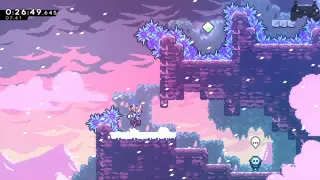
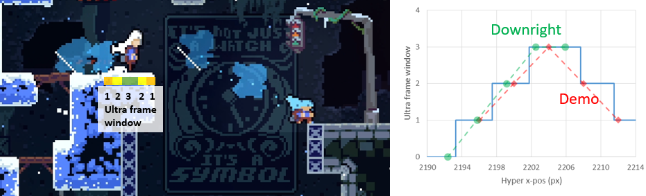

[back to main](https://github.com/kwan22/consistency/blob/main/README.md)

# The science of consistency

The following discusses some common patterns that I use in my own speedruns. The discussion will be highly technical, including frame data, pixel/speed values, inner game mechanics, etc. to justify the logic. That said, the recurring themes are 
1. Maximizing use of the game's leniency mechanics.
2. Understanding the variables that your objective is most sensitive to.
3. Eliminating variables to reduce input complexity and remove failure modes.
4. Making small time sacrifices to relax precision and simplify inputs.

Many examples are provided and discussed in great technical detail. These details are provided to illustrate the kinds of patterns I like to look for and apply to my own gameplay.

- [Leniency and convergence](#leniency-and-convergence)
- [Buffering and DashCD](#buffering-and-dashcd)
- [Pre-transition hyper](#Pre-transition-hyper)
- [Half gravity](#half-gravity)
- [Mitigating divergence](#mitigating-divergence)
- [Dash attack leniency](#dash-attack-leniency)
- [Buffer chains](#buffer-chains)

## Leniency and convergence

Leniency is a fundamental property of speedrunning and is commonly expressed in terms of a window: the range of timings or spacings you can perform an action and get the desired outcome. It is essentially a measure of your allowed margin for error. In Celeste speedrunning, frame windows are more prelevant than pixel windows, and many pixel windows are just translated into frame windows via speed. Not all frame windows of equal value are of the same difficulty. Context plays a major role in the perceived difficulty of a frame window. For example, extension timing is one of the easiest 5f windows to learn because the jump timing is anchored by the dash input. You are the one pressing dash, and then you learn the rhythm to press jump. However, hitting a random, unpracticed 5f window is quite difficult. 

More generally, a frame window becomes easier to learn if it is **normalized** by an anchor. For extension timing, the dash input is the normalization anchor. Other useful normalized timings might be max height and 12f jump. Visual cues are also a common anchor to tie down a frame window to something more tangible. With enough experience, you can project Madeline's motion to develop an intuition for when Madeline will reach a visual cue to guide your timing. Both visual cues and muscle memory can be combined as well. Transition buffering is a fundamental timing that is based on a visual cue of the screen scroll coming to a stop. Some might also just "feel out" the visual motion of the screen scroll as well. [Habits level 3](https://github.com/kwan22/habits/blob/main/level3.md#basic-leniency-and-normalization) showcases several examples that uses basic leniency and normalization techniques to enable movement options. Besides buffering, the game offers many other leniency mechanics, including coyote, cornercorrection/floorsnap, liftboost timer, to name a few. Without these, Celeste would be a much less forgiving game to play. These leniency mechanics frequently come into play in prescribing an RTA-viable frame window for many actions.

Some frame windows can be frustrating to deal with if not all frames within the window are equal. Frame windows are much nicer if every frame within gives the same outcome. I define some concepts about actions in general here:
- Convergent: small changes in the action result in the same outcome
- Divergent: small changes in the action propagate into different outcomes  
  
Changes in action generally refer to differences in timing or spacing. These are essentially expressions of sensitivity: convergence means the outcome is insensitive to small changes in the action. This describes a more general concept of a frame window: the window defines how small those "small changes" need to be. Outside of the frame window, the outcome diverges into different possibilities. What makes Celeste movement so interesting in this regard is that leniency mechanics combined with the discretization of the game physics may enable absolute convergence: different actions can converge onto the exact same game state. This enables some movement that may seem ridiculously precise to become RTA-viable. For this reason, I elected to use the term "convergence" over "sensitivity".

    
>5a "Archimedes": the updash is a 4f window, but each frame requires a different follow-up.

Normalization is a common way to approach convergence, and the two often go hand-in-hand. Transitions are the perhaps the best example, setting Madeline's position to exactly on the boundary and rounding off subpixels on both position and speed. Small differences in crossing a transition can converge onto the exact same game state. The normalizing properties of transitions enable many setups that would otherwise be difficult to make consistent. Bubbles also behave similarly, normalizing position and speed and having a well-determined trajectory.

Convergence can still be achieved without a true normalization process, depending on the scope. Broadly, most continuous frame windows lend themselves to convergence, where each frame might be slightly different but sufficiently similar to make progress to the next sequence. Cornercorrection and floorsnapping often give sufficiently similar game states for many scenarios, but some exceptions exist due to particular geometries or subpixels. For example, cornercorrection is required to extend a 2-tile horizontal dash, while floorsnapping will fail to extend. Cornercorrection also does not round off subpixels, occasionally leading to some niche scenarios such as the 3a shaft demo in ARB. 

---

## Buffering and DashCD
Buffering is perhaps the epitome of convergence: inputs of different timings generate the exact same result. While chains of consecutive buffers can quickly become complicated and arguably divergent, sparse buffers showcase the concept of convergence quite well. Common, visually obvious examples include transition buffers, cb and cornerkick setups, and pause-buffering. 

DashCD is one of the less visually obvious mechanics but has incredible potential in creating buffer setups. Besides the strats that essentially require it, a lot of leniency on otherwise hard strats can be gained by putting yourself in a position to buffer out of DashCD. Setting up the positioning may cost a small amount of time, opening an avenue to play the speed vs precision tradeoff game. Below are some examples where understanding DashCD is useful.

---

    
> The faster you are moving, the less time you spend in a spatial window, and more precise it becomes to act within that spatial window. The plot shows the average frame window for hitting a wallbounce as a function of horizontal speed. Colored regions indicate nominal values for typical movement options.

  Normally with a neutral transition super, the updash on this wallbounce in the berry route of 2500m is a 3f window. By carefully positioning the rightdash in the previous room, this updash can instead be transformed into a buffer (5f). Furthermore, there is a 1-1 correspondence between each of the possible updashes and the rightdashes upon transition (blue bar). With dash speed moving at 4 px/frame and 3 possible rightdashes (DashCD frames upon transition), there are thus 4 px/frame x 3 frames = 12 pixels from which the rightdash can be started and the updash is bufferable. The pixel window can be converted into a frame window assuming we are walking thru the window: with walking speed at 1.5 px/frame, it's an 8f window to time the rightdash.  
    
  
  Each of the colored red/green/yellow boxes corresponds to a rightdash+buffered updash pair. Dashing in the leftside red box means the buffered updash comes out on the rightside red box, etc. By starting the rightdash in the 12px window, we remove the failure mode of updashing too early. The updash itself is bufferable, but depending on where the rightdash is, the updash may have extra leniency frames. For example, if rightdashing from the left red box, the updash may be from the right red box (5f buffer), or it can also be slightly late: 1f late updashes on the right green box, 2f late updashes on the right yellow box. Rightdashing from the left yellow box has no added leniency frames beyond the buffer, as the 1st possible updash is also the last one. [Link to stratpost](https://discord.com/channels/403698615446536203/617809769322774533/1086837734607441931).

---

Coincidentally, the ultra off the coreblock in 8a-HOTM-H has almost exactly the same structure as the 2500m ARB example above. It's a 3f window to downright after a buffered transition hyper to avoid negative liftboost. That 3f can then be transformed into a buffer out of DashCD by carefully starting the demo in a 12px window. I won't rehash all the details as it's similar to above, but I will mention some nuances. The failure mode of not properly buffering the transition hyper is more relevant here compared to the 2500m ARB example above. The choice of demo vs downright also matters from a leniency perspective. Horizontal dashes move 4 px/frame, and a downright moves ~3.4 px/frame. The higher speed from a horizontal dash effectively expands the pixel range over which this concept works, i.e. the dash timing upon transition is less sensitive to starting position when the dash speed is faster (see sensitivity analysis below for a more generalized form of this). [Link to stratpost](https://discord.com/channels/403698615446536203/617809769322774533/1380229565674164317).  
   

  

> The same principle applies to other dash tech. These downrights can be made much more lenient by starting the instant hyper before transition from the right spot.

---

  
> Speed of a buffered grounded ultra as a function of jump timing on a hyper. DashCD 1-5 is extension timing, over which there is a range of 20 speed. That is half the difference between a good and bad cb, usually not too consequential but can propagate to large differences when carrying that speed over great distances like in the eyeball room.

Controlling DashCD is useful to control speed on a grounded ultra. I use DashCD to control my speed at the start of the eyeball room of 5A. The most normalized entry for the eyeball room is to transition hyper and buffer a downright, but the speed of the buffered downright and ensuing Theo ultra depend on how much DashCD remains upon entering the room. Making the cycle requires good speed generation and preservation. Good speed generation means good Theo ultras, and good speed preservation, in practice, means fitting in has many bhops as possible. I particularly struggled with fitting in small bhops near the beginning, so instead I opted to line up my DashCD entering the eyeball room itself such that the first Theo ultra is as fast as possible given a buffered transition hyper into downright out of DashCD, and simplify the beginning of the room with just 1 big bhop instead of 2 small bhops that can easily go wrong. In terms of speed generation, dashing from as far away as possible (entering with the lowest DashCD) leads to the least loss to air friction and consequently the fastest ultra upon a buffered downright. However in this case, the lip at the start of the eyeball room presents some complications. If DashCD is too low when entering eyeball room, there is not enough height+distance covered to avoid the lip with a buffered hyper+downright, resulting in a grounded ultra on the upper platform before Theo (sometimes it still works but I wouldn't count on it).  
  

I settled with aiming for DashCD(5) when entering eyeball room: DashCD(4) creates more speed and is easier to make the fast cycle, DashCD(3) is too far and runs into the grounded ultra issue, and DashCD(6) works but is just a tad more difficult. Incidentally, DashCD(4) and over are also allowed to be slightly late on buffering the transition hyper, adding a hair of leniency on that end. Recall that each dash timing corresponds to a 4px range of the starting demo because of the 4px/frame speed of the horizontal demo. To translate these numbers into something more practical: I aim to be near the left edge of the platform (red dashed line). A nice feedback cue is if I see the 2nd dash silhouette (indicated by the blue arrow) appear during the transition screen roll: this indicates DashCD(5) or less. If I don't see the 2nd dash silhouette appear during transition, I am more mentally prepared to have less speed on the first Theo ultra. A critical side effect is that by aiming for a particular DashCD, I am reducing the possible initial trajectories I will have at the start of the eyeball room. 

---

 

Wavedashes present a way to control the timing of a hyper. As much as wavedash.ppt is criticized for being wrong, there is a useful consequence of starting the downdiagonal from midair: the hyper cannot come out until Madeline reaches the ground. This means with some careful positioning, we can design the a buffered wave to give us a particular extension frame, or more generally, DashCD. This can be used to normalize trajectories. Incidentally, wavedashing on a max height jump gives DashCD(1) on the hyper, meaning in principle we can access any DashCD with a buffered wave by jumping from flat ground.  
   
> Using a wave makes these hypers bufferable and perfectly convergent. If they were to start from the ground, they would be frame-perfect ([5a](https://discord.com/channels/403698615446536203/617809769322774533/1300619075344535604)), or have otherwise terrible frame data ([8arb](https://discord.com/channels/403698615446536203/617809769322774533/1229338086454988860)).

---

## Pre-transition hyper

Hypering just before a transition is highly convergent across different starting x-positions because of the structure of the hyper trajectory and the properties of transitions. Some seemingly pixel-perfect or subpixel-precise strats involving a hyper before transition frequently have a pixel range that are a multiple of 5 in which they work because this convergence.

  
  The hyper has a factor ~6 difference in horizontal vs vertical speed during the 12f of jump timer. The hyper moves about 5 px/frame horizontally, and air friction is small at the startup, decrementing the horizontal speed by about 1.5% per frame in the first several frames. On the other hand, the hyper moves less than 1 px/frame vertically (with no loss to gravity during jump timer). The consequence of this is that the hyper stays at the nearly the same x-speed and y-position over a large x-range. Horizontal transitions set Madeline to an exact x-position, and round off decimals (in px and px/s units) on y-position and both components of speed. The possible trajectories of a hyper upon transition are thus discretized and can be (almost) exactly prescribed based on horizontal distance from said transition. 

The plot below shows the possible hyper trajectories, y-position and x-speed (u), upon a horizontal transition as a function of distance from transition. Each step represents a frame, and all positions up to the next step converge to the exact same trajectory. The outcomes (y, u) are weakly sensitive to the changes in action (x). In math speak, the sensitivity coefficients dy/dx and du/dx are small. The consequence of this is that pre-transition hyper trajectories are discretized such that they increment every ~5 pixels away from transition. Because of the low sensitivity, adjacent hyper trajectories are often similar enough where many strats work across multiple 5-pixel windows.  
    
  > In-game TAS tools can usually measure the hyper trajectory by seeing the DashCD or Jump timer values during transition as there is a 1-1 correspondence.
 
Transitions as a mechanic introduce a **spatial convergence** of trajectories, which is especially noticeable for hypers: different spacings give the exact same result. By comparison, buffering as a mechanic introduces a **temporal convergence** of inputs: different timings of button presses give the exact same result. Buffered transition hypers exhibit both spatial and temporal convergence: I won't go over them here because of how common they are. Pre-transition hypers are especially useful on temporally converging a jump release, which a transition hyper lacks. Many strats call for a jump release upon transition, which automatically converges y-speeds. Even for strats that do not release jump on transition, the y-speed will still be converged as long as jump timer is active until the next action. Below shows examples where such pre-transition hypers are useful.

---
  
  Fastfalling directly into the 1st bumper in 6b Reprieve-3 seems absolutely insane without the right setup. Fortunately, the pre-transition hyper works wonders to help us out. Incidentally, optimal movement at the end of Reprieve-2 sets this up perfectly: buffered rightdash out of Badeline recoil sets us up on the left edge of the 5 pixel window of the winning hyper trajectory. That said, because the landing is on the left edge, there is some room to the right of the optimal landing that is still viable. The consequence of this is that differences in Badeline recoil between entry and death can be resolved by simply not fastfalling after the rightdash, as slowfalling lands us slightly further to the right but still within the 5px window. Slowfalling works for both entry and death, while fastfalling is a frame faster but works only on entry. [Link to stratpost](https://discord.com/channels/403698615446536203/1137847274609848463/1137847278363738233).  
    

   
  > Hypers from 2 different initial positions that reach the transition at the same time converge onto the exact same trajectory. 

---

  The movement to consistently set up the downright cb in Intervention can be traced all the way back to the end of the previous room. There are 2 viable hyper trajectories on transition, thus a 10px window for the exiting hyper. Incidentally, one of the hyper trajectories is more forgiving than the other, but both are sufficient to set up the rest of the strat with reasonable leniency. [Link to stratpost](https://discord.com/channels/403698615446536203/617809769322774533/1162859316479537265).  
  

---

  The first cb in 3b Start-2 has a ~25 pixel range (red box) to get a good cb. There are 5 possible hypers to cross the transition (blue) and get a good cb, spread out across ~25 pixels of initial x-pos (x0, red). For the outcome of "good first cb", the pre-transition hyper is highly convergent across different initial starting positions. That said, the following upright cb being successful has some sensitivity to x0 because of the slightly different speeds mattering. In general, the longer a sequence is, the more opportunities there are for divergence to arise, as small differences in intial conditions propagate to increasingly larger changes in outcomes. Thankfully, Celeste provides many anchors for normalization, making chaining many short sequences amenable to convergence. [Link to stratpost](https://discord.com/channels/403698615446536203/617809769322774533/1232274832390098974).  
   

---

  I find a pre-transition hyper to be much more consistent in setting up the cornerslip than transition hyper. While transition hypers are well-known for their normalization properties, a major variable in using a transition hyper here is the jump release timing. Pre-transition hyper shifts the variance from jump release timing to hyper positioning, which I can take a moment to aim for if I so choose. More speed loss to air friction also may mean a larger window for the cornerslip itself. All this may be at the cost of a few frames compared to the transition hyper. In general, the transition hyper is amazing on horizontal convergence, but less so on vertical where a short hyper is required, as each frame of jump release gives a different outcome (e.g. the landing position for the bhop on this strat). The pre-transition hyper suffers a small loss of horizontal convergence, but is far more vertically convergent for short hypers. The rest of the strat still has its difficulties, but I find this variation more accessible.  
   

---

  
Sensitivity analysis

  In general, the sensitivity coefficient is expressed as a derivative of the outcome with respect to the input. High sensitivity = high divergence = bad. We can perform sensitivity analysis of the hyper trajectory (y and u) to initial starting position (x) without jumping through all the hoops of graphs and long-winded explanations. Let v = y-speed = dy/dt, u = x-speed = dx/dt. The sensitivity coefficients dy/dx and du/dx are thus

  dy/dx = dy/dt * dt/dx  
  dy/dt = v, dt/dx = 1/u  
  dy/dx = v/u

  du/dx = du/dt * dt/dx  
  du/dt is air friction, which is a constant  
  du/dx ~ 1/u

  This is all just a concise, mathematical way of expressing all the numbers I was discussing earlier. Comparing hypers and supers, hypers have lower v and higher u, so dy/dx and du/dx are larger for supers compared to hypers. One can expect pre-transition supers to be more sensitive (less convergent) on starting x-position. The main missing piece of this analysis is the rounding and discretization that happens on transition that enables certain strats, but this reflects the overall trend. There are a few spots where pre-transition supers enable certain strats, though these are less common than their hyper counterparts, mainly due to level layouts generally being more conducive to hypers over supers.  
   

  The outcome of the pre-transition hyper is really the timing upon hitting transition (t) which uniquely determines y and u, and the input is the spacing from transition (x). Notice that the dt/dx term appears in both dy/dx and du/dx. This is distinctly different than the wallbounce vs horizontal speed example earlier. In the wallbounce vs speed example, the outcome is position (x), and the input is the timing of the updash (t), so the sensitivity coefficient is dx/dt = u: faster speed = more sensitive to timing = bad. It's important to understand what your outcomes and inputs are when looking at a sensitivity analysis.
  

---

## Half-gravity

      
  > Half-gravity can be either helpful or harmful for precise vertical positioning.

Half-gravity can expand convergence by extending the duration Madeline exists at a given y-position. This typically manifests in line-ups with max-height jumps, e.g. 3a shaft demo and a whole class of demos out of a max height hyper. Certain actions and interactions apply autojump as well, that act as if we are holding jump to give us half-grav whether we want to or not. Fundamentally, half-gravity can improve frame-windows by keeping us in the same y-position for an extended period of time. On the other hand, half-gravity can be detrimental sometimes, by introducing deadframes on some strats, or more fundamentally, adding unnecessary airtime. [Avoiding half-gravity can also be convergent](https://www.youtube.com/watch?v=82gpR9rozdE), where releasing jump on different frames gives the exact same trajectory if timed correctly. A good deal of RTA movement optimization comes from putting yourself in a position to enjoy the luxury of a convergent jump release timing. For a speedrunner's perspective, the main takeaway is "just hold jump" to use half-gravity, or "find the 6f+ jump release window" to avoid half-gravity. 

The movement in this 3b start room hinges heavily on convergence. The first downwards cb by the spinners is set up with a buffered wallkick that induces ForceMove (more on this later). The last climbjump by the spikes is set up in a normalized manner, with a wide window for jump release that includes an even more lenient version of the 6f jump release window to mitigate half gravity. [Link to stratpost](https://discord.com/channels/403698615446536203/617809769322774533/1380402607612231783)  

## ForceMove

The main feature of ForceMove is that we lose horizontal aerial control and, barring an interruption like a dash, we are "forced" to travel along a specified horizontal trajectory. Typical sources of ForceMove are wallkicks (10f) and springs (18f). The first notable consequence for wallkicks is that holding into and holding away from a wall for a walljump are equivalent: it can be helpful to preferentially hold in towards walls by default for wallkicks to avoid accidental wallboosts, drifting away from walls before getting the wallkick, or to not lose horizontal speed when aiming to buffer a wallkick while approaching said wall (e.g. the 3b start example above). 

Because the horizontal trajectory is forced, it is also normalized horizontally (wallkick leniency can add variance but is usually negligible outside of a few specific strats). There are many situations where once we enter ForceMove state, we can simply ride the ForceMove and focus our attention elsewhere, frequently a dash in a different direction. As a bonus, the risk of misdash can be mitigated by preloading the direction we need to dash in long before we actually dash in that direction. Increased air friction from releasing forward is also frequently irrelevant (e.g. if bottleneck is vertical), and the horizontal deceleration can help with precise horizontal positioning. 

Some strats rely on the properties of ForceMove to be set up precise positioning.  
 

Some spots where I let ForceMove carry me to reduce misdash risk and/or make a horizontal positioning easier at virtually no timeloss.  
      
    

A max height jump and max height wallkick makes the first horizontal demo on 7a Flag 17 much more lenient. In this instance, going neutral during ForceMove from the wallkick eliminates the possibility of being too far and crashing into the ceiling spinners. Acting at the peak of each jump gives a consistent, sufficiently converged starting point for the first upright dash. The demo usually ends up being a 5f window. All this is at the cost of a fraction of the timesave compared to doing an upright instead of horizontal.   

---

## Mitigating divergence

Divergence usually manifests as a small/discontinuous frame window, or one where different sections of a frame window require different follow-ups. These are often difficult to deal with. High-speed (grounded ultra) coyote often lends itself to divergence: the strat requires high-speed to enable longer-distance coyote, but the high speed inherently spreads out your possible trajectories. For the under strat in 2a-start, the grounded ultra travels at about 6.5 px/frame. In theory there are up to 3 possible coyote hyper frames that are viable for the under strat, but these are spread out over almost 20 pixels. The end result is that the frame window for the upright is directly dependent on which coyote frame was reached. The first possible coyote frame gives a 1f window for the upright, the 2nd a 2f, and the 3rd (last) frame a 3f window.  
  

In some cases, the divergence is acceptable and reactable. For this high-speed strat in 5a Rescue, there are 4 viable coyote jump frames, but frames 1-2 and 3-4 require different responses. The major challenge here is reacting to which set you get. While you have over half a second to decide (during transition), it is certainly not easy to tell, especially with Madeline moving so fast and the 2nd/3rd frame looking similar to each other.  
       
     

The goal is to mitigate divergence as much as possible, usually by a setup that costs a small bit of time. One way to mitigate divergence is to slow down to expand a frame window. Releasing forward to slow down to create a larger framewindow, say for a wallbounce, can itself be divergent though: releasing forward at different times ends up with different viable timings for the updash. However, there are many ways to slow down to increase a frame window without increasing divergence. Below are several examples that I use.

---

  The spring skip sequence of Zkad route in 1a begins with an extended hyper into an unbuffered ultra. The leniency on the ultra is purely dependent on where the hyper is actually initiated (blue curve), and can be up to 3f. The fastest option is to demohyper after coming out of the hidden section, but this generally leaves getting a 3f ultra a 1f extension window (red points, assuming optimal demohyper). Because the downright is slower, it has a higher chance of staying in the 6px window that gives a 3f ultra for longer (and usually does). To put the plot below into words, for the 5f extension window, the nominal extension frame windows to get a 3f ultra are:
- Demo: 1/2/3/2/1
- Downright: 0/1/2/3/3

  
> Leniency of the ultra as a function of hyper position (blue) and nominal trajectories of the 5 extension frames of a demo (red) or downright (green) leading into the hyper and their corresponding frame window.
  
A demohyper has a 1f extension window to hit the 3f zone, and downright has a 2f extension window. In this particular case, it is just kind of unlucky that the demohyper does not get a 2f extension for the 3f ultra. If we were to start from a random position within range and aiming to hit an extension window within this arbitrary pixel window (~6), a demohyper would have a 74% chance of having a 2f extension window for the 3f ultra, and a downright hyper would have an 88% chance. The whole idea of slowing down is to improve our odds of getting good frame data, so to speak. In this case, the method to slow down is consistent, unlike the earlier example about releasing forward to line up a wallbounce. 

---

Case study: 5a start forward wave

3a final transition hyper

3a hub2

## Dash attack leniency

lakeskip

3a shaft

7a flag 1

6b multiboost: convergent jump release on dash crystal freeze frame

## Buffer chains

4arb slip n slide

7arb 1500m triple demo

yujene depths final spam
