[back to science](https://github.com/kwan22/consistency/blob/main/science.md)

# Buffering and DashCD

  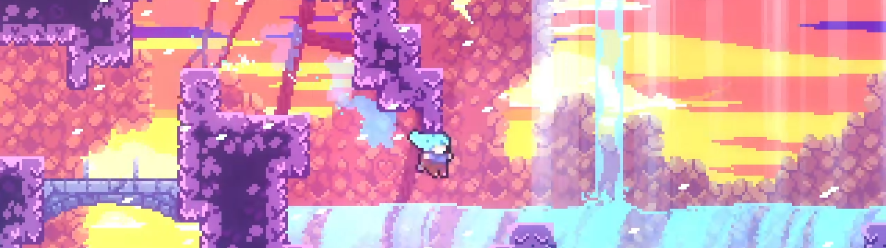  

  Buffering is perhaps the epitome of convergence: inputs of different timings generate the exact same result. While chains of consecutive buffers can quickly become complicated and arguably divergent from a human perspective (more about this later), sparse buffers showcase the concept of convergence quite well. Common, visually obvious examples include transition buffers, cb and cornerkick setups, and pause-buffering. 

  DashCD is one of the less visually obvious mechanics but has incredible potential in creating buffer setups. Besides the strats that essentially require it, a lot of leniency on otherwise hard strats can be gained by putting yourself in a position to buffer out of DashCD. Setting up the positioning may cost a small amount of time, opening an avenue to play the speed vs precision tradeoff game. In other cases, carefully designing the buffer leniency enables us to mitigate divergence in situations where small differences in extension timing can have significant impact. Below are some examples where understanding DashCD is useful.

## Table of contents
- [DashCD position setups](#dashcd-position-setups)
- [Converging extension timings](#converging-extension-timings)
- [Buffer chains](#buffer-chains)

---

## DashCD position setups

Summary: some precise (1-3f window) inputs are transformed into a 5f or larger window by designing a convergent leniency mechanic (buffering) to overlap with the target window.

  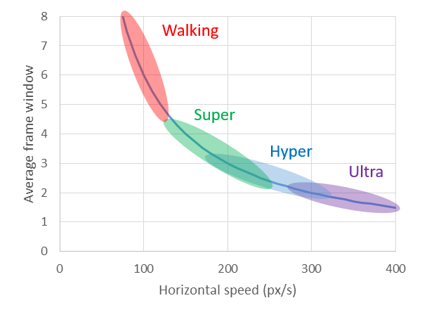  
> The faster you are moving, the less time you spend in a spatial window, and more precise it becomes to act within that spatial window. The plot shows the average frame window for hitting a wallbounce as a function of horizontal speed. Colored regions indicate nominal values for typical movement options.

  Normally with a neutral transition super, the updash on this wallbounce in the berry route of 2500m is a 3f window. By carefully positioning the rightdash in the previous room, this updash can instead be [transformed into a buffer out of DashCD](https://discord.com/channels/403698615446536203/617809769322774533/1086837734607441931). This is done by rightdashing from a prescribed position such that transition is reached at a target DashCD. Furthermore, there is a 1-1 correspondence between each of the possible updashes and the DashCD on transition. With dash speed moving at 4 px/frame and 3 possible rightdashes, there are thus 4 px/frame x 3 frames = 12 pixels from which the rightdash can be started and the updash is bufferable. The pixel window can be converted into a frame window assuming we are walking thru the window: with walking speed at 1.5 px/frame, it's an 8f window to time the rightdash.  
  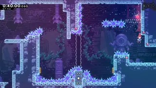 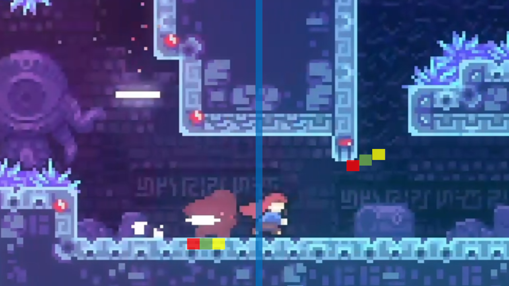  
  > A 3f updash turns into a ~6f with the right setup. The transition is marked by the blue bar, colored boxes highlight initial rightdash positions (referenced to Madeline's center) that lead to a corresponding buffered updash.
  
  Each of the colored red/green/yellow boxes corresponds to a rightdash+buffered updash pair. Dashing in the 1st red box means the buffered updash comes out on the 2nd red box, etc. By starting the rightdash in the 12px window, we remove the failure mode of updashing too early. The updash itself is bufferable, but depending on where the rightdash is, the updash may have extra leniency frames. For example, if rightdashing from the 1st red box, the updash is allowed to be slightly late: 1f late updashes on the green box, 2f late updashes on the yellow box. Rightdashing from the 1st yellow box has no added leniency frames beyond the buffer, as the 1st possible updash is also the last one.

---

  Coincidentally, the ultra off the coreblock in 8a-HOTM-H has almost exactly the same structure as the 2500m ARB example above. It's a 3f window to downright after a buffered transition hyper to avoid negative liftboost. That 3f can then be [transformed into a buffer out of DashCD](https://discord.com/channels/403698615446536203/617809769322774533/1380229565674164317) by carefully starting the demo in a 12px window. I won't rehash all the details as it's similar to above, but I will mention some nuances. The failure mode of not properly buffering the transition hyper is more relevant here compared to the 2500m ARB example above. The choice of demo vs downright also matters from a leniency perspective. Horizontal dashes move 4 px/frame, and a downright moves ~3.4 px/frame. The higher speed from a horizontal dash effectively expands the pixel range over which this concept works, i.e. the dash timing upon transition is less sensitive to starting position when the dash speed is faster (see sensitivity analysis below for a more generalized form of this).  
  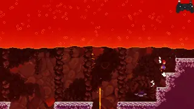  
  > Another 3f becomes a ~6f.

The same principle applies to other dash tech. These downrights can be made much more lenient by starting the instant hyper before transition from the right spot.  
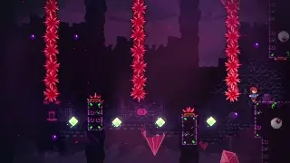 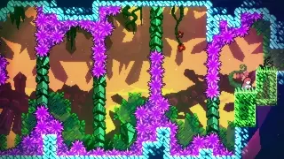  
> For these particular strats, hold jump until the buffered dash out of DashCD.

---

## Converging extension timings

Summary: some target extension frames can be turned into a buffer to optimize and/or normalize trajectories and mitigate divergence stemming slightly different extension timings.

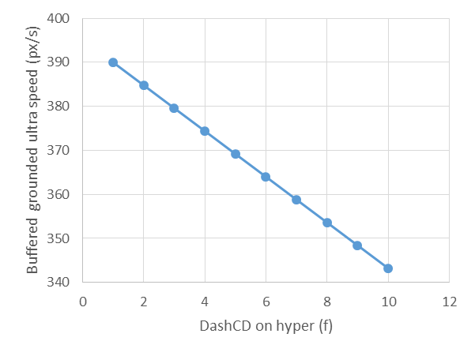  
> Speed of a buffered grounded ultra as a function of jump timing on a hyper. DashCD 1-5 is extension timing, with DashCD(1) being the last extension frame. There is a range of ~21 px/s on the buffered grounded ultra speed over the extension timing window. That is half the difference between a good and bad cb, usually inconsequential and compensated by reaching hyper-speed earlier, but can propagate to noticeable differences when carrying that speed over great distances like in the eyeball room. 

  Controlling extension timing is important for achieving different kinds of trajectories. In general, for a short-range horizontal speed burst (e.g. hyper bhop), it's fastest to jump early in the extension to reach hyper-speed earlier. For carrying speed over longer distances (e.g. ultras), jumping later on extension is faster due to keeping a higher speed from less air friction losses, propagating to a larger 1.2x multiplier on ultras as well.

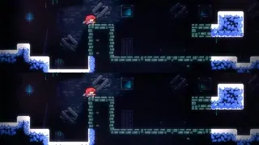 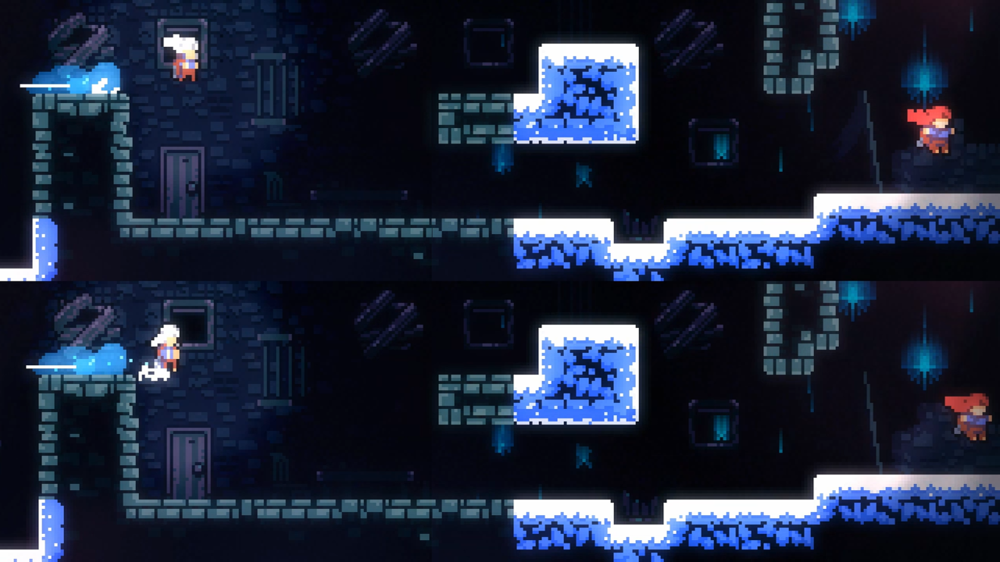  
> Comparison of a canonical ultra between a first and last extension frame hyper into buffered downdiagonal. The upper animation/image shows a first frame extension, and the lower animation/image shows a last frame extension. The 1st frame extension gets the earlier speed burst and is initially faster, but last frame extension retains higher speed over longer distances. The left side of the image is sampled at t=15f, and the right is sampled at t=59f, where t=0 is the start of the first dash.
  
  Differences in extension timing may not always be relevant in terms of determing success vs failure of a strat, and are generally more important for intrinsic movement optimization. However, some strats are more sensitive to these small differences in speed. In these cases, I may take effort to target a particular extension frame I want if I feel that achieving success is sensitive enough to those speed differences to warrant it. For example, in the 2nd long room of 1500m, I try to be mindful of aiming for later extensions to generate higher speeds, making it easier to make the cycle I want.  
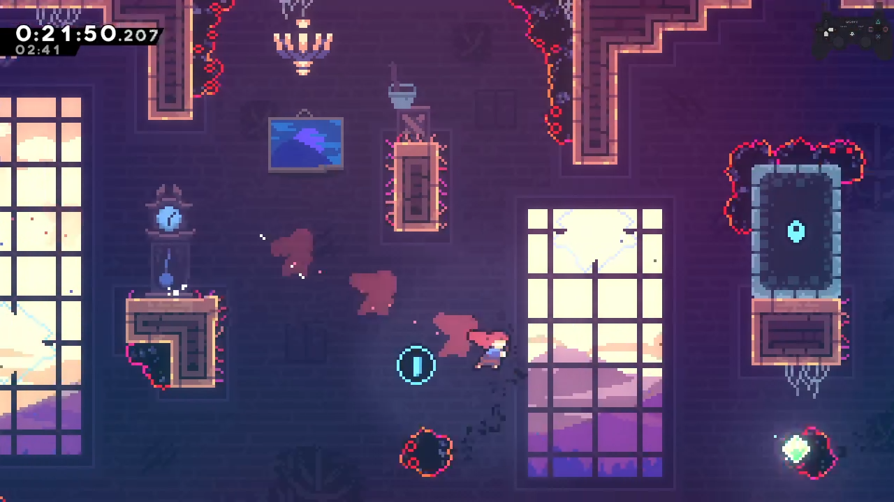  
> Generally, a faster trajectory on this downdiagonal is achieved by jumping later on extension at the start of the room, among other factors.

  The 5a eyeball room is particularly sensitive to small differences in initial trajectory. The most normalized entry for the eyeball room is to transition hyper and buffer a downright, but the speed of the buffered downright and ensuing Theo ultra depend on how much DashCD remains upon entering the room. Making the cycle requires good speed generation and preservation. Good speed generation means good Theo ultras (late extension), and good speed preservation, in practice, means fitting in has many bhops as possible. Ideally, one can fit 2 bhops in immediately at the start before performing the 2nd Theo ultra, but this requires precise jump press and release timings. I struggled with fitting in small bhops near the beginning, so instead I opted to line up my DashCD entering the eyeball room itself such that the first Theo ultra is as fast as possible given a buffered transition hyper into downright out of DashCD. This loses a bit of speed to the 2 bhop method, but simplifies the beginning of the room with just 1 big bhop instead of 2 small bhops that can easily go wrong. In terms of speed generation, dashing from as far away as possible (entering with the lowest DashCD) leads to the least loss to air friction and consequently the fastest ultra upon a buffered downright. However in this case, the lip at the start of the eyeball room presents some complications. If DashCD is too low when entering eyeball room, there is not enough height+distance covered to avoid the lip with a buffered hyper+downright, resulting in a grounded ultra on the upper platform before Theo (sometimes it still works but I wouldn't count on it). In essence, I am trying to compensate for the speed loss of not doing the extra bhop by optimizing the entry movement.  
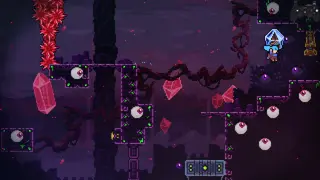 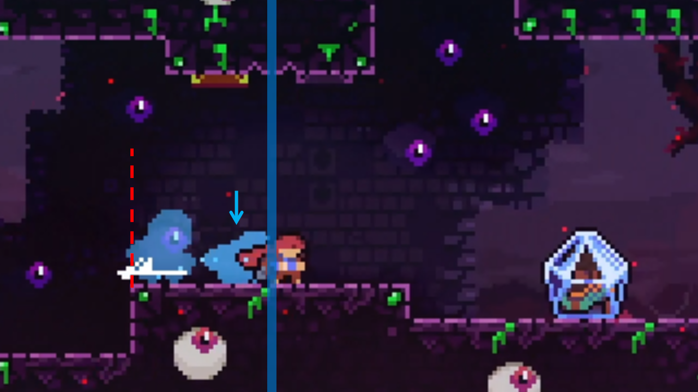  
> Aiming the exit of the previous room to set up the eyeball entry to be as fast and consistent as possible. The red dashed line indicates the boundary where I aim to have Madeline be as close as possible to but not overlapping when starting the demodash.

  I settled with aiming for DashCD(5) when entering eyeball room to give myself some margin. DashCD(4) creates more speed and is easier to make the fast cycle, DashCD(3) is too far and runs into the grounded ultra issue, and DashCD(6) works but is just a tad more difficult. Incidentally, DashCD(4) and over are also allowed to be slightly late on buffering the transition hyper, adding a hair of leniency on that end. Recall that each dash timing corresponds to a 4px range of the starting demo because of the 4px/frame speed of the horizontal demo. To translate these numbers into something more practical: I aim to be near the left edge of the platform (red dashed line). A nice feedback cue is if I see the 2nd dash silhouette (indicated by the blue arrow) appear during the transition screen roll: this indicates DashCD(5) or less. If I don't see the 2nd dash silhouette appear during transition, I am more mentally prepared to have less speed on the first Theo ultra. A critical consequence is that by aiming for a particular DashCD, I am reducing the possible initial trajectories (and thus reducing variance) I will have at the start of the eyeball room.  
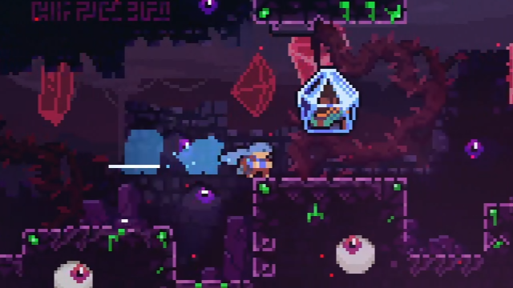  
> For the duration of a max height jump (39f), a ~21 speed difference (see above figure) translates to ~15 pixel (~1.8 tile) difference in horizontal distance traveled. That might not sound like much after having traveled 3/4 of the way through the eyeball room (almost 100 tiles up to this point), but differences of that scale can be critical in making the cycle on the eyeball room. Success on this demohyper hinges upon being close enough to the platform, as this frequently occurs while the eyeball wave is pushing you backwards. Theo also needs to be some distance downstream so the grounded ultra will catch him.

---

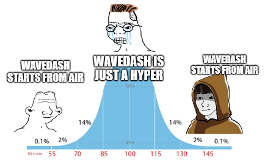  
> "wavedash.ppt is wrong, just learn the timing for extended hyper instead" - typical chatter

  Wavedashes present a way to control the timing of a hyper. As much as wavedash.ppt is criticized for being wrong, there is a useful consequence of starting the downdiagonal from midair: the hyper cannot come out until Madeline reaches the ground. This means with some careful positioning, we can design a buffered wave to give us a particular extension frame, or more generally, DashCD. This can be used to normalize trajectories. Incidentally, wavedashing on a max height jump gives DashCD(1) on the hyper, meaning in principle we can access any DashCD with a buffered wave by jumping from flat ground.  
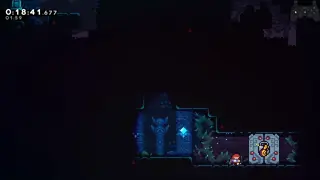   
> Using a wave makes these hypers bufferable and perfectly convergent. If they were to start from the ground, they would be frame-perfect ([5a](https://discord.com/channels/403698615446536203/617809769322774533/1300619075344535604)), or have otherwise terrible frame data ([8arb](https://discord.com/channels/403698615446536203/617809769322774533/1229338086454988860)).

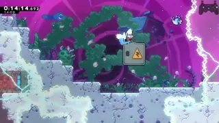  
> The cue I pay attention to is the height to start the wavedash to help me buffer a faster grounded ultra into the cutscene. Carrying good speed from this cutscene ultra at the start of FWFW propagates a long way and can be helpful to make a cycle later in the room.

Another niche but interesting use case is to use a wavedash to add buffer leniency to the 2f demo setups out of hypers through spinners. These demos are normally lined up with jumping on the first 2 frames of extension, and then buffering a horizontal demo. By starting the downright from a particular height to add buffer leniency, the 2f becomes a 5-6f, at least for height alignment. In these cases, converging the vertical trajectory is the appeal, and aligning the horizontal trajectory (or other factors) frequently becomes the difficulty bottleneck. For example, in the 5arb Search example below, the initial downright dash for the wavedash is nominally a 4f because the horizontal positioning the hyper is important as well.  
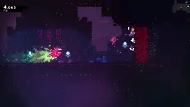  
> Shoutouts to Preimi for pioneering this idea and applying it to not only [5arb](https://discord.com/channels/403698615446536203/1137847168850477146/1137847184616861757) but also [3a cassette](https://discord.com/channels/403698615446536203/1137847192028201030/1137847207035404308) and [7arb](https://discord.com/channels/403698615446536203/1137847217282093087/1137847240455639040).

The fundamental use case of these DashCD setups is that we are incurring a timer during which we cannot dash. We can use that timer's expiration, combined with buffer leniency, to set up the next dash consistently. The above examples discussed setting up commonly occuring horizontal or vertical trajectories, but sometimes I'll just simply use DashCD as a timer for general timing/positioning purposes. The downdash after bonking the fish must be delayed by at least 1 frame after the first possible frame, but it also needs to be "as soon as possible" to make getting clean landing back on the starting platform as consistent as possible, i.e. there is a deadframe. I'll aim the downright into the fish such that I can buffer the downdash and have the deadframe occur while having a tiny bit of DashCD left, effectively removing the deadframe and getting a sufficiently early enough downdash to have the following clean landing be consistent.  
 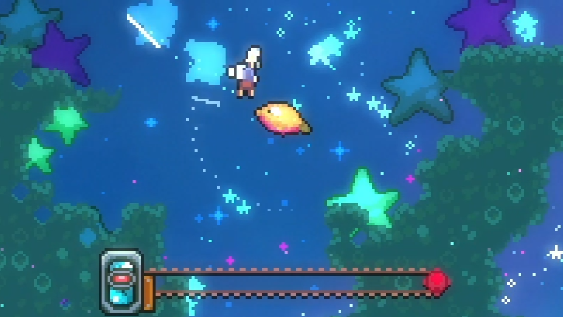  
> In the particular execution of the 1st clip, I hit the fish with DashCD(2): the 3rd blue dash silhouette not appearing is a clear indicator that there is still some amount of DashCD left. This results in the downdash coming out on the 3rd frame after the bonk, safely avoiding the deadframe and still being sufficiently early enough for an easy clean landing. Care is taken to aim for a sufficiently consistent DashCD upon hitting the fish by approaching the fish with a particular, slightly suboptimal but reasonably fast trajectory. 

   
> The strat fails if the downdash is too early, which is a 1f normally, or would turn into a 5f of "deadframes" if granted buffer "leniency". 

---

## Buffer chains

  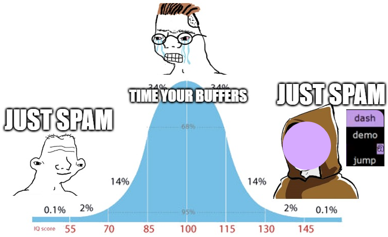  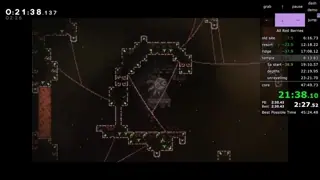  
> "It's free time save, just buffer" - typical chatter

Summary: long chains of consecutive buffers are not easy due to potential timing drift, I recommend using visual cues to anchor buffer timings.

  Much of Celeste's high input density and high-speed movement comes down to learning the muscle memory for movement sequences, where you may learn the timing of one input relative to a previous one. One of the challenges is chaining many consecutive buffers. A fundamental property of buffering is that the action does not occur at the same time as the input. This can add variance to timings that we are used to. A canonical example would be buffering extended hyper when landing without a dash. 

  The normal way to learn extended hyper timing is a muscle memory of the 10-14f rhythm between dash and jump. Nobody is counting 10-14f in their head, we just feel it out after having hit and missed it many times over. This is perhaps the most important arbitrary timing to learn in the game and mastery of it is a must for reaching advanced levels of play. When buffering the dash is thrown into the mix, our beloved timing gets a little befuddled. Buffering the dash means the jump input is no longer always 10-14f timing: for example, it could be a 14-18f timing, depending on where in the buffer window the dash was input.  
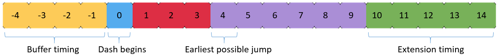
>Frame structure of a dash and ensuing jump. The dash can be input anywhere from -4 to 0 and it comes out on 0. The jump timing for instant and extended hypers is always the same 5f window with respect to the dash coming out, but its timing relative to your button press has variance. 

  Empirically, the typical way to handle this is just "jump a bit later than usual." As you stack more consecutive buffers, there becomes increasingly more variance in viable relative timings. For example, when trying to buffer consecutive dashes purely out of DashCD, unless you can maintain a perfect 240bpm on the dashes, your timing will likely drift towards one side of the window. In a sense, one could argue this to introduce divergence: the timing of a buffered input affects the relative timing of a subsequent buffered input. In many cases of high-density, multi-buffer sequences, I often find muscle memory to quickly fall apart, and need visual cues to reliably anchor my timing. 

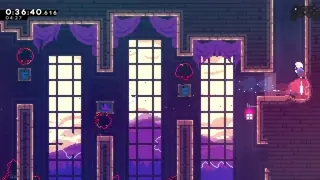  
> A fully buffered strat, but terribly unintuitive for muscle memory, being not only a long buffer sequence but also having various extra freeze frames thrown in between. I heavily rely on visual cues in the background textures to help me guide my dash timings.

  A similar story can be said for instant hypers. Jump can be pressed on frames 0-4 for an instant hyper (0 being simultaneous), which empirically translates to "instantly", hence the name, but only if the dash isn't buffered. The timing is no longer "instantly" when the dash is buffered. One technique to mitigate the variance in jump timing is to stagger jump presses, though I would only recommend this when releasing jump is not an objective. Personally I'll use a dashjump + jump combo in some instances where it is crucial to buffer instant hyper and I intend or am allowed to hold jump for a long time. When the dash is properly buffered, the jump portion of dashjump doesn't actually do anything because it is lost to freezeframes. Rather, the dashjump simply serves to save me if I didn't actually buffer the dash, acknowledging that I am not going to hit every buffer. An accidental unbuffered dash combined with an intentionally delayed jump could spell trouble in situations where the hyper being instant is critical to success.  
  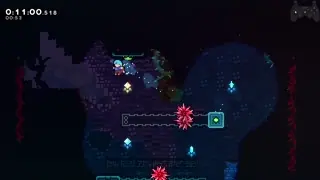  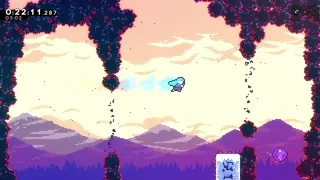 
  > The dashjump is not a replacement for a jump, it is just adding insurance.

This is a similar principle to staggering jumps on diagonal demo cornerkicks that are notorious for having variable timing because of the crouch state dynamics. In principle, one could roll a whole series of jumps as even more insurance, but not all of us have that luxury and would probably be more trouble than its worth to do for every instant hyper.  

---

[Previous: science overview](https://github.com/kwan22/consistency/blob/main/science.md)

[Next: transitions](https://github.com/kwan22/consistency/blob/main/science2_transitions.md)
