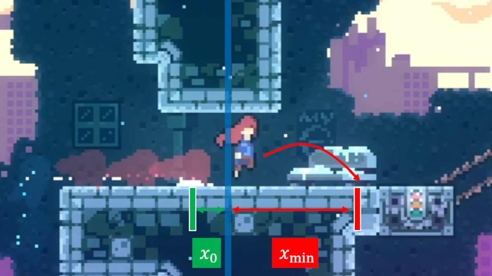
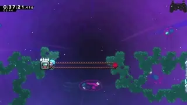

[back to science](https://github.com/kwan22/consistency/blob/main/science.md)

# Transitions

Summary: transitions can converge slightly different trajectories onto the exact same one. These are showcased very well with a hyper shortly before transition, and frequently followed by releasing jump during transition. Sensitivity of a hyper's trajectory to jump timing release can be significantly dampened to a pre-transition hyper.

Buffering transition movement (e.g. transition hyper) is well-known for being an excellent normalizer: these are so common and I discussed them briefly already, so I won't go over them again here. Hypering just before a transition seems like it adds variance depending on the starting x-position, but it turns out that it is still highly convergent across different starting x-positions because of the structure of the hyper trajectory and the properties of transitions. Some seemingly pixel-perfect or subpixel-precise strats involving a hyper before transition frequently have a pixel range that are a multiple of 5 in which they work because this convergence.
  
The plot below shows the possible hyper trajectories, y-position and x-speed (u), upon a horizontal transition as a function of distance from transition. Each step represents a frame, and all positions up to the next step converge to the exact same trajectory. The outcomes (y, u) are weakly sensitive to the changes in action (x0). The other components of the trajectory are normalized: x is exactly on the transition boundary, and y-speed (v) is easy to control by either holding or releasing jump during transition. An extremely common pattern is to release jump during transition, enabling many strats that will be showcased in the upcoming examples. The consequence of this is that pre-transition hyper trajectories are discretized such that they increment every ~5 pixels away from transition. Furthermore, adjacent hyper trajectories are often similar enough where many strats work across multiple ~5-pixel windows.  
    
  > The x-axis is really a "Time from hyper start upon reaching the transition", which has a 1-1 correspondence with trajectory upon transition. 
 
  Transitions introduce a **spatial convergence** of trajectories, which is especially noticeable for hypers: different initial positions give the exact same result, and the range of positions is proportional to the speed. By comparison, buffering introduces a **temporal convergence** of inputs: different timings of button presses give the exact same result. Buffered transition hypers exhibit both spatial and temporal convergence and are the usual preferred method for converging horizontal trajectories. While this concept works for any well-defined trajectory, it is perhaps the most prevalent and well-illustrated by hypers before transition. Below shows several examples where such pre-transition hypers are useful.

---
  
  Fastfalling directly into the 1st bumper in 6b Reprieve-3 seems absolutely insane. Fortunately, there is a [setup](https://discord.com/channels/403698615446536203/1137847274609848463/1137847278363738233) to help us out. Incidentally, optimal movement at the end of Reprieve-2 sets this up perfectly: buffered rightdash out of Badeline recoil sets us up on the left edge of the 5 pixel window of the winning hyper trajectory. That said, because the landing is on the left edge, there is some room to the right of the optimal landing that is still viable. The consequence of this is that differences in Badeline recoil between entry and death can be resolved by simply not fastfalling after the rightdash, as slowfalling lands us slightly further to the right but still within the 5px window. Slowfalling works for both entry and death, while fastfalling is a frame faster but works only on entry.  
    

   
  > Hypers from different initial positions that reach the transition at the same time converge onto the exact same trajectory. 

---

  The [setup](https://discord.com/channels/403698615446536203/617809769322774533/1162859316479537265) for the downright cb in Intervention can be traced all the way back to the end of the previous room. There are 2 viable hyper trajectories on transition, thus a 10px window for the exiting hyper. Incidentally, one of the hyper trajectories is more forgiving than the other, but both are sufficient to set up the rest of the strat with reasonable leniency.  
  
  > Because the setup starts from the previous room, so far there is no known normalized way of quickly setting up the downright cb from entry.

---

  The [first cb in 3b Start-2](https://discord.com/channels/403698615446536203/617809769322774533/1232274832390098974) has a ~25 pixel range (red box) to get a good cb. There are 5 possible hypers to cross the transition (blue) and get a good cb, spread out across ~25 pixels of initial x-pos (x0, red). For the outcome of "good first cb", the pre-transition hyper is highly convergent across different initial starting positions. That said, the following upright cb being successful has some sensitivity to x0 because of the slightly different speeds mattering. In general, the longer a sequence is, the more opportunities there are for divergence to arise, as small differences in intial conditions propagate to increasingly larger changes in outcomes. Thankfully, Celeste provides many anchors for normalization, making chaining many short sequences amenable to convergence.  
   
  > There is a massive range to get the first cb to be a good cb, but getting the 2nd cb is a bit trickier.

---

  I find a pre-transition hyper to be much more consistent in setting up these 7a 500m and the 8b Heartbeat-H strats than transition hyper. While transition hypers are well-known for their normalization properties, a major variable in using a transition hyper here is the jump release timing. Pre-transition hyper shifts the variance from jump release timing to hyper positioning, which I can take a moment to aim for if I so choose. All this may be at the cost of a few frames compared to the transition hyper, if at all. In general, the transition hyper is amazing on horizontal convergence, but less so on vertical where a short hyper is required, as each frame of jump release gives a different outcome (e.g. the landing position for the bhop on this strat).  
     
  > More speed loss to air friction also may mean a larger window for the 500m cornerglide itself and better avoids brushing against the next wall. In 8b, with a very close pre-transition hyper, a [12f jump](https://www.youtube.com/watch?v=82gpR9rozdE) on the bhop sets up the upright demo very well and avoids crashing into the wall. The death strat is to simply reverse transition hyper, which is an even more normalized pre-transition hyper thanks to buffer leniency.

  To generalize, the minimum landing distance (assuming no forward release and jump held until transition) of a pre-transition hyper as a function of initial distance before transition is illustrated below. Landing distance is useful as the ability to fit in a bhop is frequently dictated by how much floor you have in front of you. For a wide range of starting x-positions, the total variance in minimum landing distance is just under 16 pixels (2 tiles).  
      
  For comparison, the minimum landing distance of a transition hyper as a function of jump duration is illustrated. Every frame of jump timing increments the minimum landing distance by almost 10 pixels (~1.2 tiles). While comparing initial starting position and jump release timing is not exactly apples-to-apples, the point is that there is much more variance in the landing distance from a transition hyper compared to a pre-transition hyper with a comparable precision of execution.  
      
  Understanding minimum landing distance is also useful when trying to move downwards past the floor. Pre-transition hypers are frequently successful at normalizing this.  
      
  Notice the small amount of space between Madeline and the door. This spacing ensures the minimum landing distance carries over the floor in the next room so we can get a better downwards trajectory into the bubble. This loses a frame in the current room, but gains more back in the next. Incidentally, this positioning is set up perfectly with a single downright coming out of the previous room (which by itself is already optimal for key cycle considerations), and then naturally coming to a stop by just holding downright.

  Pre-transition hypers are especially useful on converging vertical trajectories. Transition hyper vertical trajectories are much more sensitive to jump release timing: hence, there is a tradeoff between horizontal and vertical convergence. On the other hand, the transition hyper's horizontal speed is nearly independent of jump release timing since air friction is a constant: there is just a slight variable in the timing of when the +40 bhop speed is applied (earlier = faster). This kind of variance usually has negligible impact assuming vertical trajectory is irrelevant. 

  The further away the hyper starts from transition, the more horizontal speed it loses to air fraction, but it also gains some elevation (up to a point), giving it more airtime to travel further before landing. These two factors somewhat counteract each other and end up providing some degree of convergence on the minimum landing distance and, to some extent, the following trajectories. This counteraction is showcased really well in the early-activation strat for the autoscroller block in FW-EH.  
      
  > There is a whopping ~60 pixel window to hyper from before transition, starting from Madeline's position in the image and all the way up to the transition (basically the entire platform save the very left edge). Release jump during transition and Madeline automatically grabs the block on the left side for an early activation.

---

  
Sensitivity analysis

  The hyper has a factor ~6 difference in horizontal vs vertical speed during the 12f of jump timer. The hyper moves about 5 px/frame horizontally, and air friction is small at the startup, decrementing the horizontal speed by about 1.5% per frame in the first several frames. On the other hand, the hyper moves less than 1 px/frame vertically. The consequence of this is that the hyper stays at the nearly the same x-speed and y-position over a large x-range. 

  In general, the sensitivity coefficient is expressed as a derivative of the outcome with respect to the input. High sensitivity = high divergence = bad. We can perform sensitivity analysis of the hyper trajectory (y and u) to initial starting position (x) without jumping through all the hoops of graphs and long-winded explanations. Let v = y-speed = dy/dt, u = x-speed = dx/dt. The sensitivity coefficients dy/dx and du/dx are thus

  dy/dx = dy/dt * dt/dx  
  dy/dt = v, dt/dx = 1/u  
  dy/dx = v/u

  du/dx = du/dt * dt/dx  
  du/dt is air friction, which is a constant  
  du/dx ~ 1/u

  This is all just a concise, mathematical way of expressing all the numbers I was discussing earlier. Comparing hypers and supers, hypers have lower v and higher u, so dy/dx and du/dx are larger for supers compared to hypers. One can expect pre-transition supers to be more sensitive (less convergent) on starting x-position. The main missing piece of this analysis is the rounding and discretization that happens on transition that enables certain strats, but this reflects the overall trend. There are a few spots where pre-transition supers enable certain strats, though these are less common than their hyper counterparts, mainly due to level layouts generally being more conducive to hypers over supers.  
   

  The outcome of the pre-transition hyper is really the timing upon hitting transition (t) which uniquely determines y and u, and the input is the distance from transition (x). Notice that the dt/dx term appears in both dy/dx and du/dx. This is distinctly different than the wallbounce vs horizontal speed example earlier. In the wallbounce vs speed example, the outcome is position (x), and the input is the timing of the updash (t), so the sensitivity coefficient is dx/dt = u: faster speed = more sensitive to timing = bad. It's important to understand what your outcomes and inputs are when looking at a sensitivity analysis.
  

---

[Previous: buffering](https://github.com/kwan22/consistency/blob/main/science1_buffering.md)

[Next: Other movement mechanics](https://github.com/kwan22/consistency/blob/main/science3_other.md)
