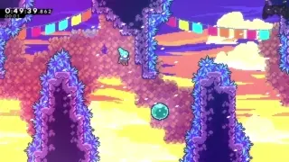
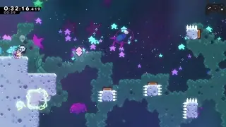
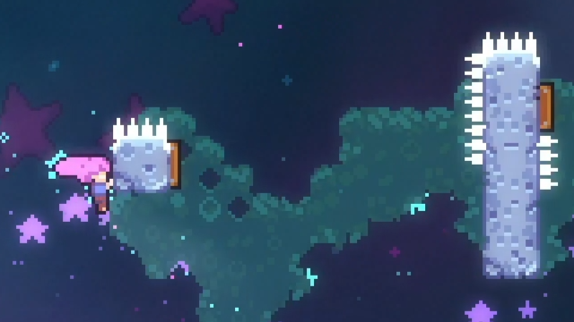
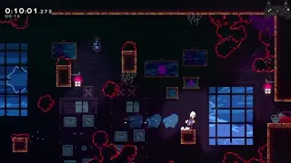
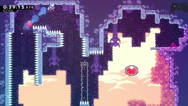

[back to science](https://github.com/kwan22/consistency/blob/main/science.md)

# Other movement mechanics

Various other features of Madeline's movement options that can be leveraged for consistency.

# Table of contents

- [Half gravity](#half-gravity)
- [ForceMove](#forcemove)
- [Cornercorrection](#cornercorrection)
- [Dash attack](#dash-attack)

## Half-gravity

      
  > Half-gravity can be either helpful or harmful for precise vertical positioning.

Summary: releasing jump to avoid half-gravity can be done in a convergent manner, enabling more consistent strats and can make fundamental movement optimizations more consistent.

  Half-gravity can extend the duration Madeline exists at a given y-position. This typically manifests in line-ups with max-height jumps, e.g. 3a shaft demo and a whole class of demos out of a max height hyper. Certain actions and interactions apply autojump as well, that act as if we are holding jump to give us half-grav whether we want to or not. Fundamentally, half-gravity can improve frame-windows by keeping us in a small range of y-positions for an extended period of time. On the other hand, half-gravity can be detrimental sometimes, by introducing deadframes on some strats, or more fundamentally, adding unnecessary airtime. Avoiding half-gravity can also be convergent, where releasing jump on different frames gives the exact same trajectory if timed correctly (the so-called [12f jump](https://www.youtube.com/watch?v=82gpR9rozdE)). In summary, a 12f-17f jump gives the exact same trajectory for a normal jump, i.e. releasing jump at different times within this 6f window gives the same result. There is an even larger window for wallbounce jump release convergence (9f) and other vertically boosted trajectories. A good deal of RTA movement optimization comes from putting yourself in a position to enjoy the luxury of a convergent jump release timing. For a speedrunner's perspective, the main takeaway is "just hold jump" to use half-gravity, or "find the 6f+ jump release window" to avoid half-gravity.   
    
  > Sometimes there are [setups](https://discord.com/channels/403698615446536203/617809769322774533/1269034670272680093) to have a 12f jump give an optimal landing

  The movement in this 3b start room hinges heavily on convergence. The first downwards cb by the spinners is set up with a buffered wallkick that induces ForceMove (more on this later). The last climbjump by the spikes is [set up in a normalized manner](https://discord.com/channels/403698615446536203/617809769322774533/1380402607612231783), with a wide window for jump release that includes an even more lenient version of the 6f jump release window to mitigate half gravity.  

  A 9f jump release on a buffered bubble wallbounce (centered around the blue flag in the background) converge all onto the exact same trajectory such that the wallkick can be done without releasing right.  
  
  > 4c-1 is one of the longest rooms that is "relatively easy" to TAS-tie because of how much convergence there is. 

  Getting the early activation on the long vertical block can be quite tricky since a jump release is required when over the falling spring block, but an arbitrary jump release makes this strat difficult to normalize. I aim to climbjump from the lower half of the spring block, usually allowing a 12f jump to hit the spring early enough to get the early activation on the next block. While there are other factors at play that can add variance to the strat, the goal is to effectively remove the variable of jump release timing by setting it up on a sufficiently convergent trajectory.  
     
  
## ForceMove

Summary: understanding ForceMove is useful to normalize some trajectories and/or remove the variable of timing a directional input.

  The main feature of ForceMove is that we lose horizontal aerial control and, barring an interruption like a dash, we are "forced" to travel along a specified horizontal trajectory. Typical sources of ForceMove are wallkicks (11f) and springs (19f). The first notable consequence for wallkicks is that holding into and holding away from a wall for a walljump are equivalent: it can be helpful to preferentially hold in towards walls by default for wallkicks to generally just remove the variable of needing to switch directions in the first place. 

  Because the horizontal trajectory is forced, it is also normalized horizontally. There are many situations where once we enter ForceMove state, we can simply ride the ForceMove and focus our attention elsewhere, frequently a dash in a different direction. As a bonus, the risk of misdash can be mitigated by preloading the direction we need to dash in long before we actually dash in that direction. Increased air friction from releasing forward is also frequently irrelevant (e.g. if bottleneck is vertical), and the horizontal deceleration can help with precise horizontal positioning. 

Some strats rely on the properties of ForceMove to be set up precise positioning.  
     
> ForceMove allows a change of direction to be done in an extremely forgiving window while maintaining the exact same trajectory. This can help make the updash in towels easier, or open up some creative setups to make the [3a shaft demo an 8f window](https://discord.com/channels/403698615446536203/617809769322774533/1030745734707945492), where you are allowed a massive time window to switch from right to left between wallkicks and stay converged on the exact same trajectory for a subpixel-precise setup.
  
Some spots where I let ForceMove carry me to reduce misdash risk and/or make a horizontal positioning easier at virtually no timeloss.  
      
      
  > I release horizontal directions almost immediately after hitting the spring since the horizontal trajectory is largely forced and any remaining losses to air friction are negligible time-wise and potentially even helpful for consistency.

ForceMove is useful to not need to change directions for a wallkick. 
     
      
  > I just hold 1 direction and jump, no need to time directional inputs until after the last wallkick.

Turnarounds over (moving) blocks are notoriously divergent because of how sensitive they are to turnaround timings. In these 2500m examples, I only need to time the first right-to-left turnaround, and hold left during the wallkick. Turning back away from the wall prematurely would add another variable and just make these turnarounds even messier than they already are.  
 

  A max height jump and max height wallkick makes the first horizontal demo on 7a Flag 17 much more lenient. In this instance, going neutral during ForceMove from the wallkick eliminates the possibility of being too far and crashing into the ceiling spinners. Acting at the peak of each jump gives a consistent, sufficiently converged starting point for the first upright dash. The demo usually ends up being a 5f window. Waiting for peak height loses time to optimal movement but is still appreciably faster than doing a 2nd upright.   

---

## Cornercorrection

Summary: some examples and patterns to think about when looking to make midair dash tech more consistent.

  For ground jumps there are 3 convergent vertical trajectories: full jump (jump held the whole time), [12f jump](https://www.youtube.com/watch?v=82gpR9rozdE), and full hyper. These are extremely common actions and provide various options for lining up for cornercorrection/floorsnapping, showcasing the speed vs precision tradeoff quite nicely. The plots below the vertical trajectories of these jumps, focusing on their alignment with 1-, 2-, and 3-tile height as canonical examples. Of the two collision correction mechanics, cornercorrection by itself is mainly useful for 2-tile extensions and other precise positioning setups as x-pos is perfectly normalized. Floorsnapping by itself is less useful and is generally harder to intentionally use because of its smaller pixel window, but has some niche applications. In general, when arbitrarily passing over a floor at max jump speed (105), there is a 78% chance that cornercorrection is a 2f and 12% chance a 3f. 1-tile height alignment happens to enjoy the luxury of a 3f window for cornercorrection, improving accessibility of some setups like [burgyscience](https://discord.com/channels/403698615446536203/617809769322774533/1092191710504828979). Combined cornercorrection/floorsnap leniency for alignment at max jump speed is virtually always a 4f, barring some shenanigans like floating point precision.  
        
      
  > Vertical trajectories of a full jump (blue), 12f jump (light blue), and a hyper (orange), accompanied by zoom-ins around a 1-, 2-, and 3-tile elevation gain on the upswing. Green regions show zones of cornercorrection and floorsnapping. Black dashed lines show the position of 1, 2, or 3 tiles, above being floorsnapping and below being cornercorrection. Points on zoomed in plots are rounded to the nearest y-px to highlight Madeline's rendered hitbox position, assuming no initial subpixels.  
  
  Despite 1-tile alignment from jumping being a 4f, I find it more difficult than the 2-tile alignment primarily due to it empirically being "jump and then very quickly but also not too quickly dash", i.e. frame consecutive jump+dash fails. One way to get around the frame-consecutive failure mode is to use a super and take advantage of DashCD: the 1st 4f of extension allow a buffered dash to line up with a 1-tile because DashCD nullifies the "deadframe" as long as you don't get 5th frame extension. This simply moves the 4f to a more comfy spot at the cost of a buffer and potentially a small amount of timeloss. The same principle applies to a 1-tile cornercorrect alignment, though this method would need the middle 3f extension.  
        
  > Sometimes the target extension frame gains buffer leniency. Sound familiar?

  Requiring cornercorrection enables 2-tile extension but significantly increases the required precision due to the reduction in viable y-positions. This is where I preferentially use hypers for some required cornercorrects. The slower vertical speed of hypers makes the vertical positioning easier. In some cases, it may help with making horizontal progress as well.  
        
In a similar vein, max height hypers always cornercorrect at 2-tile height. The tradeoff for vertical speed and precision is quite clear, with hypers having much more lenient frame windows but taking ~4f longer on average for a 1-tile alignment and ~10f for a 2-tile alignment, measured from the middle of their respective frame windows.

  3-tile alignment tells an interesting story. Cornercorrection on the upswing is still a 2f despite a small loss of speed due to gravity. Both full and 12f jump give good frame data for 3-tile alignment, but full jump actually has 4 deadframes at the very top. 12f jump gives a continuous 15f window for alignment. 12f jump also gives an 8f continuous window for floorsnap, where full jump would have a double 4f. This type of trajectory and ensuing frame pattern shows up in both [3arb jasig](https://discord.com/channels/403698615446536203/617809769322774533/1354968751262535691) and [7b heart demo](https://discord.com/channels/403698615446536203/617809769322774533/1353209624232464395). It can be argued that in cases where vertical positioning is the only relevant factor, releasing jump might be preferred for 3-tile alignment to remove deadframes despite adding another variable in jump release timing, as even a 9f jump still gives a massive, continuous window for a 3-tile alignment. 

  Below is a summary of the nominal frame windows for these various types of jumps and canonical alignments, with or without requiring cornercorrection. Exact frame data for specific geometries and movement options is largely case-by-case: these examples aim to highlight some common patterns.  
    

    
  >After the super, it is optimal to do 2 climbjumps to maintain maximum jump speed, and the demohyper is a 4f as mentioned above, but runs the risk of overshooting and falling into the dust bunnies at the end of a very long room. 1 climbjump is an alternative that loses a few frames but still works, reduces input density, increases leniency, and significantly reduces risk.

     
  > The massive frame windows on 3-tile alignment might seem like overkill, but they reduce sensitivity to horizontal trajectories or other factors that influence the time at which the corner is reached. The actual frame windows for the above midair super/demohyper at 3-tile elevation gain may be less than 8f because of horizontal considerations and seekers, but they allow slightly different trajectories approaching the corner to still be viable.

## Dash attack

Summary: dash attack leniency can be used to relax precision on wallbounces, usually at the cost of a small amount of timeloss.

Dash attack leniency here refers to the 6 frames after a dash ends while still retaining some properties of a dash. The key properties of interest here are
1. regain aerial control
2. loss of vertical speed

### Aerial control 

  Regaining aerial control in this context means that wallbounces can gain some extra leniency away from the wall. In the 6 frames of dash attack leniency, Madeline can move up to 2.7px horizontally, theoretically adding that much leniency, room layout allowing. That said, it is not always easy or ideal to take advantage of this leniency. For example, holding in toward a wall means the wallbounce will experience increased air friction until away is held, which can be helpful or harmful depending on context. 

  The 2nd wallbounce on Flag 2 is difficult partially because of the spinners interfering with updash cornercorrection leniency, but it can be made easier with dash attack leniency. I aim to have my horizontal trajectory as normalized as possible before attempting this precise wallbounces: in this case, to have the previous wallbounce be flush/cornercorrect on the wall to normalize horizontal trajectory so the updash alignment is the exact same timing every single time. Furthermore, having the first wallbounce flush against the wall reduces the horizontal distance needed to travel back towards the updash pixel window, and thus total time traveled and total horizontal speed gained from acceleration. Less horizontal speed means more time in the pixel window. The lineup on the lower wall may or may not be optimal from a movement perspective, but what I am actually interested here is the normalization and the potentially increased frame window for the updash due to low horizontal speed. If I see the first wallbounce was not normalized, i.e. not from flush against the previous wall, I will completely bail on attempting the 2nd wallbounce because of both reduced frame window and loss of normalization.  
     
  > Snapshot shows the first possible updash frame for the 2nd wallbounce on 7a Flag 2, hinging upon aerial control during dash attack to enter wallbounce range from outside. Note the low horizontal speed, enabled by setting up the previous wallbounce at a more favorable horizontal position, that will generally increase the updash frame window. Perhaps more importantly, a consistent starting horizontal position on the previous wallbounce normalizes the timing of the updash.

  A similar story happens with the 8arb lava wallbounce. Here, lining the previous wallbounce to be flush off the upper coreblock is easier because the lower coreblock helps line it up. A nuance here is that I aim the previous wallbounce to be low so dash attack does not vertically overshoot the lava. Holding left for too long may suffer the increased air friction problem mentioned earlier. The Flag 2 example is less sensitive to air friction.  
     

With the right vertical positioning, using dash-attack leniency to hold towards the wall adds 1f of leniency (3f at best to 4f at best) to the updash on lakeskip. Holding towards the wall immediately after the wallbounce happens to be optimal in this case.  
      

One caveat to be careful about is colliding with a wall, which immediately removes dash attack. For this transition wallbounce in 7arb 1500m towards the winged berry, I wait to hold left until shortly after hitting the wallbounce. In principle, holding left the whole time for the transition wallbounce is fine, but being slightly late on the transition buffer while holding left will cause the transition wallbounce to fail. The wallbounce being neutral for a few frames has essentially no impact on the room.  
      
  > Image shows the first frame I started holding left.

---

### Vertical speed loss

The loss of vertical speed opens up some setups enable a larger frame window to fire a wallbounce within a precise y-pos. Firing a wallbounce during dash attack leniency significantly reduces the sensitivity of the wallbounce trajectory to jump timing. Once again, another instance of a speed vs precision tradeoff.  
    
  > The elevation gain of an updash as a function of time. Orange points indicate dash attack leniency.

Getting clean landing in 3a shaft-3 requires a wallbounce at the top ~5px of the 1-tile thick platform. The grounded ultra setup not only gives a consistent horizontal position for the updash, but also puts us in a vertical position such that dash attack leniency gives us a large and consistent (5-6f depending on cornercorrection) frame window to hit this clean landing. Otherwise, passing through this spatial window at max dash speed gives a 1-2f window on the jump input for clean landing.  
    
I apply a similar principle to a section of 7a Flag 1. It is optimal to super when dashing left towards the wall to resolve the vertical bottleneck. I opt to start the updash from the ground level and wallbounce during dash attack. This makes lining up the following super more normalized with larger frame windows, shown below.  
      
> Nominal frame data for the right dash as a function of prior wallbounce timing when starting the updash from the ground. Frame 0 is the last frame of dash and the lowest viable wallbounce, frames 1-6 are dash attack leninecy. 

The exact frame data here depends on subpixels so only nominal values are given, but regardless, the windows will be large. Furthermore, the timings are commonly performed timings: dash attack leniency and peak wallbounce height timings are commonly used in many places. I am well-versed in them and they take no additional brain space. By comparison, with the optimal super before the updash to save 0.1-0.2, the frame data becomes some combination of:
- tighter: most likely a faster y-speed while aiming the right dash
- more arbitrary: either jump on some arbitrary mid-late extension frame to line up the wallbounce peak height, or right dash at some arbitrary position along the wallbounce trajectory
- less normalized: add variables in the extension timing of the super and subsequent updash

---

[Previous: transitions](https://github.com/kwan22/consistency/blob/main/science2_transitions.md)

[back to top](#other-movement-mechanics)
